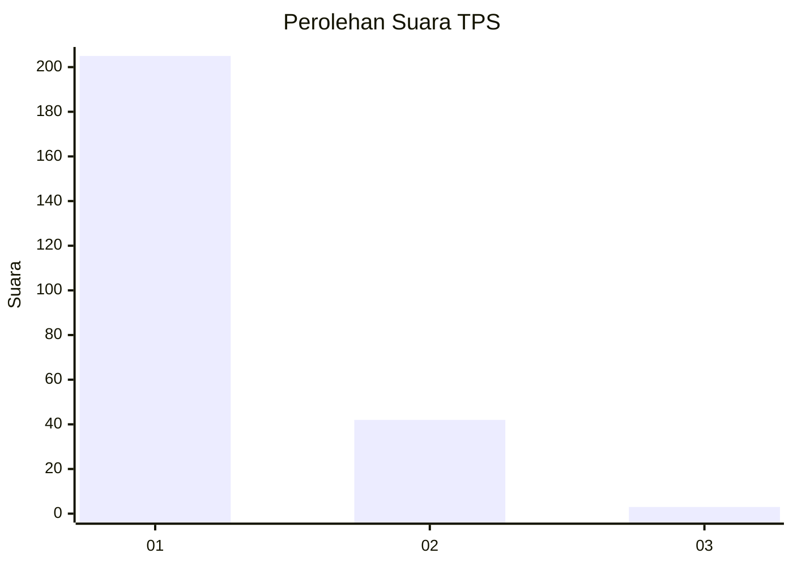
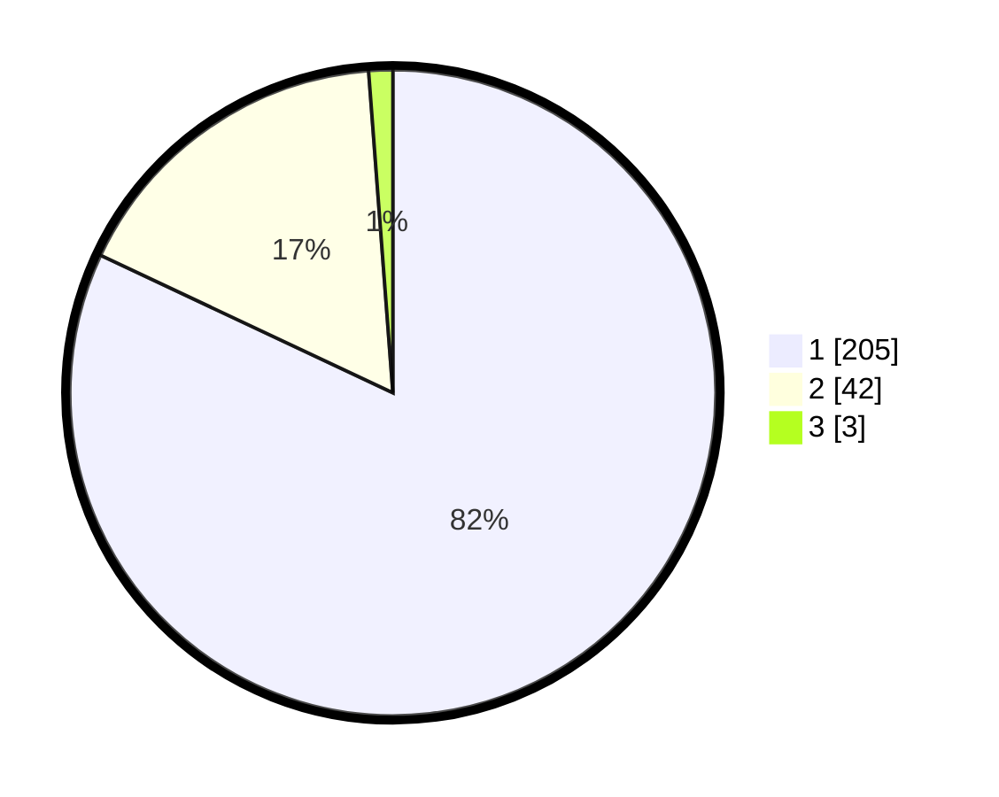

# Hasil

## Grafik

## Tabel

| No. | Nama Paslon    | Suara | Suara (raw) | Persentase |
|:--- |:-------------- | -----:| -----------:| ----------:|
| 1   | ANIES MUHAIMIN | 205   | [205][p-1]  | 82,00      |
| 2   | PRABOWO GIBRAN | 42    | [42][p-2]   | 16,80      |
| 3   | GANJAR MAHFUD  | 3     | [3][p-3]    | 1,20       |

[p-1]: https://github.com/gigit-pemilu/pemilu-2024-11-aceh/blob/main/pilpres/hitung-suara/sub/11-aceh/sub/72-kota-sabang/sub/01-sukakarya/sub/2004-krueng-raya/sub/003-tps/sub/paslon-1.txt
[p-2]: https://github.com/gigit-pemilu/pemilu-2024-11-aceh/blob/main/pilpres/hitung-suara/sub/11-aceh/sub/72-kota-sabang/sub/01-sukakarya/sub/2004-krueng-raya/sub/003-tps/sub/paslon-2.txt
[p-3]: https://github.com/gigit-pemilu/pemilu-2024-11-aceh/blob/main/pilpres/hitung-suara/sub/11-aceh/sub/72-kota-sabang/sub/01-sukakarya/sub/2004-krueng-raya/sub/003-tps/sub/paslon-3.txt

## Foto C Plano

https://sirekap-obj-formc.kpu.go.id/dd68/pemilu/ppwp/11/72/01/20/04/1172012004003-20240226-155155--ed75bd49-35ba-4e66-bb89-fb0edda6db05.jpg

https://sirekap-obj-formc.kpu.go.id/dd68/pemilu/ppwp/11/72/01/20/04/1172012004003-20240226-155157--dac091b1-2ac0-43fd-a0a3-e7351b5c5715.jpg

https://sirekap-obj-formc.kpu.go.id/dd68/pemilu/ppwp/11/72/01/20/04/1172012004003-20240226-155156--41bdd3f8-2787-4d2f-a803-f5ecfd4675f7.jpg

## Metadata

| Key        | Value               |
| ---------- | ------------------- |
| Time Stamp | 2024-02-26 18:00:00 |

## DATA PEMILIH TETAP

Jumlah pemilih dalam DPT: **293**.
 * L: **154**.
 * P: **139**.

## DATA PENGGUNA HAK PILIH

Jumlah pengguna hak pilih dalam DPT: **258**.
 * L: **132**.
 * P: **126**.

Jumlah pengguna hak pilih dalam DPTb: **5**.
 * L: **3**.
 * P: **2**.

Jumlah pengguna hak pilih dalam DPK: **1**.
 * L: **0**.
 * P: **1**.

Jumlah pengguna hak pilih: **264**.
 * L: **135**.
 * P: **129**.

## JUMLAH SUARA SAH DAN TIDAK SAH

JUMLAH SELURUH SUARA SAH: **250**.

JUMLAH SUARA TIDAK SAH: **14**.

JUMLAH SELURUH SUARA SAH DAN SUARA TIDAK SAH: **264**.

