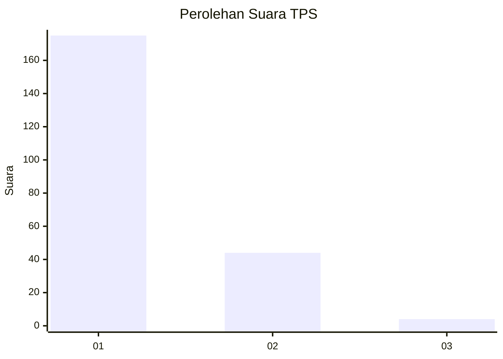
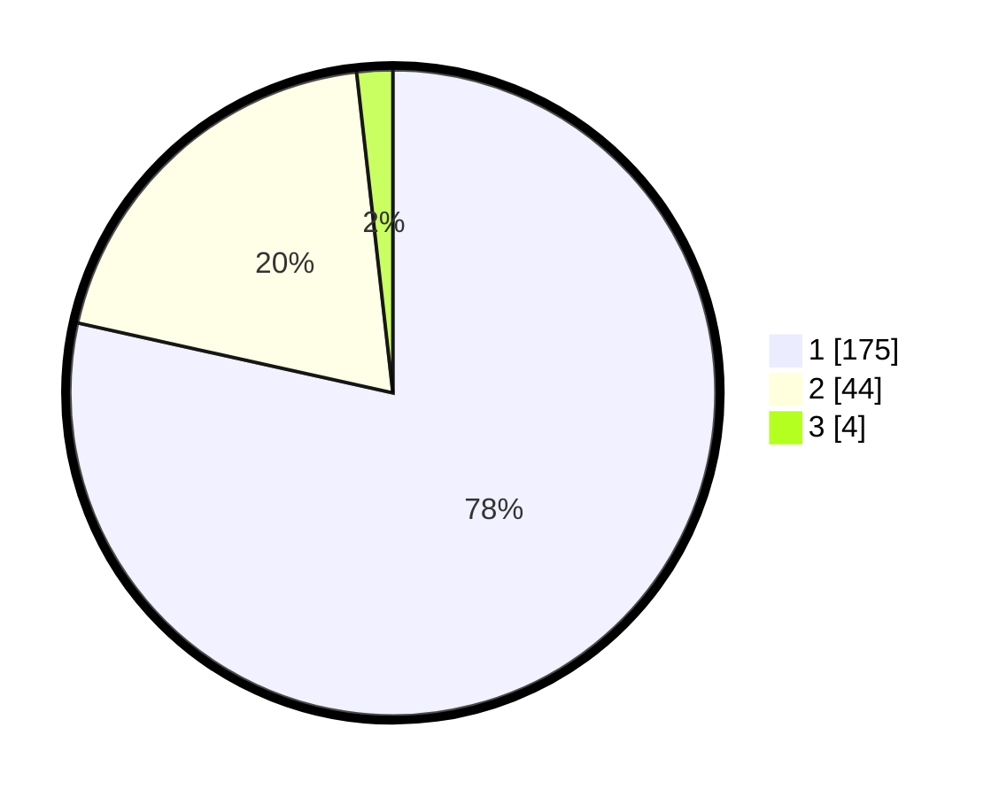

# Hasil

## Grafik

## Tabel

| No. | Nama Paslon    | Suara | Suara (raw) | Persentase |
|:--- |:-------------- | -----:| -----------:| ----------:|
| 1   | ANIES MUHAIMIN | 175   | [175][p-1]  | 78,48      |
| 2   | PRABOWO GIBRAN | 44    | [44][p-2]   | 19,73      |
| 3   | GANJAR MAHFUD  | 4     | [4][p-3]    | 1,79       |

[p-1]: https://github.com/gigit-pemilu/pemilu-2024-11-aceh/blob/main/pilpres/hitung-suara/sub/11-aceh/sub/72-kota-sabang/sub/01-sukakarya/sub/2004-krueng-raya/sub/004-tps/sub/paslon-1.txt
[p-2]: https://github.com/gigit-pemilu/pemilu-2024-11-aceh/blob/main/pilpres/hitung-suara/sub/11-aceh/sub/72-kota-sabang/sub/01-sukakarya/sub/2004-krueng-raya/sub/004-tps/sub/paslon-2.txt
[p-3]: https://github.com/gigit-pemilu/pemilu-2024-11-aceh/blob/main/pilpres/hitung-suara/sub/11-aceh/sub/72-kota-sabang/sub/01-sukakarya/sub/2004-krueng-raya/sub/004-tps/sub/paslon-3.txt

## Foto C Plano

https://sirekap-obj-formc.kpu.go.id/5827/pemilu/ppwp/11/72/01/20/04/1172012004004-20240215-103215--ca467769-721f-4220-9477-8c55864e4ad1.jpg

https://sirekap-obj-formc.kpu.go.id/5827/pemilu/ppwp/11/72/01/20/04/1172012004004-20240215-103409--5e6a61b5-c72b-4452-9a77-501b0f1b4d96.jpg

https://sirekap-obj-formc.kpu.go.id/5827/pemilu/ppwp/11/72/01/20/04/1172012004004-20240215-103553--ba9a18ff-2149-4238-a757-54757133832f.jpg

## Metadata

| Key        | Value               |
| ---------- | ------------------- |
| Time Stamp | 2024-02-16 05:00:26 |

