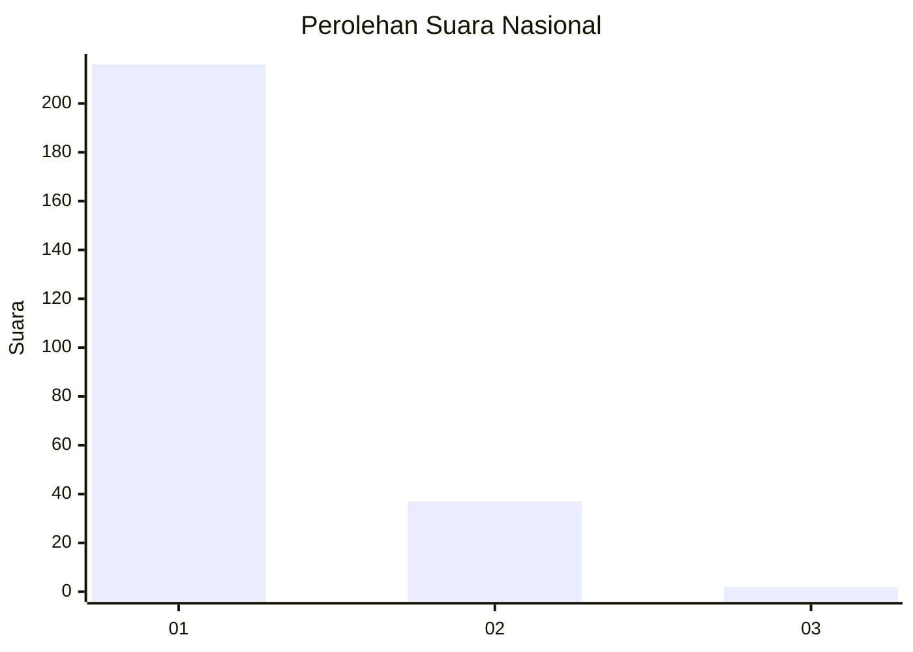
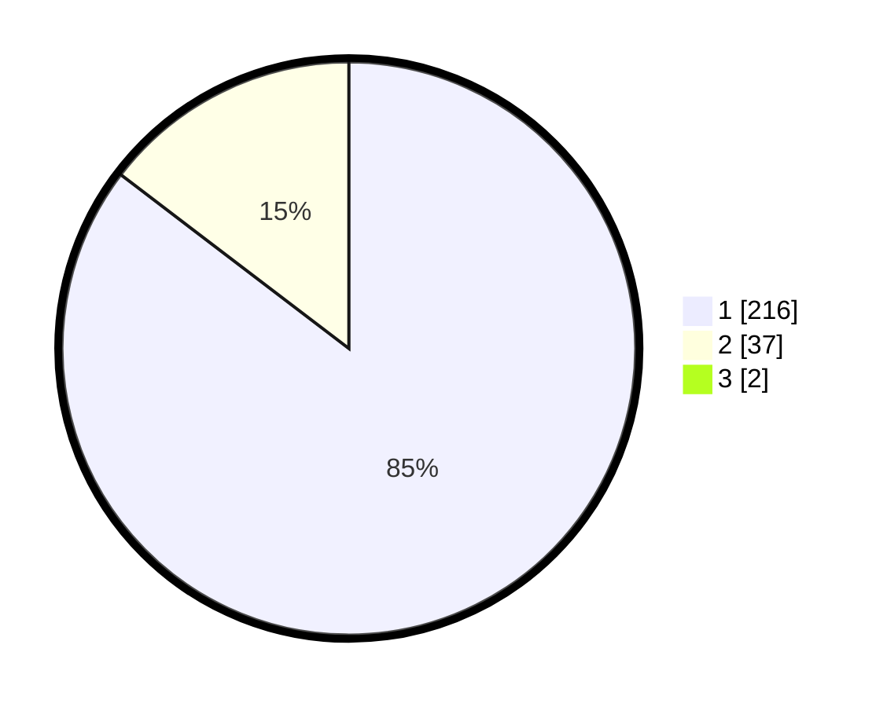

# Hasil

## Grafik

## Tabel

| No. | Nama Paslon    | Suara | Suara (raw) | Persentase |
|:--- |:-------------- | -----:| -----------:| ----------:|
| 1   | ANIES MUHAIMIN | 216   | [216][p-1]  | 84,71      |
| 2   | PRABOWO GIBRAN | 37    | [37][p-2]   | 14,51      |
| 3   | GANJAR MAHFUD  | 2     | [2][p-3]    | 0,78       |

[p-1]: https://github.com/gigit-pemilu/pemilu-2024/blob/main/pilpres/hitung-suara/sub/11-aceh/sub/72-kota-sabang/sub/01-sukakarya/sub/2004-krueng-raya/sub/005-tps/sub/paslon-1.txt
[p-2]: https://github.com/gigit-pemilu/pemilu-2024/blob/main/pilpres/hitung-suara/sub/11-aceh/sub/72-kota-sabang/sub/01-sukakarya/sub/2004-krueng-raya/sub/005-tps/sub/paslon-2.txt
[p-3]: https://github.com/gigit-pemilu/pemilu-2024/blob/main/pilpres/hitung-suara/sub/11-aceh/sub/72-kota-sabang/sub/01-sukakarya/sub/2004-krueng-raya/sub/005-tps/sub/paslon-3.txt

## Foto C Plano

https://sirekap-obj-formc.kpu.go.id/8915/pemilu/ppwp/11/72/01/20/04/1172012004005-20240214-193902--e47ec3b9-0c2c-4e4b-ad2b-a72e3b4f004f.jpg

https://sirekap-obj-formc.kpu.go.id/8915/pemilu/ppwp/11/72/01/20/04/1172012004005-20240214-194143--9999bb80-367b-46a0-acfb-821906e3bd10.jpg

https://sirekap-obj-formc.kpu.go.id/8915/pemilu/ppwp/11/72/01/20/04/1172012004005-20240214-194407--bdbd3c48-9625-4f00-97db-df6c80fba7cd.jpg

## Metadata

| Key        | Value               |
| ---------- | ------------------- |
| Time Stamp | 2024-02-15 12:00:28 |

## DATA PEMILIH TETAP

Jumlah pemilih dalam DPT: **294**.
 * L: **143**.
 * P: **151**.

## DATA PENGGUNA HAK PILIH

Jumlah pengguna hak pilih dalam DPT: **268**.
 * L: **129**.
 * P: **139**.

Jumlah pengguna hak pilih dalam DPTb: **0**.
 * L: **0**.
 * P: **0**.

Jumlah pengguna hak pilih dalam DPK: **0**.
 * L: **0**.
 * P: **0**.

Jumlah pengguna hak pilih: **268**.
 * L: **129**.
 * P: **139**.

## JUMLAH SUARA SAH DAN TIDAK SAH

JUMLAH SELURUH SUARA SAH: **255**.

JUMLAH SUARA TIDAK SAH: **13**.

JUMLAH SELURUH SUARA SAH DAN SUARA TIDAK SAH: **268**.

