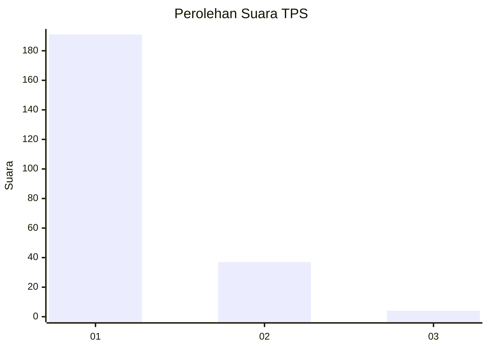
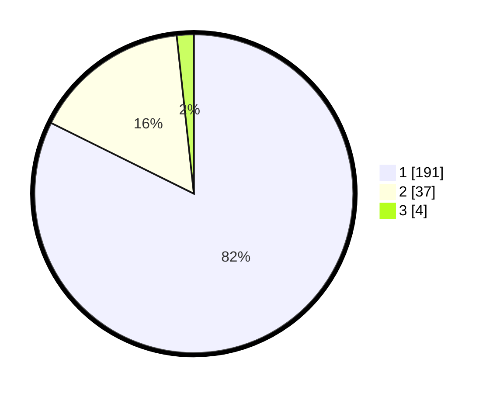

# Hasil

## Grafik

## Tabel

| No. | Nama Paslon    | Suara | Suara (raw) | Persentase |
|:--- |:-------------- | -----:| -----------:| ----------:|
| 1   | ANIES MUHAIMIN | 191   | [191][p-1]  | 82,33      |
| 2   | PRABOWO GIBRAN | 37    | [37][p-2]   | 15,95      |
| 3   | GANJAR MAHFUD  | 4     | [4][p-3]    | 1,72       |

[p-1]: https://github.com/gigit-pemilu/pemilu-2024-11-aceh/blob/main/pilpres/hitung-suara/sub/11-aceh/sub/72-kota-sabang/sub/01-sukakarya/sub/2005-aneuk-laot/sub/001-tps/sub/paslon-1.txt
[p-2]: https://github.com/gigit-pemilu/pemilu-2024-11-aceh/blob/main/pilpres/hitung-suara/sub/11-aceh/sub/72-kota-sabang/sub/01-sukakarya/sub/2005-aneuk-laot/sub/001-tps/sub/paslon-2.txt
[p-3]: https://github.com/gigit-pemilu/pemilu-2024-11-aceh/blob/main/pilpres/hitung-suara/sub/11-aceh/sub/72-kota-sabang/sub/01-sukakarya/sub/2005-aneuk-laot/sub/001-tps/sub/paslon-3.txt

## Foto C Plano

https://sirekap-obj-formc.kpu.go.id/9c0e/pemilu/ppwp/11/72/01/20/05/1172012005001-20240217-161628--9c37ea12-f280-46b7-bc4f-792b52eedc1e.jpg

https://sirekap-obj-formc.kpu.go.id/9c0e/pemilu/ppwp/11/72/01/20/05/1172012005001-20240217-162323--669e78d8-65bb-4bd2-ae9f-0541c8b92765.jpg

https://sirekap-obj-formc.kpu.go.id/9c0e/pemilu/ppwp/11/72/01/20/05/1172012005001-20240217-162604--4b7a7dc9-263d-4780-98f8-c09ad39c7eb4.jpg

## Metadata

| Key        | Value               |
| ---------- | ------------------- |
| Time Stamp | 2024-02-17 16:36:25 |

## DATA PEMILIH TETAP

Jumlah pemilih dalam DPT: **286**.
 * L: **137**.
 * P: **149**.

## DATA PENGGUNA HAK PILIH

Jumlah pengguna hak pilih dalam DPT: **228**.
 * L: **100**.
 * P: **128**.

Jumlah pengguna hak pilih dalam DPTb: **5**.
 * L: **3**.
 * P: **2**.

Jumlah pengguna hak pilih dalam DPK: **0**.
 * L: **0**.
 * P: **0**.

Jumlah pengguna hak pilih: **233**.
 * L: **103**.
 * P: **130**.

## JUMLAH SUARA SAH DAN TIDAK SAH

JUMLAH SELURUH SUARA SAH: **232**.

JUMLAH SUARA TIDAK SAH: **1**.

JUMLAH SELURUH SUARA SAH DAN SUARA TIDAK SAH: **233**.

