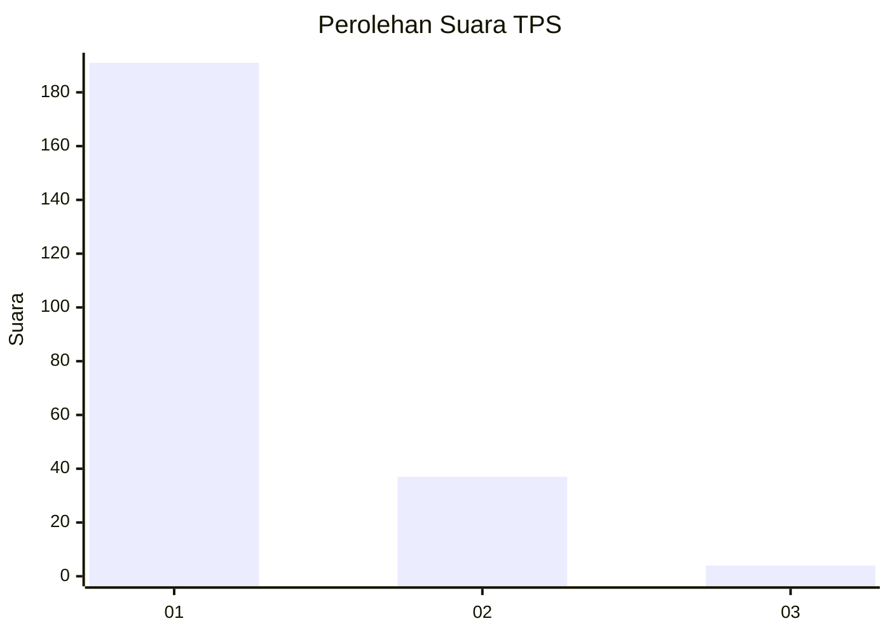
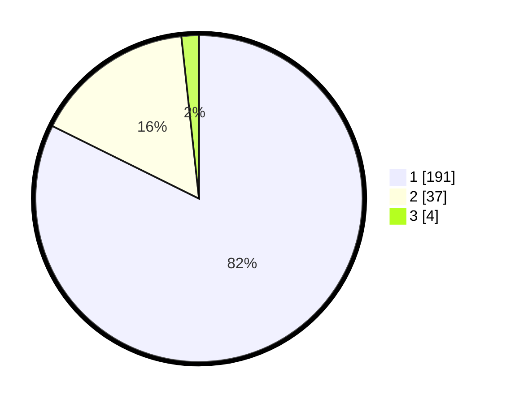

# Hasil

## Grafik

## Tabel

| No. | Nama Paslon    | Suara | Suara (raw) | Persentase |
|:--- |:-------------- | -----:| -----------:| ----------:|
| 1   | ANIES MUHAIMIN | 191   | [191][p-1]  | 82,33      |
| 2   | PRABOWO GIBRAN | 37    | [37][p-2]   | 15,95      |
| 3   | GANJAR MAHFUD  | 4     | [4][p-3]    | 1,72       |

[p-1]: https://github.com/gigit-pemilu/pemilu-2024-11-aceh/blob/main/pilpres/hitung-suara/sub/11-aceh/sub/72-kota-sabang/sub/01-sukakarya/sub/2005-aneuk-laot/sub/002-tps/sub/paslon-1.txt
[p-2]: https://github.com/gigit-pemilu/pemilu-2024-11-aceh/blob/main/pilpres/hitung-suara/sub/11-aceh/sub/72-kota-sabang/sub/01-sukakarya/sub/2005-aneuk-laot/sub/002-tps/sub/paslon-2.txt
[p-3]: https://github.com/gigit-pemilu/pemilu-2024-11-aceh/blob/main/pilpres/hitung-suara/sub/11-aceh/sub/72-kota-sabang/sub/01-sukakarya/sub/2005-aneuk-laot/sub/002-tps/sub/paslon-3.txt

## Foto C Plano

https://sirekap-obj-formc.kpu.go.id/81e8/pemilu/ppwp/11/72/01/20/05/1172012005002-20240217-164822--41796485-5780-44ef-89ad-109675ba4847.jpg

https://sirekap-obj-formc.kpu.go.id/81e8/pemilu/ppwp/11/72/01/20/05/1172012005002-20240214-222730--fb1550d6-2517-400f-a46d-cc3db524fb21.jpg

https://sirekap-obj-formc.kpu.go.id/81e8/pemilu/ppwp/11/72/01/20/05/1172012005002-20240215-094100--2f273002-b637-4a58-874a-6a0e25a831fb.jpg

## Metadata

| Key        | Value               |
| ---------- | ------------------- |
| Time Stamp | 2024-02-17 16:52:47 |

