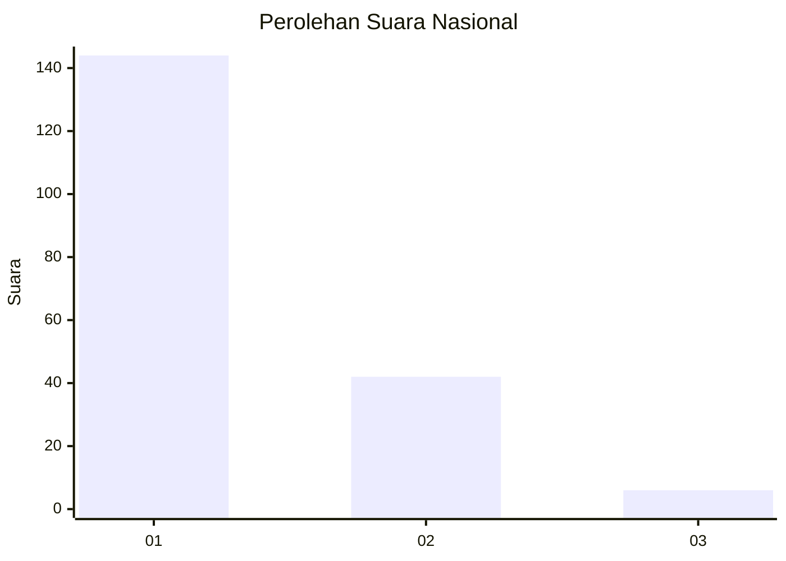
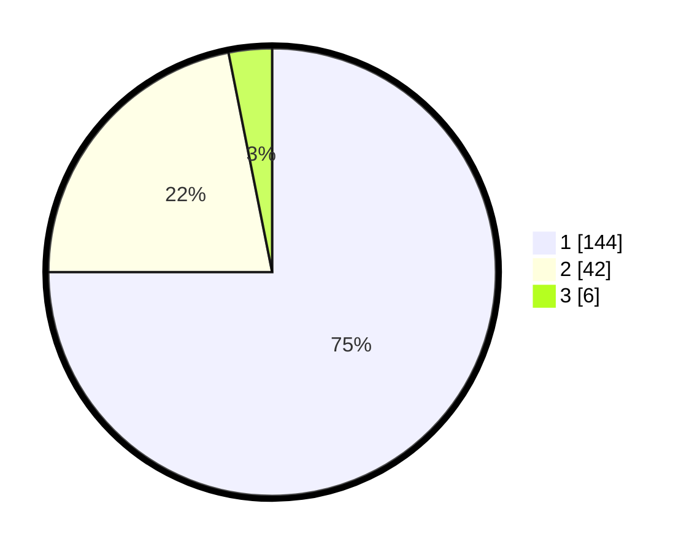

# Hasil

## Grafik

## Tabel

| No. | Nama Paslon    | Suara | Suara (raw) | Persentase |
|:--- |:-------------- | -----:| -----------:| ----------:|
| 1   | ANIES MUHAIMIN | 144   | [144][p-1]  | 75,00      |
| 2   | PRABOWO GIBRAN | 42    | [42][p-2]   | 21,88      |
| 3   | GANJAR MAHFUD  | 6     | [6][p-3]    | 3,13       |

[p-1]: https://github.com/gigit-pemilu/pemilu-2024/blob/main/pilpres/hitung-suara/sub/11-aceh/sub/72-kota-sabang/sub/01-sukakarya/sub/2006-kuta-timu/sub/004-tps/sub/paslon-1.txt
[p-2]: https://github.com/gigit-pemilu/pemilu-2024/blob/main/pilpres/hitung-suara/sub/11-aceh/sub/72-kota-sabang/sub/01-sukakarya/sub/2006-kuta-timu/sub/004-tps/sub/paslon-2.txt
[p-3]: https://github.com/gigit-pemilu/pemilu-2024/blob/main/pilpres/hitung-suara/sub/11-aceh/sub/72-kota-sabang/sub/01-sukakarya/sub/2006-kuta-timu/sub/004-tps/sub/paslon-3.txt

## Foto C Plano

https://sirekap-obj-formc.kpu.go.id/7e21/pemilu/ppwp/11/72/01/20/06/1172012006004-20240215-063943--62254313-d11a-4c25-b569-ad9410e41d68.jpg

https://sirekap-obj-formc.kpu.go.id/7e21/pemilu/ppwp/11/72/01/20/06/1172012006004-20240215-064523--a00e4017-5878-4f67-a9a3-3ff862b14885.jpg

https://sirekap-obj-formc.kpu.go.id/7e21/pemilu/ppwp/11/72/01/20/06/1172012006004-20240215-064650--c815c52d-b95f-45b8-a652-2eabf52cff90.jpg

## Metadata

| Key        | Value               |
| ---------- | ------------------- |
| Time Stamp | 2024-02-16 05:30:26 |

