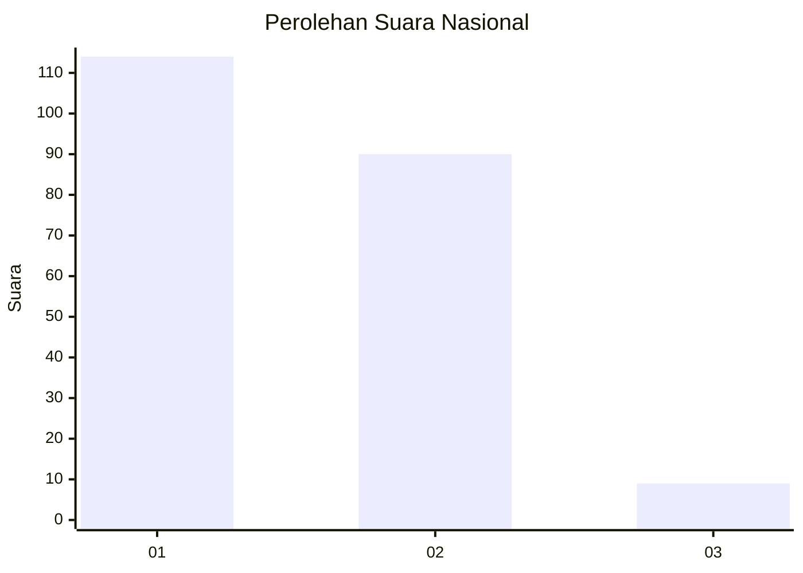
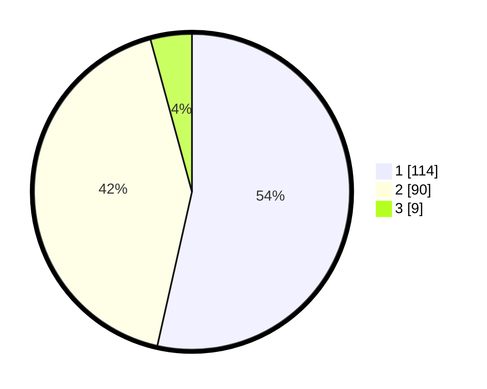

# Hasil

## Grafik

## Tabel

| No. | Nama Paslon    | Suara | Suara (raw) | Persentase |
|:--- |:-------------- | -----:| -----------:| ----------:|
| 1   | ANIES MUHAIMIN | 114   | [114][p-1]  | 53,52      |
| 2   | PRABOWO GIBRAN | 90    | [90][p-2]   | 42,25      |
| 3   | GANJAR MAHFUD  | 9     | [9][p-3]    | 4,23       |

[p-1]: https://github.com/gigit-pemilu/pemilu-2024/blob/main/pilpres/hitung-suara/sub/11-aceh/sub/72-kota-sabang/sub/01-sukakarya/sub/2007-kuta-barat/sub/005-tps/sub/paslon-1.txt
[p-2]: https://github.com/gigit-pemilu/pemilu-2024/blob/main/pilpres/hitung-suara/sub/11-aceh/sub/72-kota-sabang/sub/01-sukakarya/sub/2007-kuta-barat/sub/005-tps/sub/paslon-2.txt
[p-3]: https://github.com/gigit-pemilu/pemilu-2024/blob/main/pilpres/hitung-suara/sub/11-aceh/sub/72-kota-sabang/sub/01-sukakarya/sub/2007-kuta-barat/sub/005-tps/sub/paslon-3.txt

## Foto C Plano

https://sirekap-obj-formc.kpu.go.id/5eac/pemilu/ppwp/11/72/01/20/07/1172012007005-20240218-144926--b66bf53a-4006-4470-a187-cd58ac807c29.jpg

https://sirekap-obj-formc.kpu.go.id/5eac/pemilu/ppwp/11/72/01/20/07/1172012007005-20240218-145053--2fe60aa1-2799-4e36-82ea-c0bf169d47ed.jpg

https://sirekap-obj-formc.kpu.go.id/5eac/pemilu/ppwp/11/72/01/20/07/1172012007005-20240218-145151--fa822014-38d3-4517-a8a6-d09bbe8cd077.jpg

## Metadata

| Key        | Value               |
| ---------- | ------------------- |
| Time Stamp | 2024-02-24 22:31:28 |

