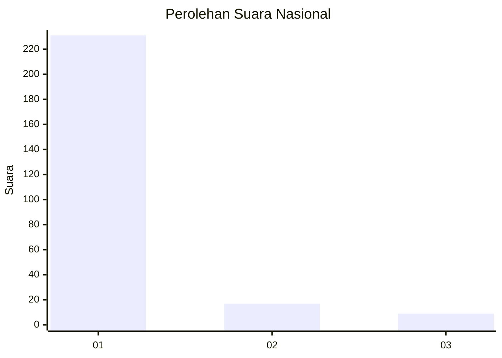
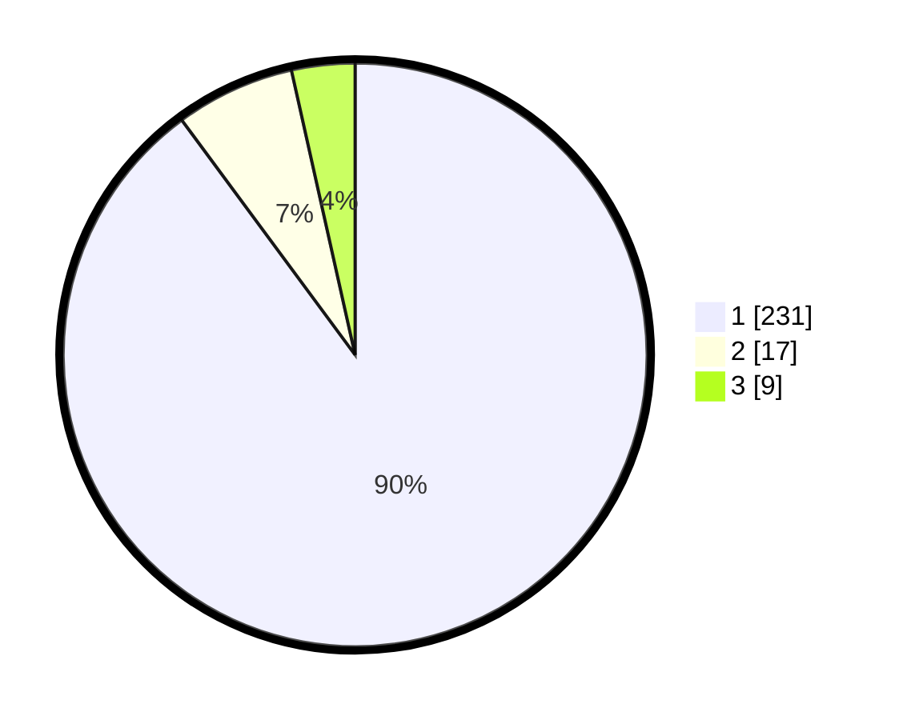

# Hasil

## Grafik

## Tabel

| No. | Nama Paslon    | Suara | Suara (raw) | Persentase |
|:--- |:-------------- | -----:| -----------:| ----------:|
| 1   | ANIES MUHAIMIN | 231   | [231][p-1]  | 89,88      |
| 2   | PRABOWO GIBRAN | 17    | [17][p-2]   | 6,61       |
| 3   | GANJAR MAHFUD  | 9     | [9][p-3]    | 3,50       |

[p-1]: https://github.com/gigit-pemilu/pemilu-2024/blob/main/pilpres/hitung-suara/sub/11-aceh/sub/72-kota-sabang/sub/02-sukajaya/sub/2004-jaboi/sub/001-tps/sub/paslon-1.txt
[p-2]: https://github.com/gigit-pemilu/pemilu-2024/blob/main/pilpres/hitung-suara/sub/11-aceh/sub/72-kota-sabang/sub/02-sukajaya/sub/2004-jaboi/sub/001-tps/sub/paslon-2.txt
[p-3]: https://github.com/gigit-pemilu/pemilu-2024/blob/main/pilpres/hitung-suara/sub/11-aceh/sub/72-kota-sabang/sub/02-sukajaya/sub/2004-jaboi/sub/001-tps/sub/paslon-3.txt

## Foto C Plano

https://sirekap-obj-formc.kpu.go.id/1988/pemilu/ppwp/11/72/02/20/04/1172022004001-20240217-171210--423f3120-00ff-4aae-a0fd-c1f8a8e50000.jpg

https://sirekap-obj-formc.kpu.go.id/1988/pemilu/ppwp/11/72/02/20/04/1172022004001-20240217-171609--f4952119-f46d-4568-bcae-2041eef60b2f.jpg

## Metadata

| Key        | Value               |
| ---------- | ------------------- |
| Time Stamp | 2024-02-25 18:00:00 |

