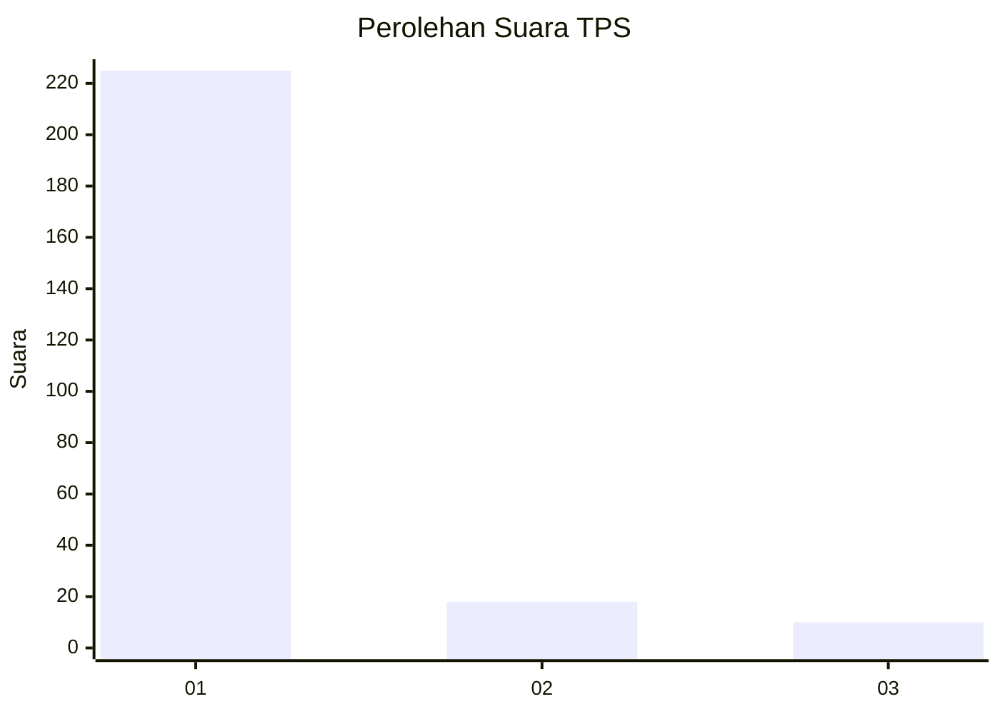
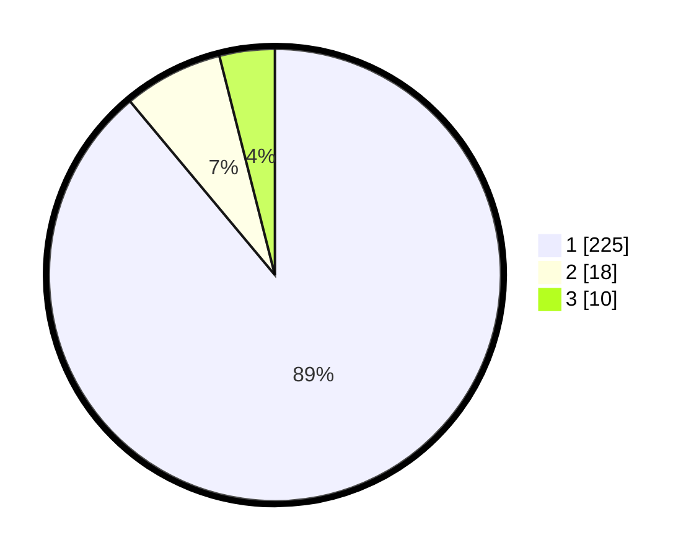

# Hasil

## Grafik

## Tabel

| No. | Nama Paslon    | Suara | Suara (raw) | Persentase |
|:--- |:-------------- | -----:| -----------:| ----------:|
| 1   | ANIES MUHAIMIN | 225   | [225][p-1]  | 88,93      |
| 2   | PRABOWO GIBRAN | 18    | [18][p-2]   | 7,11       |
| 3   | GANJAR MAHFUD  | 10    | [10][p-3]   | 3,95       |

[p-1]: https://github.com/gigit-pemilu/pemilu-2024-11-aceh/blob/main/pilpres/hitung-suara/sub/11-aceh/sub/72-kota-sabang/sub/02-sukajaya/sub/2004-jaboi/sub/002-tps/sub/paslon-1.txt
[p-2]: https://github.com/gigit-pemilu/pemilu-2024-11-aceh/blob/main/pilpres/hitung-suara/sub/11-aceh/sub/72-kota-sabang/sub/02-sukajaya/sub/2004-jaboi/sub/002-tps/sub/paslon-2.txt
[p-3]: https://github.com/gigit-pemilu/pemilu-2024-11-aceh/blob/main/pilpres/hitung-suara/sub/11-aceh/sub/72-kota-sabang/sub/02-sukajaya/sub/2004-jaboi/sub/002-tps/sub/paslon-3.txt

## Foto C Plano

https://sirekap-obj-formc.kpu.go.id/9ba4/pemilu/ppwp/11/72/02/20/04/1172022004002-20240216-132729--7fc7a7da-b634-4418-b6a2-c271526bb18b.jpg

https://sirekap-obj-formc.kpu.go.id/9ba4/pemilu/ppwp/11/72/02/20/04/1172022004002-20240216-132730--96c372cb-c4bf-4429-84e4-1bac4fbf9a10.jpg

https://sirekap-obj-formc.kpu.go.id/9ba4/pemilu/ppwp/11/72/02/20/04/1172022004002-20240216-132729--32bfaddf-07c5-4b1b-9e20-2a6b5ea6468d.jpg

## Metadata

| Key        | Value               |
| ---------- | ------------------- |
| Time Stamp | 2024-02-22 11:00:00 |

## DATA PEMILIH TETAP

Jumlah pemilih dalam DPT: **294**.
 * L: **148**.
 * P: **146**.

## DATA PENGGUNA HAK PILIH

Jumlah pengguna hak pilih dalam DPT: **261**.
 * L: **130**.
 * P: **131**.

Jumlah pengguna hak pilih dalam DPTb: **1**.
 * L: **0**.
 * P: **1**.

Jumlah pengguna hak pilih dalam DPK: **1**.
 * L: **1**.
 * P: **0**.

Jumlah pengguna hak pilih: **263**.
 * L: **131**.
 * P: **132**.

## JUMLAH SUARA SAH DAN TIDAK SAH

JUMLAH SELURUH SUARA SAH: **253**.

JUMLAH SUARA TIDAK SAH: **10**.

JUMLAH SELURUH SUARA SAH DAN SUARA TIDAK SAH: **263**.

