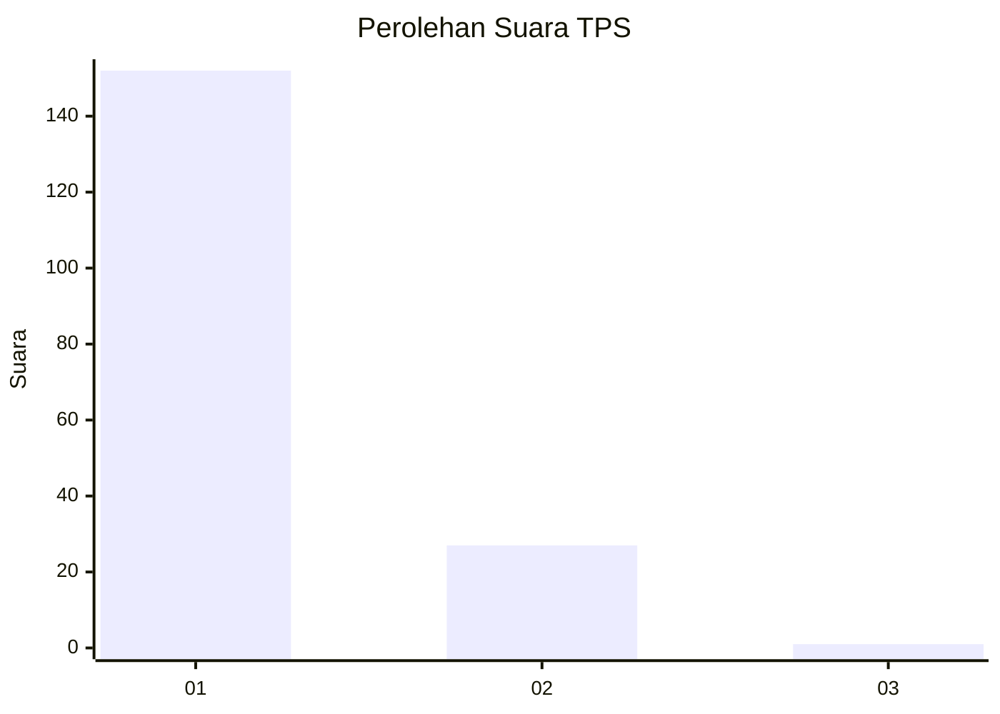
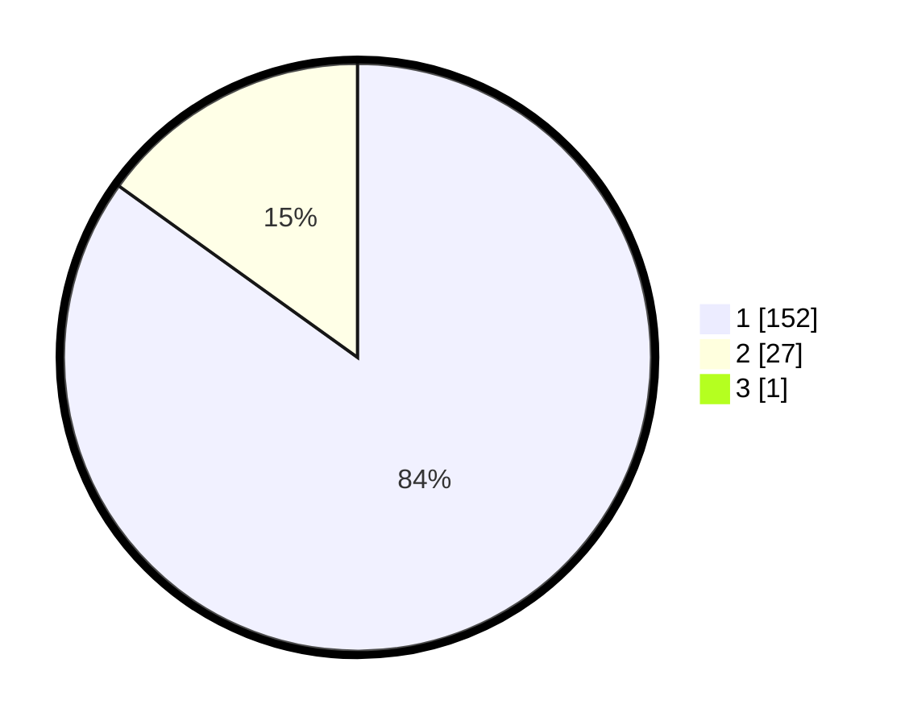

# Hasil

## Grafik

## Tabel

| No. | Nama Paslon    | Suara | Suara (raw) | Persentase |
|:--- |:-------------- | -----:| -----------:| ----------:|
| 1   | ANIES MUHAIMIN | 152   | [152][p-1]  | 84,44      |
| 2   | PRABOWO GIBRAN | 27    | [27][p-2]   | 15,00      |
| 3   | GANJAR MAHFUD  | 1     | [1][p-3]    | 0,56       |

[p-1]: https://github.com/gigit-pemilu/pemilu-2024-11-aceh/blob/main/pilpres/hitung-suara/sub/11-aceh/sub/72-kota-sabang/sub/02-sukajaya/sub/2005-balohan/sub/002-tps/sub/paslon-1.txt
[p-2]: https://github.com/gigit-pemilu/pemilu-2024-11-aceh/blob/main/pilpres/hitung-suara/sub/11-aceh/sub/72-kota-sabang/sub/02-sukajaya/sub/2005-balohan/sub/002-tps/sub/paslon-2.txt
[p-3]: https://github.com/gigit-pemilu/pemilu-2024-11-aceh/blob/main/pilpres/hitung-suara/sub/11-aceh/sub/72-kota-sabang/sub/02-sukajaya/sub/2005-balohan/sub/002-tps/sub/paslon-3.txt

## Foto C Plano

https://sirekap-obj-formc.kpu.go.id/f3c2/pemilu/ppwp/11/72/02/20/05/1172022005002-20240214-200354--bebfde53-e451-4ecd-a2a2-b09e16eed578.jpg

https://sirekap-obj-formc.kpu.go.id/f3c2/pemilu/ppwp/11/72/02/20/05/1172022005002-20240214-200558--084068ef-621a-4ff2-a354-f6e9e227ae59.jpg

https://sirekap-obj-formc.kpu.go.id/f3c2/pemilu/ppwp/11/72/02/20/05/1172022005002-20240214-200702--6516d791-4f10-49ed-9a87-e7e40ab8a249.jpg

## Metadata

| Key        | Value               |
| ---------- | ------------------- |
| Time Stamp | 2024-02-15 19:00:26 |

