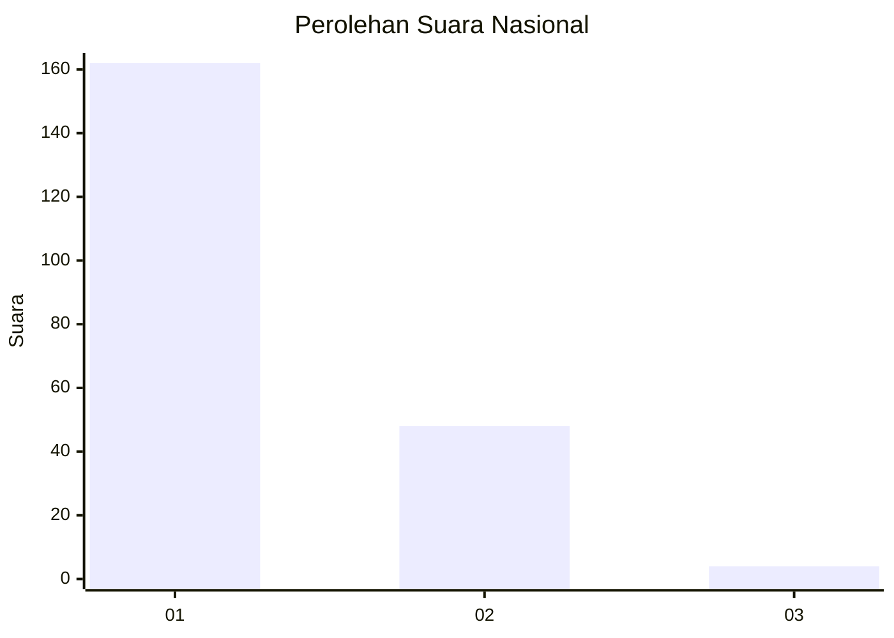
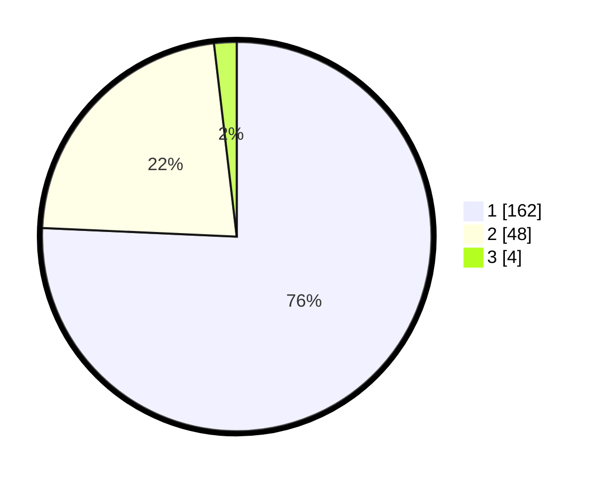

# Hasil

## Grafik

## Tabel

| No. | Nama Paslon    | Suara | Suara (raw) | Persentase |
|:--- |:-------------- | -----:| -----------:| ----------:|
| 1   | ANIES MUHAIMIN | 162   | [162][p-1]  | 75,70      |
| 2   | PRABOWO GIBRAN | 48    | [48][p-2]   | 22,43      |
| 3   | GANJAR MAHFUD  | 4     | [4][p-3]    | 1,87       |

[p-1]: https://github.com/gigit-pemilu/pemilu-2024/blob/main/pilpres/hitung-suara/sub/11-aceh/sub/72-kota-sabang/sub/02-sukajaya/sub/2005-balohan/sub/004-tps/sub/paslon-1.txt
[p-2]: https://github.com/gigit-pemilu/pemilu-2024/blob/main/pilpres/hitung-suara/sub/11-aceh/sub/72-kota-sabang/sub/02-sukajaya/sub/2005-balohan/sub/004-tps/sub/paslon-2.txt
[p-3]: https://github.com/gigit-pemilu/pemilu-2024/blob/main/pilpres/hitung-suara/sub/11-aceh/sub/72-kota-sabang/sub/02-sukajaya/sub/2005-balohan/sub/004-tps/sub/paslon-3.txt

## Foto C Plano

https://sirekap-obj-formc.kpu.go.id/ad9f/pemilu/ppwp/11/72/02/20/05/1172022005004-20240214-204540--c59364e1-2d5b-48fa-9e6b-42a9ee1007a5.jpg

https://sirekap-obj-formc.kpu.go.id/ad9f/pemilu/ppwp/11/72/02/20/05/1172022005004-20240214-203750--fb288697-ead2-46dd-9887-9978b4298f54.jpg

https://sirekap-obj-formc.kpu.go.id/ad9f/pemilu/ppwp/11/72/02/20/05/1172022005004-20240214-203935--994f4d3e-76a8-4601-9e71-74834c8520c8.jpg

## Metadata

| Key        | Value               |
| ---------- | ------------------- |
| Time Stamp | 2024-02-15 19:00:26 |

