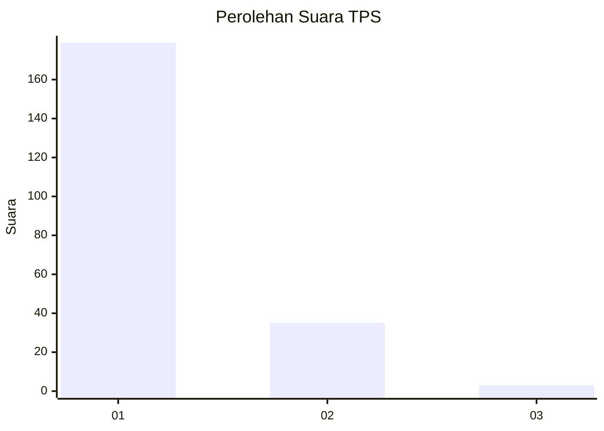
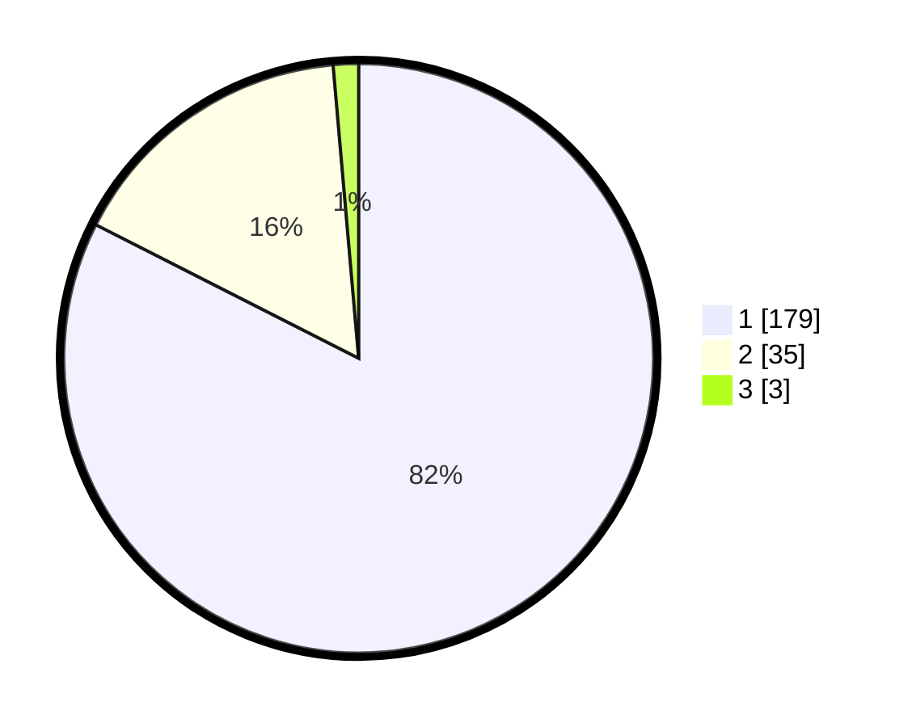

# Hasil

## Grafik

## Tabel

| No. | Nama Paslon    | Suara | Suara (raw) | Persentase |
|:--- |:-------------- | -----:| -----------:| ----------:|
| 1   | ANIES MUHAIMIN | 179   | [179][p-1]  | 82,49      |
| 2   | PRABOWO GIBRAN | 35    | [35][p-2]   | 16,13      |
| 3   | GANJAR MAHFUD  | 3     | [3][p-3]    | 1,38       |

[p-1]: https://github.com/gigit-pemilu/pemilu-2024-11-aceh/blob/main/pilpres/hitung-suara/sub/11-aceh/sub/72-kota-sabang/sub/02-sukajaya/sub/2007-cot-ba-u/sub/012-tps/sub/paslon-1.txt
[p-2]: https://github.com/gigit-pemilu/pemilu-2024-11-aceh/blob/main/pilpres/hitung-suara/sub/11-aceh/sub/72-kota-sabang/sub/02-sukajaya/sub/2007-cot-ba-u/sub/012-tps/sub/paslon-2.txt
[p-3]: https://github.com/gigit-pemilu/pemilu-2024-11-aceh/blob/main/pilpres/hitung-suara/sub/11-aceh/sub/72-kota-sabang/sub/02-sukajaya/sub/2007-cot-ba-u/sub/012-tps/sub/paslon-3.txt

## Foto C Plano

https://sirekap-obj-formc.kpu.go.id/9e38/pemilu/ppwp/11/72/02/20/07/1172022007012-20240214-202713--dc9fcdfc-5961-470b-b821-a863b67b5103.jpg

https://sirekap-obj-formc.kpu.go.id/9e38/pemilu/ppwp/11/72/02/20/07/1172022007012-20240214-202609--51b94906-371e-4f6d-8d6a-87b026e95777.jpg

https://sirekap-obj-formc.kpu.go.id/9e38/pemilu/ppwp/11/72/02/20/07/1172022007012-20240214-194143--f9522af2-cb0f-498b-bfe2-c52b01c351b9.jpg

## Metadata

| Key        | Value               |
| ---------- | ------------------- |
| Time Stamp | 2024-02-25 19:00:00 |

