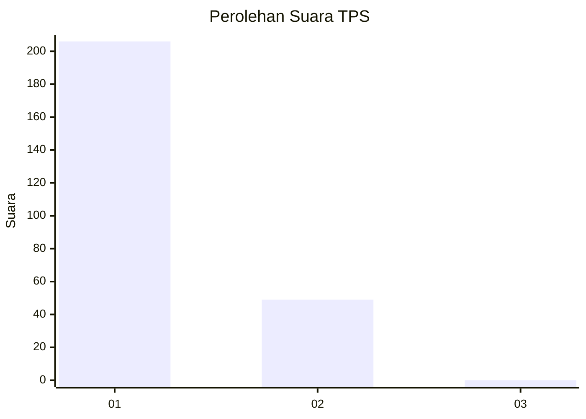
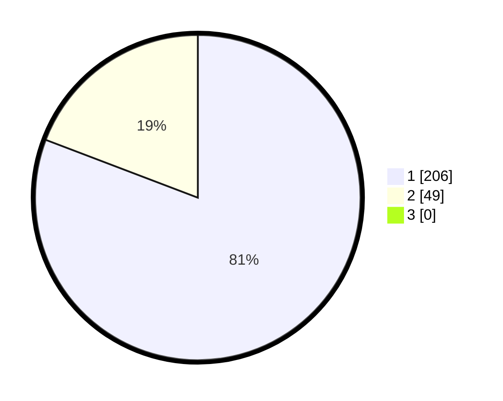

# Hasil

## Grafik

## Tabel

| No. | Nama Paslon    | Suara | Suara (raw) | Persentase |
|:--- |:-------------- | -----:| -----------:| ----------:|
| 1   | ANIES MUHAIMIN | 206   | [206][p-1]  | 80,78      |
| 2   | PRABOWO GIBRAN | 49    | [49][p-2]   | 19,22      |
| 3   | GANJAR MAHFUD  | 0     | [0][p-3]    | 0,00       |

[p-1]: https://github.com/gigit-pemilu/pemilu-2024-11-aceh/blob/main/pilpres/hitung-suara/sub/11-aceh/sub/72-kota-sabang/sub/02-sukajaya/sub/2007-cot-ba-u/sub/019-tps/sub/paslon-1.txt
[p-2]: https://github.com/gigit-pemilu/pemilu-2024-11-aceh/blob/main/pilpres/hitung-suara/sub/11-aceh/sub/72-kota-sabang/sub/02-sukajaya/sub/2007-cot-ba-u/sub/019-tps/sub/paslon-2.txt
[p-3]: https://github.com/gigit-pemilu/pemilu-2024-11-aceh/blob/main/pilpres/hitung-suara/sub/11-aceh/sub/72-kota-sabang/sub/02-sukajaya/sub/2007-cot-ba-u/sub/019-tps/sub/paslon-3.txt

## Foto C Plano

https://sirekap-obj-formc.kpu.go.id/d720/pemilu/ppwp/11/72/02/20/07/1172022007019-20240214-203526--a6af5bc6-976a-41a2-89d6-96e349f1055c.jpg

https://sirekap-obj-formc.kpu.go.id/d720/pemilu/ppwp/11/72/02/20/07/1172022007019-20240214-203632--50557e46-c9d9-4a97-8a5b-93831538faba.jpg

https://sirekap-obj-formc.kpu.go.id/d720/pemilu/ppwp/11/72/02/20/07/1172022007019-20240214-203715--02cbae67-9b6c-4ebb-aef2-fac6f7a5b1f6.jpg

## Metadata

| Key        | Value               |
| ---------- | ------------------- |
| Time Stamp | 2024-02-15 22:40:13 |

