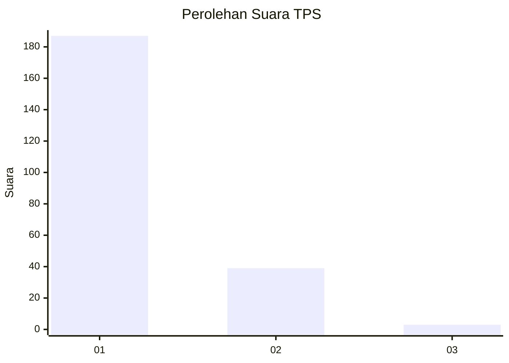
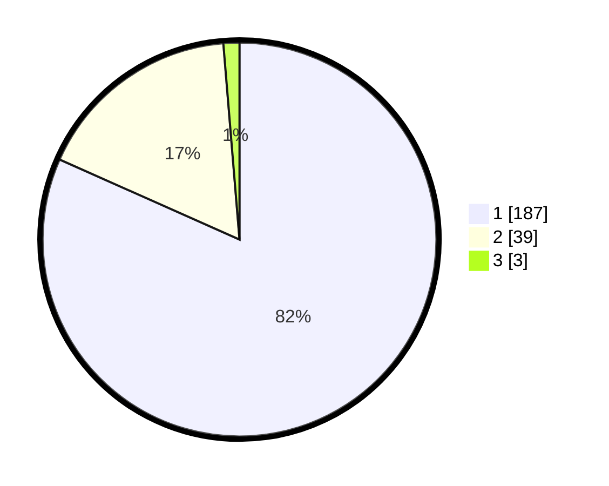

# Hasil

## Grafik

## Tabel

| No. | Nama Paslon    | Suara | Suara (raw) | Persentase |
|:--- |:-------------- | -----:| -----------:| ----------:|
| 1   | ANIES MUHAIMIN | 187   | [187][p-1]  | 81,66      |
| 2   | PRABOWO GIBRAN | 39    | [39][p-2]   | 17,03      |
| 3   | GANJAR MAHFUD  | 3     | [3][p-3]    | 1,31       |

[p-1]: https://github.com/gigit-pemilu/pemilu-2024-11-aceh/blob/main/pilpres/hitung-suara/sub/11-aceh/sub/72-kota-sabang/sub/02-sukajaya/sub/2008-ie-meulee/sub/001-tps/sub/paslon-1.txt
[p-2]: https://github.com/gigit-pemilu/pemilu-2024-11-aceh/blob/main/pilpres/hitung-suara/sub/11-aceh/sub/72-kota-sabang/sub/02-sukajaya/sub/2008-ie-meulee/sub/001-tps/sub/paslon-2.txt
[p-3]: https://github.com/gigit-pemilu/pemilu-2024-11-aceh/blob/main/pilpres/hitung-suara/sub/11-aceh/sub/72-kota-sabang/sub/02-sukajaya/sub/2008-ie-meulee/sub/001-tps/sub/paslon-3.txt

## Foto C Plano

https://sirekap-obj-formc.kpu.go.id/9341/pemilu/ppwp/11/72/02/20/08/1172022008001-20240214-220051--b6a0ea6c-bfbc-4ad9-be4e-133b0d90fb35.jpg

https://sirekap-obj-formc.kpu.go.id/9341/pemilu/ppwp/11/72/02/20/08/1172022008001-20240214-220501--180d38a5-6b64-4795-8c4b-f4353518b251.jpg

https://sirekap-obj-formc.kpu.go.id/9341/pemilu/ppwp/11/72/02/20/08/1172022008001-20240214-220804--3f929a85-f90b-49d9-86e8-28fe3f067276.jpg

## Metadata

| Key        | Value               |
| ---------- | ------------------- |
| Time Stamp | 2024-02-15 23:29:50 |

