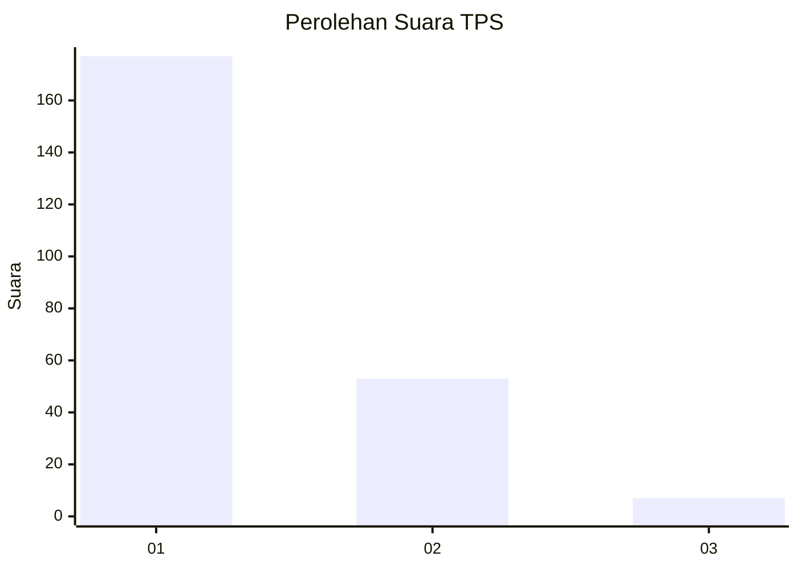
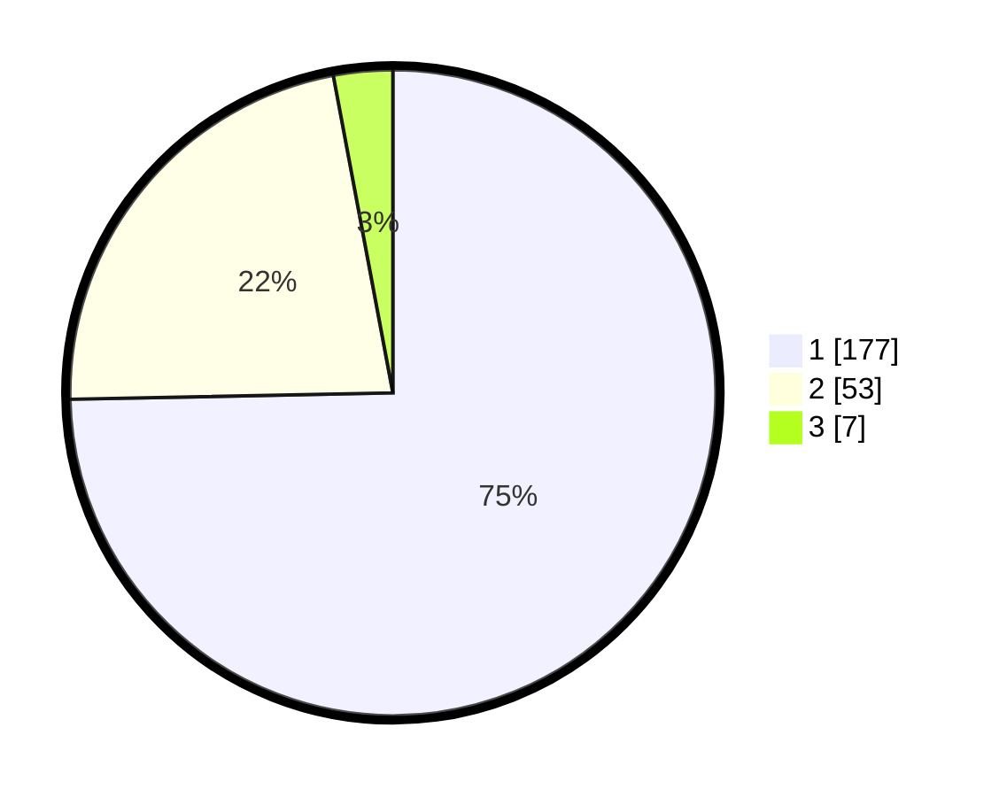

# Hasil

## Grafik

## Tabel

| No. | Nama Paslon    | Suara | Suara (raw) | Persentase |
|:--- |:-------------- | -----:| -----------:| ----------:|
| 1   | ANIES MUHAIMIN | 177   | [177][p-1]  | 74,68      |
| 2   | PRABOWO GIBRAN | 53    | [53][p-2]   | 22,36      |
| 3   | GANJAR MAHFUD  | 7     | [7][p-3]    | 2,95       |

[p-1]: https://github.com/gigit-pemilu/pemilu-2024-11-aceh/blob/main/pilpres/hitung-suara/sub/11-aceh/sub/72-kota-sabang/sub/02-sukajaya/sub/2008-ie-meulee/sub/002-tps/sub/paslon-1.txt
[p-2]: https://github.com/gigit-pemilu/pemilu-2024-11-aceh/blob/main/pilpres/hitung-suara/sub/11-aceh/sub/72-kota-sabang/sub/02-sukajaya/sub/2008-ie-meulee/sub/002-tps/sub/paslon-2.txt
[p-3]: https://github.com/gigit-pemilu/pemilu-2024-11-aceh/blob/main/pilpres/hitung-suara/sub/11-aceh/sub/72-kota-sabang/sub/02-sukajaya/sub/2008-ie-meulee/sub/002-tps/sub/paslon-3.txt

## Foto C Plano

https://sirekap-obj-formc.kpu.go.id/1dc0/pemilu/ppwp/11/72/02/20/08/1172022008002-20240220-121018--eb48543f-21d3-41f9-bbb9-dea84dd93ca8.jpg

https://sirekap-obj-formc.kpu.go.id/1dc0/pemilu/ppwp/11/72/02/20/08/1172022008002-20240214-213651--c7606ca7-cf2d-4465-b2a7-b636334efec4.jpg

https://sirekap-obj-formc.kpu.go.id/1dc0/pemilu/ppwp/11/72/02/20/08/1172022008002-20240214-213841--9908457d-7334-42d5-a11f-af232c1bc6d9.jpg

## Metadata

| Key        | Value               |
| ---------- | ------------------- |
| Time Stamp | 2024-02-20 13:00:00 |

