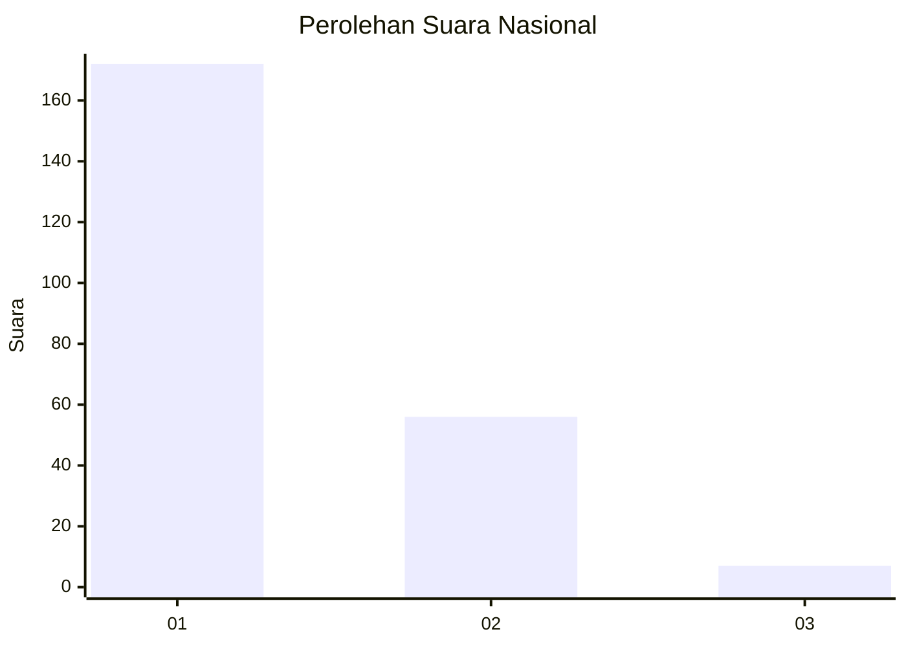
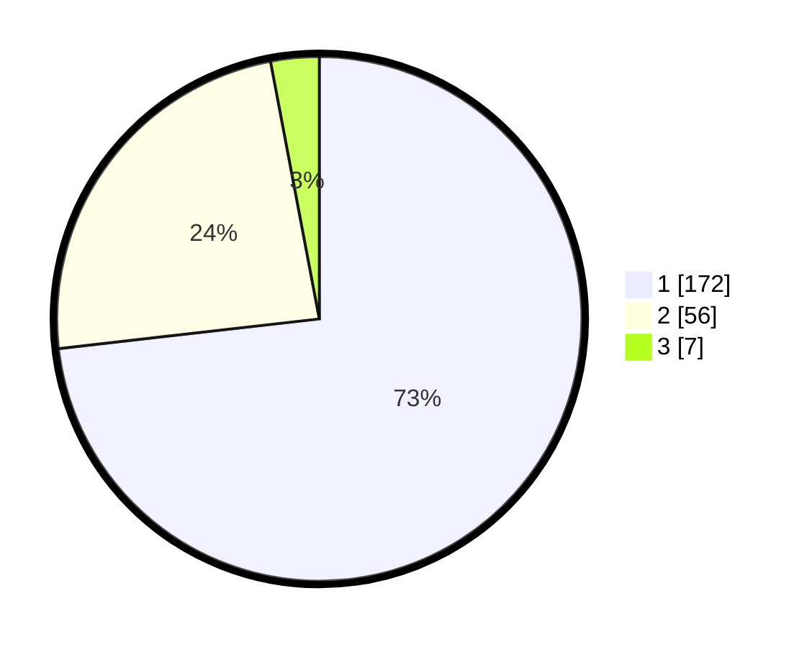

# Hasil

## Grafik

## Tabel

| No. | Nama Paslon    | Suara | Suara (raw) | Persentase |
|:--- |:-------------- | -----:| -----------:| ----------:|
| 1   | ANIES MUHAIMIN | 172   | [172][p-1]  | 73,19      |
| 2   | PRABOWO GIBRAN | 56    | [56][p-2]   | 23,83      |
| 3   | GANJAR MAHFUD  | 7     | [7][p-3]    | 2,98       |

[p-1]: https://github.com/gigit-pemilu/pemilu-2024/blob/main/pilpres/hitung-suara/sub/11-aceh/sub/72-kota-sabang/sub/02-sukajaya/sub/2008-ie-meulee/sub/004-tps/sub/paslon-1.txt
[p-2]: https://github.com/gigit-pemilu/pemilu-2024/blob/main/pilpres/hitung-suara/sub/11-aceh/sub/72-kota-sabang/sub/02-sukajaya/sub/2008-ie-meulee/sub/004-tps/sub/paslon-2.txt
[p-3]: https://github.com/gigit-pemilu/pemilu-2024/blob/main/pilpres/hitung-suara/sub/11-aceh/sub/72-kota-sabang/sub/02-sukajaya/sub/2008-ie-meulee/sub/004-tps/sub/paslon-3.txt

## Foto C Plano

https://sirekap-obj-formc.kpu.go.id/be45/pemilu/ppwp/11/72/02/20/08/1172022008004-20240215-110858--2c9da3c6-5c14-4af5-b4e0-c9d2b7d98255.jpg

https://sirekap-obj-formc.kpu.go.id/be45/pemilu/ppwp/11/72/02/20/08/1172022008004-20240215-110951--b91fa181-d3b2-47f2-81cb-0ff418da4c3d.jpg

https://sirekap-obj-formc.kpu.go.id/be45/pemilu/ppwp/11/72/02/20/08/1172022008004-20240215-111047--62339519-b61f-4486-8a09-bcd207a8096b.jpg

## Metadata

| Key        | Value               |
| ---------- | ------------------- |
| Time Stamp | 2024-02-15 23:29:50 |

