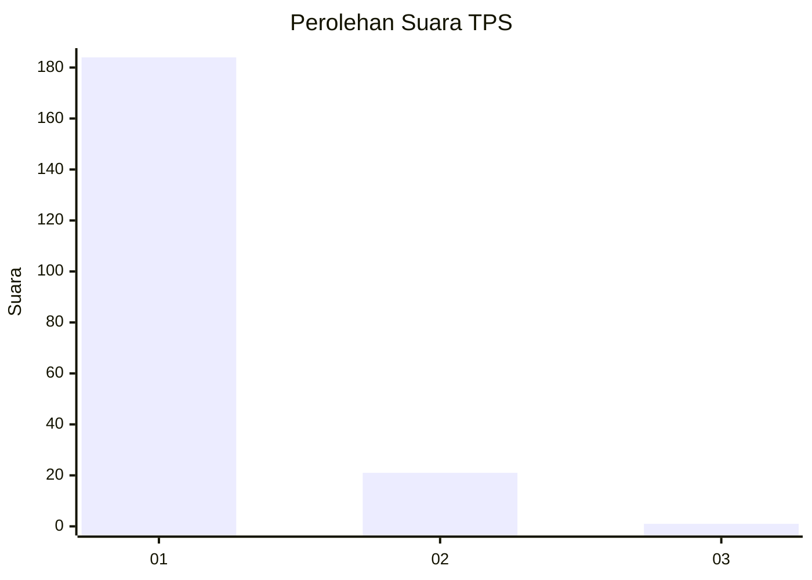
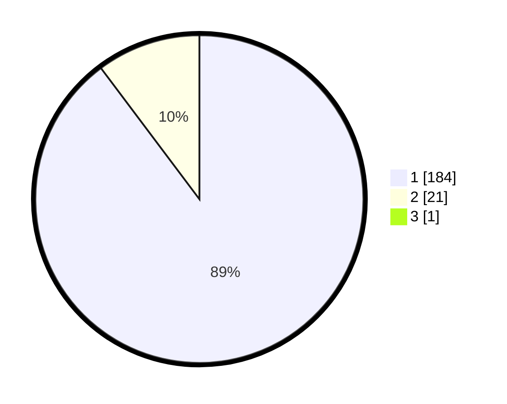

# Hasil

## Grafik

## Tabel

| No. | Nama Paslon    | Suara | Suara (raw) | Persentase |
|:--- |:-------------- | -----:| -----------:| ----------:|
| 1   | ANIES MUHAIMIN | 184   | [184][p-1]  | 89,32      |
| 2   | PRABOWO GIBRAN | 21    | [21][p-2]   | 10,19      |
| 3   | GANJAR MAHFUD  | 1     | [1][p-3]    | 0,49       |

[p-1]: https://github.com/gigit-pemilu/pemilu-2024-11-aceh/blob/main/pilpres/hitung-suara/sub/11-aceh/sub/72-kota-sabang/sub/03-sukamakmue/sub/2001-iboih/sub/001-tps/sub/paslon-1.txt
[p-2]: https://github.com/gigit-pemilu/pemilu-2024-11-aceh/blob/main/pilpres/hitung-suara/sub/11-aceh/sub/72-kota-sabang/sub/03-sukamakmue/sub/2001-iboih/sub/001-tps/sub/paslon-2.txt
[p-3]: https://github.com/gigit-pemilu/pemilu-2024-11-aceh/blob/main/pilpres/hitung-suara/sub/11-aceh/sub/72-kota-sabang/sub/03-sukamakmue/sub/2001-iboih/sub/001-tps/sub/paslon-3.txt

## Foto C Plano

https://sirekap-obj-formc.kpu.go.id/ccbf/pemilu/ppwp/11/72/03/20/01/1172032001001-20240217-111253--c6f9f8e0-1ccb-46d2-9b61-04151d02aa6e.jpg

https://sirekap-obj-formc.kpu.go.id/ccbf/pemilu/ppwp/11/72/03/20/01/1172032001001-20240215-051839--b20ecfa2-8164-4c90-983e-c1eaae7086ae.jpg

https://sirekap-obj-formc.kpu.go.id/ccbf/pemilu/ppwp/11/72/03/20/01/1172032001001-20240215-052204--39222088-4164-4fc8-9f0e-900c43875c2a.jpg

## Metadata

| Key        | Value               |
| ---------- | ------------------- |
| Time Stamp | 2024-02-17 11:30:03 |

