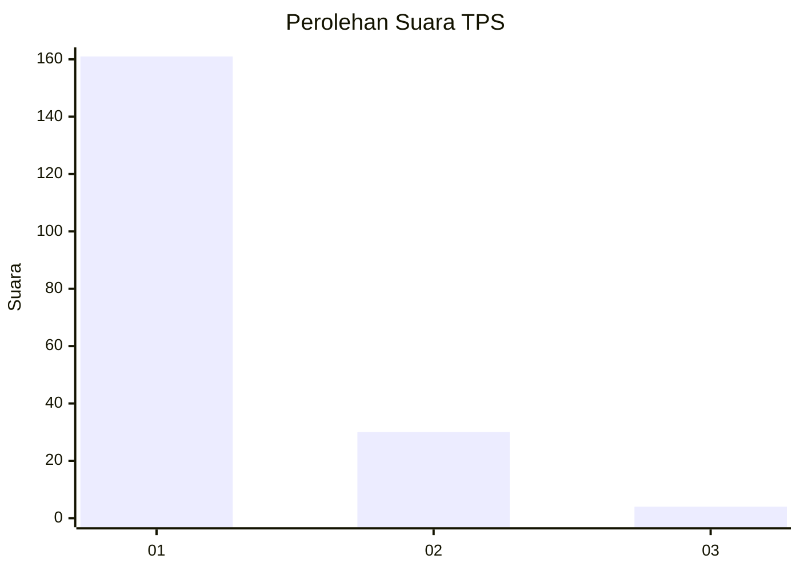
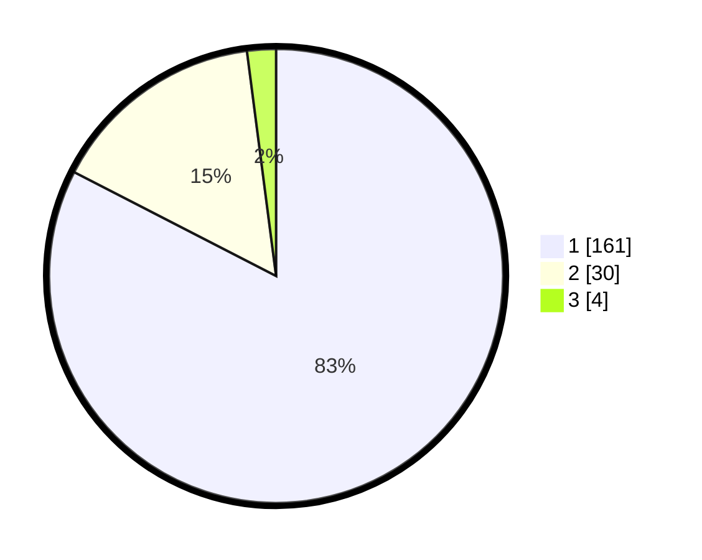

# Hasil

## Grafik

## Tabel

| No. | Nama Paslon    | Suara | Suara (raw) | Persentase |
|:--- |:-------------- | -----:| -----------:| ----------:|
| 1   | ANIES MUHAIMIN | 161   | [161][p-1]  | 82,56      |
| 2   | PRABOWO GIBRAN | 30    | [30][p-2]   | 15,38      |
| 3   | GANJAR MAHFUD  | 4     | [4][p-3]    | 2,05       |

[p-1]: https://github.com/gigit-pemilu/pemilu-2024-11-aceh/blob/main/pilpres/hitung-suara/sub/11-aceh/sub/72-kota-sabang/sub/03-sukamakmue/sub/2001-iboih/sub/002-tps/sub/paslon-1.txt
[p-2]: https://github.com/gigit-pemilu/pemilu-2024-11-aceh/blob/main/pilpres/hitung-suara/sub/11-aceh/sub/72-kota-sabang/sub/03-sukamakmue/sub/2001-iboih/sub/002-tps/sub/paslon-2.txt
[p-3]: https://github.com/gigit-pemilu/pemilu-2024-11-aceh/blob/main/pilpres/hitung-suara/sub/11-aceh/sub/72-kota-sabang/sub/03-sukamakmue/sub/2001-iboih/sub/002-tps/sub/paslon-3.txt

## Foto C Plano

https://sirekap-obj-formc.kpu.go.id/705e/pemilu/ppwp/11/72/03/20/01/1172032001002-20240216-205908--3f3037e5-3612-4050-819d-c1fad0a7843d.jpg

https://sirekap-obj-formc.kpu.go.id/705e/pemilu/ppwp/11/72/03/20/01/1172032001002-20240216-210053--0cda670a-2a84-4a01-8cbc-652c42aa65b6.jpg

https://sirekap-obj-formc.kpu.go.id/705e/pemilu/ppwp/11/72/03/20/01/1172032001002-20240216-210236--174b2e9b-95ae-4ea0-a3a5-9d0348cfd795.jpg

## Metadata

| Key        | Value               |
| ---------- | ------------------- |
| Time Stamp | 2024-02-25 12:00:00 |

