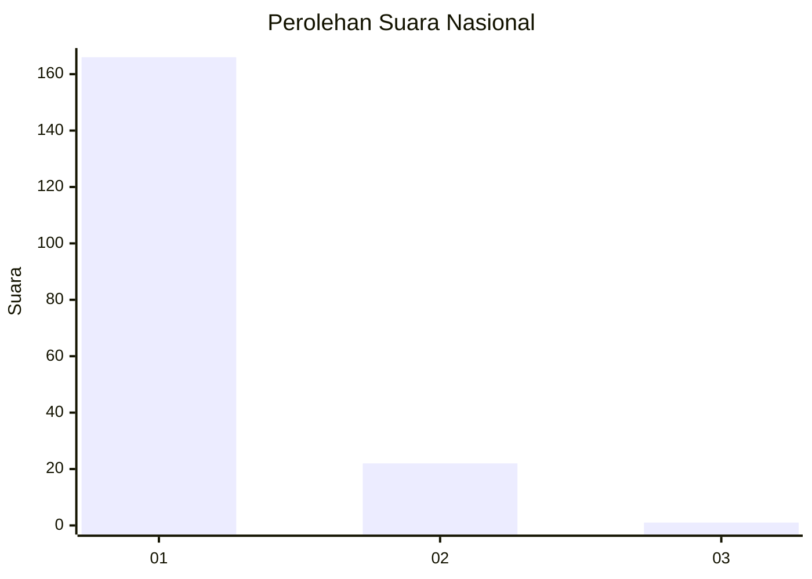
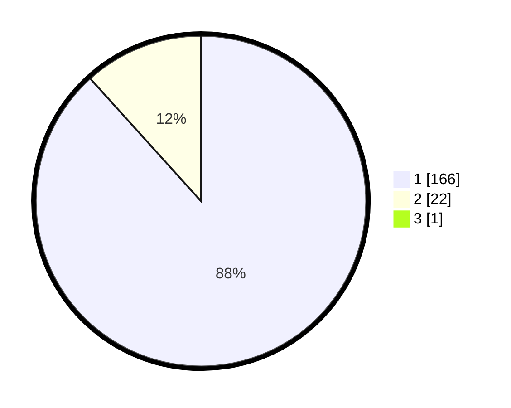

# Hasil

## Grafik

## Tabel

| No. | Nama Paslon    | Suara | Suara (raw) | Persentase |
|:--- |:-------------- | -----:| -----------:| ----------:|
| 1   | ANIES MUHAIMIN | 166   | [166][p-1]  | 87,83      |
| 2   | PRABOWO GIBRAN | 22    | [22][p-2]   | 11,64      |
| 3   | GANJAR MAHFUD  | 1     | [1][p-3]    | 0,53       |

[p-1]: https://github.com/gigit-pemilu/pemilu-2024/blob/main/pilpres/hitung-suara/sub/11-aceh/sub/72-kota-sabang/sub/03-sukamakmue/sub/2001-iboih/sub/003-tps/sub/paslon-1.txt
[p-2]: https://github.com/gigit-pemilu/pemilu-2024/blob/main/pilpres/hitung-suara/sub/11-aceh/sub/72-kota-sabang/sub/03-sukamakmue/sub/2001-iboih/sub/003-tps/sub/paslon-2.txt
[p-3]: https://github.com/gigit-pemilu/pemilu-2024/blob/main/pilpres/hitung-suara/sub/11-aceh/sub/72-kota-sabang/sub/03-sukamakmue/sub/2001-iboih/sub/003-tps/sub/paslon-3.txt

## Foto C Plano

https://sirekap-obj-formc.kpu.go.id/78d8/pemilu/ppwp/11/72/03/20/01/1172032001003-20240216-204905--989232d8-1251-450c-b0ef-2b9bf9bbe94f.jpg

https://sirekap-obj-formc.kpu.go.id/78d8/pemilu/ppwp/11/72/03/20/01/1172032001003-20240216-205020--94c46cd0-de1d-44ce-ac6a-d577b2401eb3.jpg

https://sirekap-obj-formc.kpu.go.id/78d8/pemilu/ppwp/11/72/03/20/01/1172032001003-20240216-205103--1c510457-d33d-413a-9a3f-309fef58ca0f.jpg

## Metadata

| Key        | Value               |
| ---------- | ------------------- |
| Time Stamp | 2024-02-24 22:31:28 |

