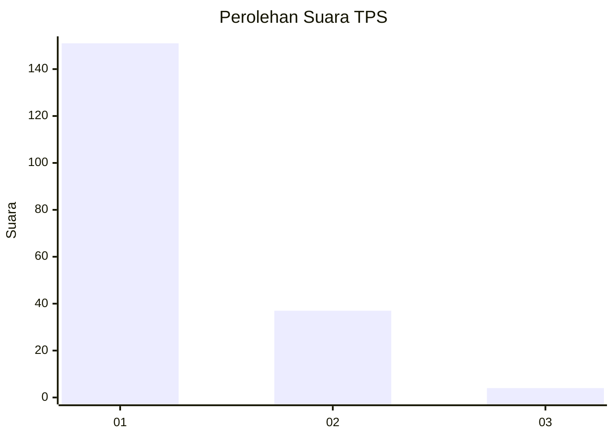
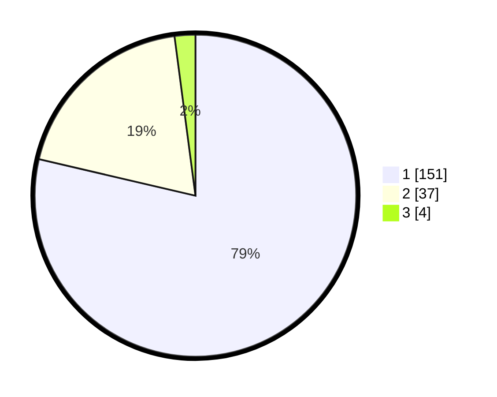

# Hasil

## Grafik

## Tabel

| No. | Nama Paslon    | Suara | Suara (raw) | Persentase |
|:--- |:-------------- | -----:| -----------:| ----------:|
| 1   | ANIES MUHAIMIN | 151   | [151][p-1]  | 78,65      |
| 2   | PRABOWO GIBRAN | 37    | [37][p-2]   | 19,27      |
| 3   | GANJAR MAHFUD  | 4     | [4][p-3]    | 2,08       |

[p-1]: https://github.com/gigit-pemilu/pemilu-2024-11-aceh/blob/main/pilpres/hitung-suara/sub/11-aceh/sub/72-kota-sabang/sub/03-sukamakmue/sub/2001-iboih/sub/004-tps/sub/paslon-1.txt
[p-2]: https://github.com/gigit-pemilu/pemilu-2024-11-aceh/blob/main/pilpres/hitung-suara/sub/11-aceh/sub/72-kota-sabang/sub/03-sukamakmue/sub/2001-iboih/sub/004-tps/sub/paslon-2.txt
[p-3]: https://github.com/gigit-pemilu/pemilu-2024-11-aceh/blob/main/pilpres/hitung-suara/sub/11-aceh/sub/72-kota-sabang/sub/03-sukamakmue/sub/2001-iboih/sub/004-tps/sub/paslon-3.txt

## Foto C Plano

https://sirekap-obj-formc.kpu.go.id/669c/pemilu/ppwp/11/72/03/20/01/1172032001004-20240216-210903--abfc6458-e029-4b88-900c-4ac98a591cdb.jpg

https://sirekap-obj-formc.kpu.go.id/669c/pemilu/ppwp/11/72/03/20/01/1172032001004-20240216-211059--bf25d690-984d-427e-bac0-6248c10c3dd6.jpg

https://sirekap-obj-formc.kpu.go.id/669c/pemilu/ppwp/11/72/03/20/01/1172032001004-20240216-211138--7c026b84-3b34-444c-999f-feab1e3cac0b.jpg

## Metadata

| Key        | Value               |
| ---------- | ------------------- |
| Time Stamp | 2024-02-24 22:31:28 |

