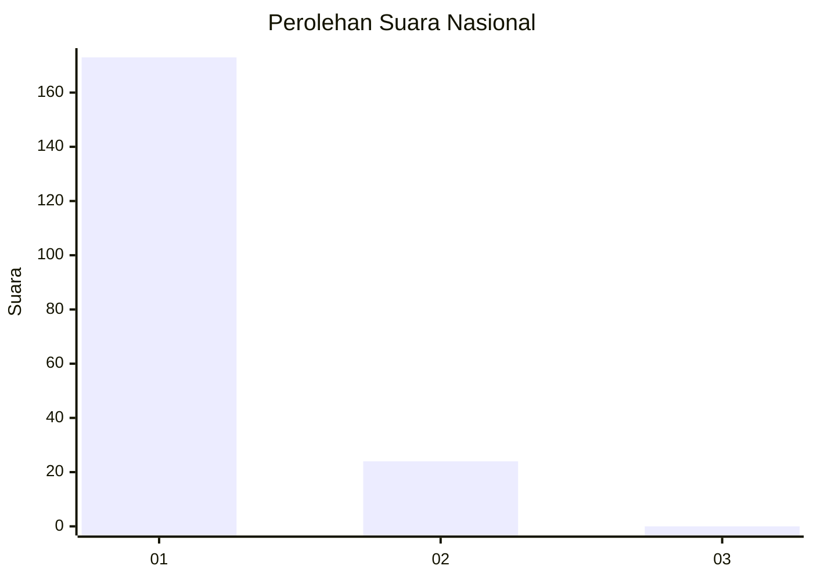
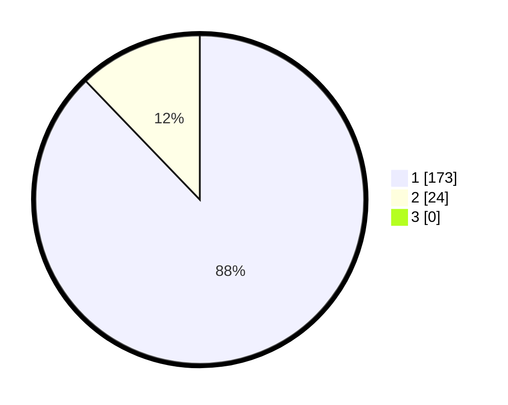

# Hasil

## Grafik

## Tabel

| No. | Nama Paslon    | Suara | Suara (raw) | Persentase |
|:--- |:-------------- | -----:| -----------:| ----------:|
| 1   | ANIES MUHAIMIN | 173   | [173][p-1]  | 87,82      |
| 2   | PRABOWO GIBRAN | 24    | [24][p-2]   | 12,18      |
| 3   | GANJAR MAHFUD  | 0     | [0][p-3]    | 0,00       |

[p-1]: https://github.com/gigit-pemilu/pemilu-2024/blob/main/pilpres/hitung-suara/sub/11-aceh/sub/72-kota-sabang/sub/03-sukamakmue/sub/2003-paya-seunara/sub/004-tps/sub/paslon-1.txt
[p-2]: https://github.com/gigit-pemilu/pemilu-2024/blob/main/pilpres/hitung-suara/sub/11-aceh/sub/72-kota-sabang/sub/03-sukamakmue/sub/2003-paya-seunara/sub/004-tps/sub/paslon-2.txt
[p-3]: https://github.com/gigit-pemilu/pemilu-2024/blob/main/pilpres/hitung-suara/sub/11-aceh/sub/72-kota-sabang/sub/03-sukamakmue/sub/2003-paya-seunara/sub/004-tps/sub/paslon-3.txt

## Foto C Plano

https://sirekap-obj-formc.kpu.go.id/dde4/pemilu/ppwp/11/72/03/20/03/1172032003004-20240215-113412--adb61315-b833-4c62-ae1f-54296addd869.jpg

https://sirekap-obj-formc.kpu.go.id/dde4/pemilu/ppwp/11/72/03/20/03/1172032003004-20240215-113459--4b7d405f-558f-490d-8e1e-bc937ca049c8.jpg

https://sirekap-obj-formc.kpu.go.id/dde4/pemilu/ppwp/11/72/03/20/03/1172032003004-20240215-113526--be167afb-ebc2-40bb-8c4e-78cb201c5555.jpg

## Metadata

| Key        | Value               |
| ---------- | ------------------- |
| Time Stamp | 2024-02-16 06:30:27 |

