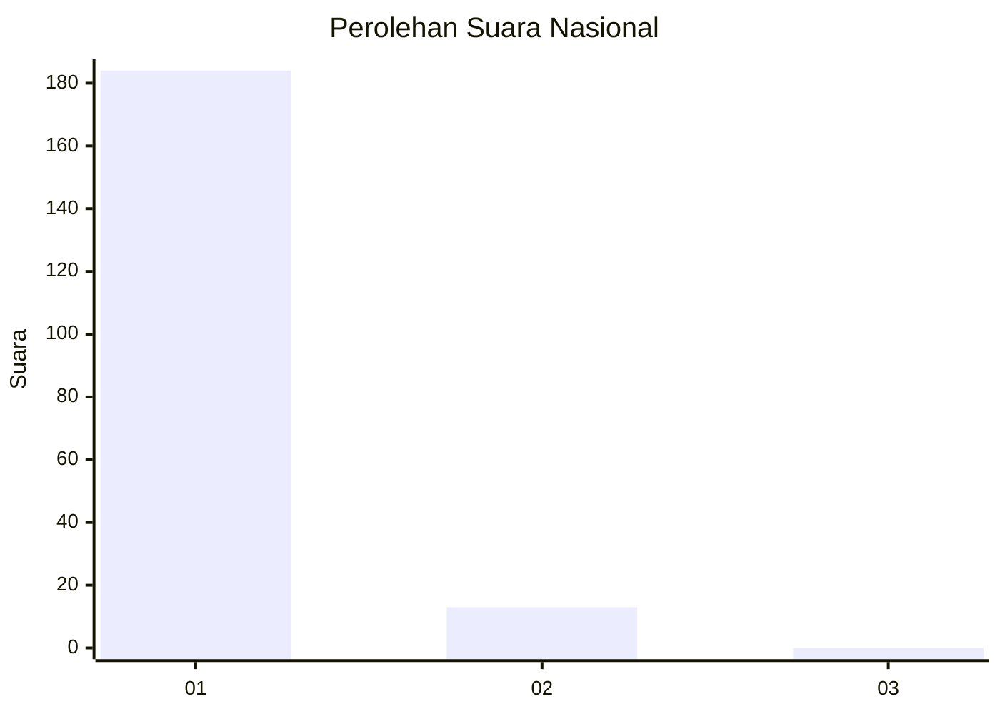
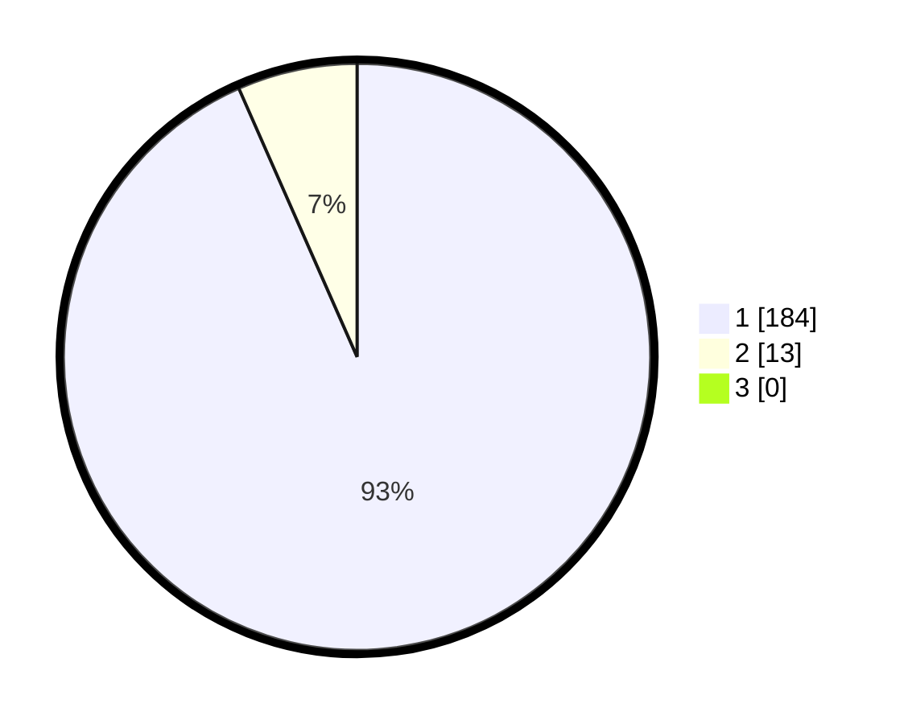

# Hasil

## Grafik

## Tabel

| No. | Nama Paslon    | Suara | Suara (raw) | Persentase |
|:--- |:-------------- | -----:| -----------:| ----------:|
| 1   | ANIES MUHAIMIN | 184   | [184][p-1]  | 93,40      |
| 2   | PRABOWO GIBRAN | 13    | [13][p-2]   | 6,60       |
| 3   | GANJAR MAHFUD  | 0     | [0][p-3]    | 0,00       |

[p-1]: https://github.com/gigit-pemilu/pemilu-2024/blob/main/pilpres/hitung-suara/sub/11-aceh/sub/72-kota-sabang/sub/03-sukamakmue/sub/2005-keunekai/sub/001-tps/sub/paslon-1.txt
[p-2]: https://github.com/gigit-pemilu/pemilu-2024/blob/main/pilpres/hitung-suara/sub/11-aceh/sub/72-kota-sabang/sub/03-sukamakmue/sub/2005-keunekai/sub/001-tps/sub/paslon-2.txt
[p-3]: https://github.com/gigit-pemilu/pemilu-2024/blob/main/pilpres/hitung-suara/sub/11-aceh/sub/72-kota-sabang/sub/03-sukamakmue/sub/2005-keunekai/sub/001-tps/sub/paslon-3.txt

## Foto C Plano

https://sirekap-obj-formc.kpu.go.id/eb5a/pemilu/ppwp/11/72/03/20/05/1172032005001-20240214-212629--775a1caa-1dbe-4e88-a2c8-1aec73c7e6f0.jpg

https://sirekap-obj-formc.kpu.go.id/eb5a/pemilu/ppwp/11/72/03/20/05/1172032005001-20240214-210049--050cb8d3-4fcb-4094-9b35-08fece78a641.jpg

https://sirekap-obj-formc.kpu.go.id/eb5a/pemilu/ppwp/11/72/03/20/05/1172032005001-20240214-210708--11033344-ce56-41e6-9e47-8fc0d3c9aaf9.jpg

## Metadata

| Key        | Value               |
| ---------- | ------------------- |
| Time Stamp | 2024-02-16 06:30:27 |

