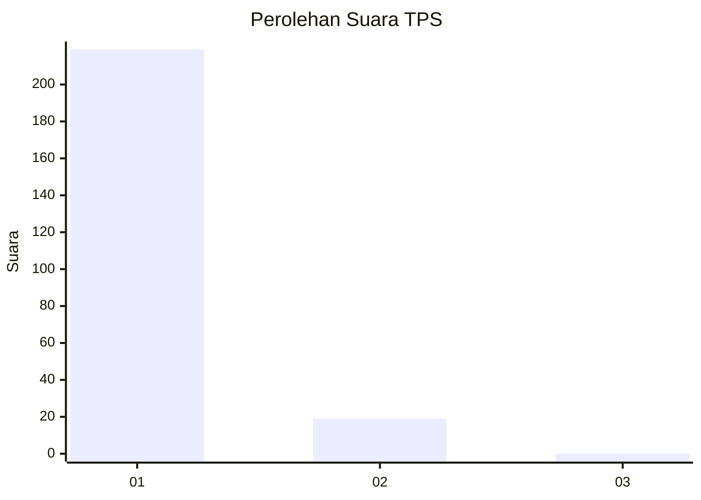
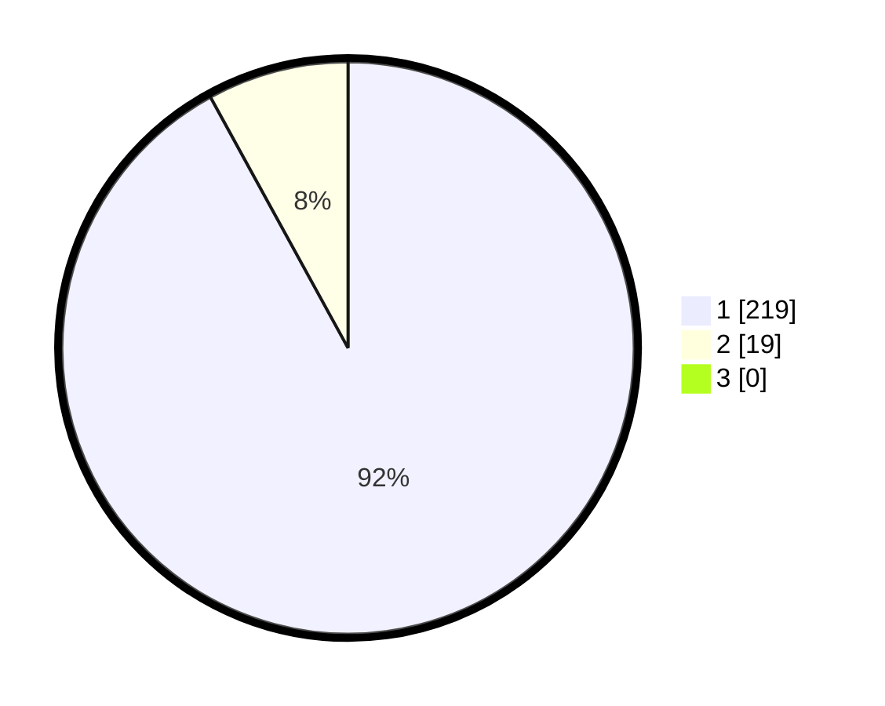

# Hasil

## Grafik

## Tabel

| No. | Nama Paslon    | Suara | Suara (raw) | Persentase |
|:--- |:-------------- | -----:| -----------:| ----------:|
| 1   | ANIES MUHAIMIN | 219   | [219][p-1]  | 92,02      |
| 2   | PRABOWO GIBRAN | 19    | [19][p-2]   | 7,98       |
| 3   | GANJAR MAHFUD  | 0     | [0][p-3]    | 0,00       |

[p-1]: https://github.com/gigit-pemilu/pemilu-2024-11-aceh/blob/main/pilpres/hitung-suara/sub/11-aceh/sub/72-kota-sabang/sub/03-sukamakmue/sub/2006-beurawang/sub/001-tps/sub/paslon-1.txt
[p-2]: https://github.com/gigit-pemilu/pemilu-2024-11-aceh/blob/main/pilpres/hitung-suara/sub/11-aceh/sub/72-kota-sabang/sub/03-sukamakmue/sub/2006-beurawang/sub/001-tps/sub/paslon-2.txt
[p-3]: https://github.com/gigit-pemilu/pemilu-2024-11-aceh/blob/main/pilpres/hitung-suara/sub/11-aceh/sub/72-kota-sabang/sub/03-sukamakmue/sub/2006-beurawang/sub/001-tps/sub/paslon-3.txt

## Foto C Plano

https://sirekap-obj-formc.kpu.go.id/12ca/pemilu/ppwp/11/72/03/20/06/1172032006001-20240214-200810--32f78c2a-ee33-4b10-9c07-b17567f56a2b.jpg

https://sirekap-obj-formc.kpu.go.id/12ca/pemilu/ppwp/11/72/03/20/06/1172032006001-20240214-201232--90fbf7ae-d270-4b4f-a7b1-4698c742ee9d.jpg

https://sirekap-obj-formc.kpu.go.id/12ca/pemilu/ppwp/11/72/03/20/06/1172032006001-20240214-201355--f6678bba-e72d-43a8-873b-86f53e135842.jpg

## Metadata

| Key        | Value               |
| ---------- | ------------------- |
| Time Stamp | 2024-02-16 06:30:27 |

