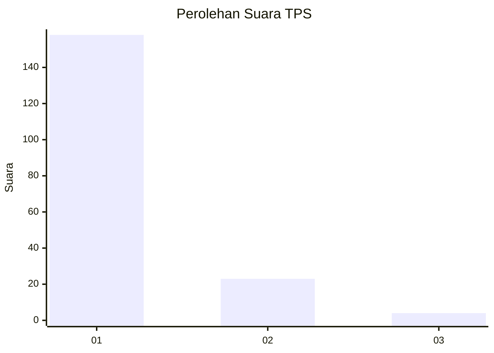
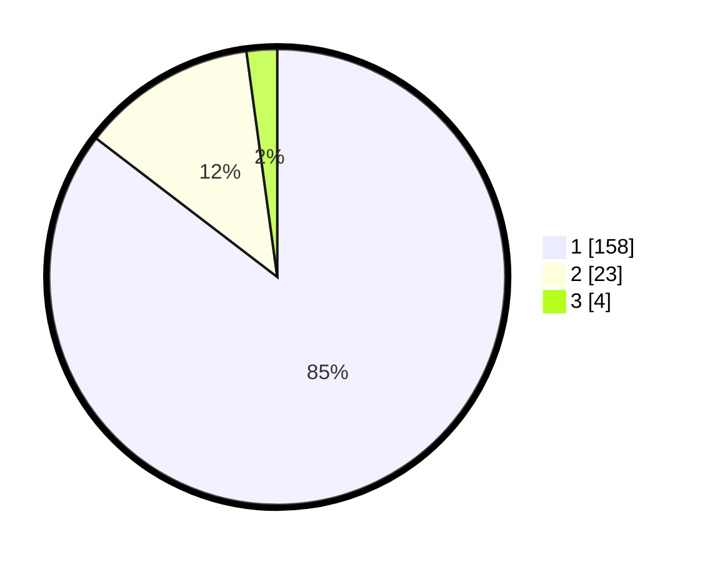

# Hasil

## Grafik

## Tabel

| No. | Nama Paslon    | Suara | Suara (raw) | Persentase |
|:--- |:-------------- | -----:| -----------:| ----------:|
| 1   | ANIES MUHAIMIN | 158   | [158][p-1]  | 85,41      |
| 2   | PRABOWO GIBRAN | 23    | [23][p-2]   | 12,43      |
| 3   | GANJAR MAHFUD  | 4     | [4][p-3]    | 2,16       |

[p-1]: https://github.com/gigit-pemilu/pemilu-2024-11-aceh/blob/main/pilpres/hitung-suara/sub/11-aceh/sub/73-kota-lhokseumawe/sub/01-muara-dua/sub/2002-alue-awe/sub/001-tps/sub/paslon-1.txt
[p-2]: https://github.com/gigit-pemilu/pemilu-2024-11-aceh/blob/main/pilpres/hitung-suara/sub/11-aceh/sub/73-kota-lhokseumawe/sub/01-muara-dua/sub/2002-alue-awe/sub/001-tps/sub/paslon-2.txt
[p-3]: https://github.com/gigit-pemilu/pemilu-2024-11-aceh/blob/main/pilpres/hitung-suara/sub/11-aceh/sub/73-kota-lhokseumawe/sub/01-muara-dua/sub/2002-alue-awe/sub/001-tps/sub/paslon-3.txt

## Foto C Plano

https://sirekap-obj-formc.kpu.go.id/4d2d/pemilu/ppwp/11/73/01/20/02/1173012002001-20240225-113321--1c0854e6-a088-4e0a-803f-240fa6e3e8eb.jpg

https://sirekap-obj-formc.kpu.go.id/4d2d/pemilu/ppwp/11/73/01/20/02/1173012002001-20240225-113617--a0d9b4a9-ef5b-4465-bd95-28306a8427aa.jpg

https://sirekap-obj-formc.kpu.go.id/4d2d/pemilu/ppwp/11/73/01/20/02/1173012002001-20240225-113735--9ea94230-5fec-4478-81d0-e553fd6a6e21.jpg

## Metadata

| Key        | Value               |
| ---------- | ------------------- |
| Time Stamp | 2024-02-25 14:00:00 |

## DATA PEMILIH TETAP

Jumlah pemilih dalam DPT: **247**.
 * L: **129**.
 * P: **118**.

## DATA PENGGUNA HAK PILIH

Jumlah pengguna hak pilih dalam DPT: **181**.
 * L: **93**.
 * P: **88**.

Jumlah pengguna hak pilih dalam DPTb: **2**.
 * L: **2**.
 * P: **0**.

Jumlah pengguna hak pilih dalam DPK: **6**.
 * L: **3**.
 * P: **3**.

Jumlah pengguna hak pilih: **189**.
 * L: **98**.
 * P: **91**.

## JUMLAH SUARA SAH DAN TIDAK SAH

JUMLAH SELURUH SUARA SAH: **185**.

JUMLAH SUARA TIDAK SAH: **4**.

JUMLAH SELURUH SUARA SAH DAN SUARA TIDAK SAH: **189**.

