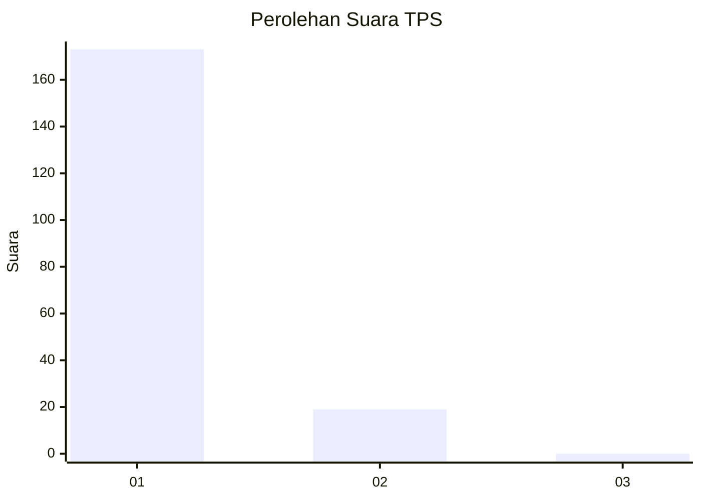
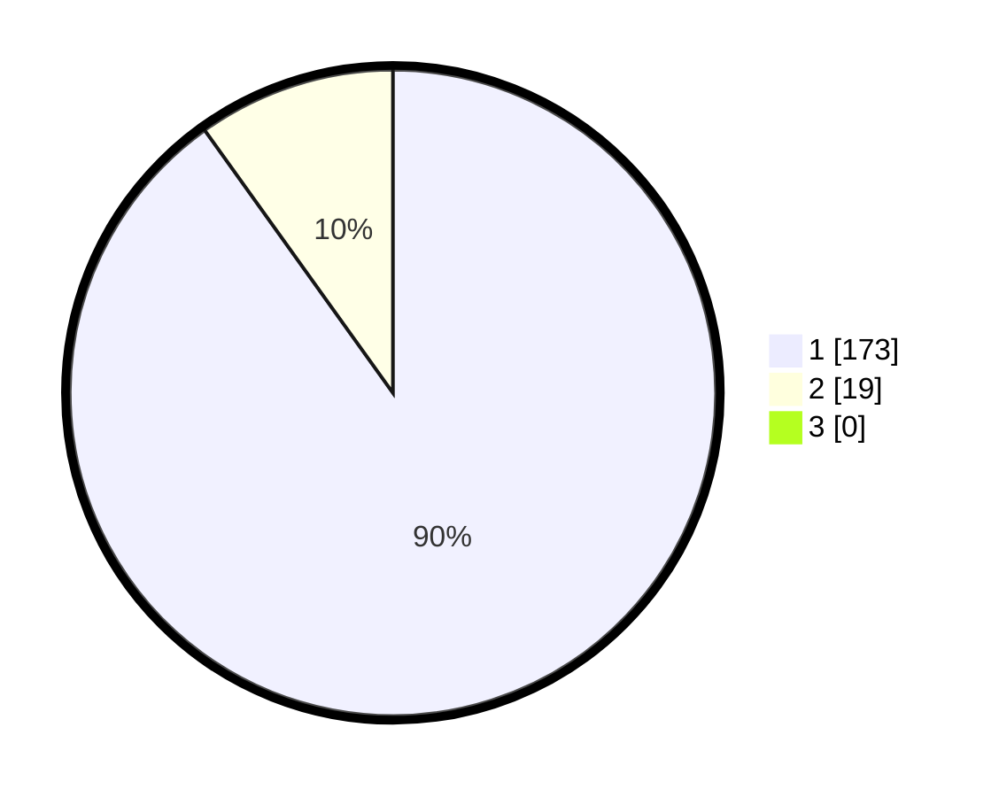

# Hasil

## Grafik

## Tabel

| No. | Nama Paslon    | Suara | Suara (raw) | Persentase |
|:--- |:-------------- | -----:| -----------:| ----------:|
| 1   | ANIES MUHAIMIN | 173   | [173][p-1]  | 90,10      |
| 2   | PRABOWO GIBRAN | 19    | [19][p-2]   | 9,90       |
| 3   | GANJAR MAHFUD  | 0     | [0][p-3]    | 0,00       |

[p-1]: https://github.com/gigit-pemilu/pemilu-2024-11-aceh/blob/main/pilpres/hitung-suara/sub/11-aceh/sub/73-kota-lhokseumawe/sub/01-muara-dua/sub/2002-alue-awe/sub/002-tps/sub/paslon-1.txt
[p-2]: https://github.com/gigit-pemilu/pemilu-2024-11-aceh/blob/main/pilpres/hitung-suara/sub/11-aceh/sub/73-kota-lhokseumawe/sub/01-muara-dua/sub/2002-alue-awe/sub/002-tps/sub/paslon-2.txt
[p-3]: https://github.com/gigit-pemilu/pemilu-2024-11-aceh/blob/main/pilpres/hitung-suara/sub/11-aceh/sub/73-kota-lhokseumawe/sub/01-muara-dua/sub/2002-alue-awe/sub/002-tps/sub/paslon-3.txt

## Foto C Plano

https://sirekap-obj-formc.kpu.go.id/d412/pemilu/ppwp/11/73/01/20/02/1173012002002-20240214-203350--fb17848f-33fc-4840-a97f-fcb041a84f2c.jpg

https://sirekap-obj-formc.kpu.go.id/d412/pemilu/ppwp/11/73/01/20/02/1173012002002-20240215-000939--615f3990-8e14-4dc1-8e83-0761d6e14a1b.jpg

## Metadata

| Key        | Value               |
| ---------- | ------------------- |
| Time Stamp | 2024-02-15 15:00:29 |

