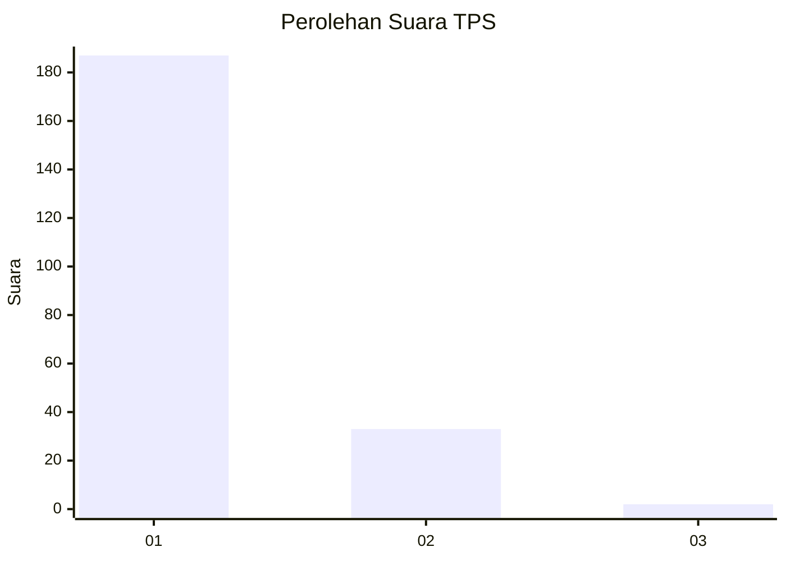
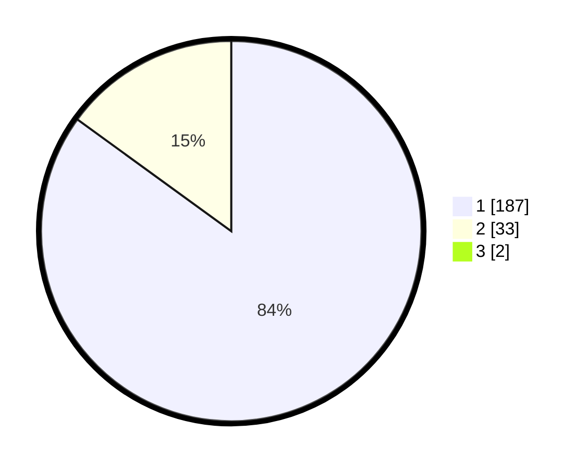

# Hasil

## Grafik

## Tabel

| No. | Nama Paslon    | Suara | Suara (raw) | Persentase |
|:--- |:-------------- | -----:| -----------:| ----------:|
| 1   | ANIES MUHAIMIN | 187   | [187][p-1]  | 84,23      |
| 2   | PRABOWO GIBRAN | 33    | [33][p-2]   | 14,86      |
| 3   | GANJAR MAHFUD  | 2     | [2][p-3]    | 0,90       |

[p-1]: https://github.com/gigit-pemilu/pemilu-2024-11-aceh/blob/main/pilpres/hitung-suara/sub/11-aceh/sub/73-kota-lhokseumawe/sub/01-muara-dua/sub/2002-alue-awe/sub/003-tps/sub/paslon-1.txt
[p-2]: https://github.com/gigit-pemilu/pemilu-2024-11-aceh/blob/main/pilpres/hitung-suara/sub/11-aceh/sub/73-kota-lhokseumawe/sub/01-muara-dua/sub/2002-alue-awe/sub/003-tps/sub/paslon-2.txt
[p-3]: https://github.com/gigit-pemilu/pemilu-2024-11-aceh/blob/main/pilpres/hitung-suara/sub/11-aceh/sub/73-kota-lhokseumawe/sub/01-muara-dua/sub/2002-alue-awe/sub/003-tps/sub/paslon-3.txt

## Foto C Plano

https://sirekap-obj-formc.kpu.go.id/7136/pemilu/ppwp/11/73/01/20/02/1173012002003-20240225-114544--fed954fa-f190-4d04-8874-1fad1b6d3289.jpg

https://sirekap-obj-formc.kpu.go.id/7136/pemilu/ppwp/11/73/01/20/02/1173012002003-20240225-115301--dc7397ff-f2cd-40aa-9a1e-ef2585c9c944.jpg

https://sirekap-obj-formc.kpu.go.id/7136/pemilu/ppwp/11/73/01/20/02/1173012002003-20240225-115618--58878488-084e-4359-9dfd-cded9d917d12.jpg

## Metadata

| Key        | Value               |
| ---------- | ------------------- |
| Time Stamp | 2024-02-25 16:00:00 |

## DATA PEMILIH TETAP

Jumlah pemilih dalam DPT: **256**.
 * L: **117**.
 * P: **139**.

## DATA PENGGUNA HAK PILIH

Jumlah pengguna hak pilih dalam DPT: **216**.
 * L: **93**.
 * P: **123**.

Jumlah pengguna hak pilih dalam DPTb: **2**.
 * L: **1**.
 * P: **1**.

Jumlah pengguna hak pilih dalam DPK: **4**.
 * L: **1**.
 * P: **3**.

Jumlah pengguna hak pilih: **222**.
 * L: **95**.
 * P: **127**.

## JUMLAH SUARA SAH DAN TIDAK SAH

JUMLAH SELURUH SUARA SAH: **222**.

JUMLAH SUARA TIDAK SAH: **0**.

JUMLAH SELURUH SUARA SAH DAN SUARA TIDAK SAH: **222**.

