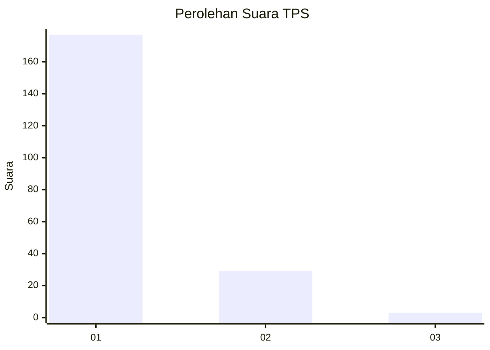
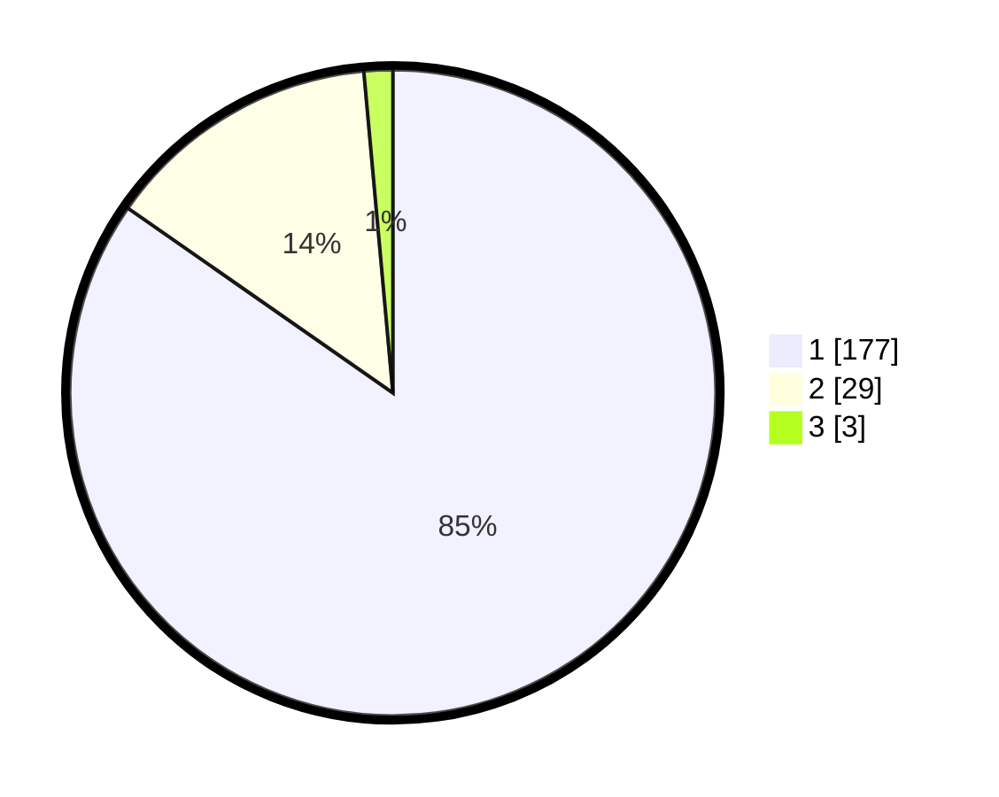

# Hasil

## Grafik

## Tabel

| No. | Nama Paslon    | Suara | Suara (raw) | Persentase |
|:--- |:-------------- | -----:| -----------:| ----------:|
| 1   | ANIES MUHAIMIN | 177   | [177][p-1]  | 84,69      |
| 2   | PRABOWO GIBRAN | 29    | [29][p-2]   | 13,88      |
| 3   | GANJAR MAHFUD  | 3     | [3][p-3]    | 1,44       |

[p-1]: https://github.com/gigit-pemilu/pemilu-2024-11-aceh/blob/main/pilpres/hitung-suara/sub/11-aceh/sub/73-kota-lhokseumawe/sub/01-muara-dua/sub/2002-alue-awe/sub/004-tps/sub/paslon-1.txt
[p-2]: https://github.com/gigit-pemilu/pemilu-2024-11-aceh/blob/main/pilpres/hitung-suara/sub/11-aceh/sub/73-kota-lhokseumawe/sub/01-muara-dua/sub/2002-alue-awe/sub/004-tps/sub/paslon-2.txt
[p-3]: https://github.com/gigit-pemilu/pemilu-2024-11-aceh/blob/main/pilpres/hitung-suara/sub/11-aceh/sub/73-kota-lhokseumawe/sub/01-muara-dua/sub/2002-alue-awe/sub/004-tps/sub/paslon-3.txt

## Foto C Plano

https://sirekap-obj-formc.kpu.go.id/4635/pemilu/ppwp/11/73/01/20/02/1173012002004-20240225-113344--0d0ddf78-515a-406d-80b4-1a5ab8ccec7f.jpg

https://sirekap-obj-formc.kpu.go.id/4635/pemilu/ppwp/11/73/01/20/02/1173012002004-20240225-114153--e15c3ffd-3f9b-4188-8b75-d36eeb6e7507.jpg

https://sirekap-obj-formc.kpu.go.id/4635/pemilu/ppwp/11/73/01/20/02/1173012002004-20240225-113848--1a0fe8e3-bc23-4676-bcf6-c8af5f4da825.jpg

## Metadata

| Key        | Value               |
| ---------- | ------------------- |
| Time Stamp | 2024-02-25 16:00:00 |

## DATA PEMILIH TETAP

Jumlah pemilih dalam DPT: **260**.
 * L: **122**.
 * P: **138**.

## DATA PENGGUNA HAK PILIH

Jumlah pengguna hak pilih dalam DPT: **207**.
 * L: **93**.
 * P: **114**.

Jumlah pengguna hak pilih dalam DPTb: **2**.
 * L: **1**.
 * P: **1**.

Jumlah pengguna hak pilih dalam DPK: **1**.
 * L: **1**.
 * P: **0**.

Jumlah pengguna hak pilih: **210**.
 * L: **95**.
 * P: **115**.

## JUMLAH SUARA SAH DAN TIDAK SAH

JUMLAH SELURUH SUARA SAH: **209**.

JUMLAH SUARA TIDAK SAH: **1**.

JUMLAH SELURUH SUARA SAH DAN SUARA TIDAK SAH: **210**.

