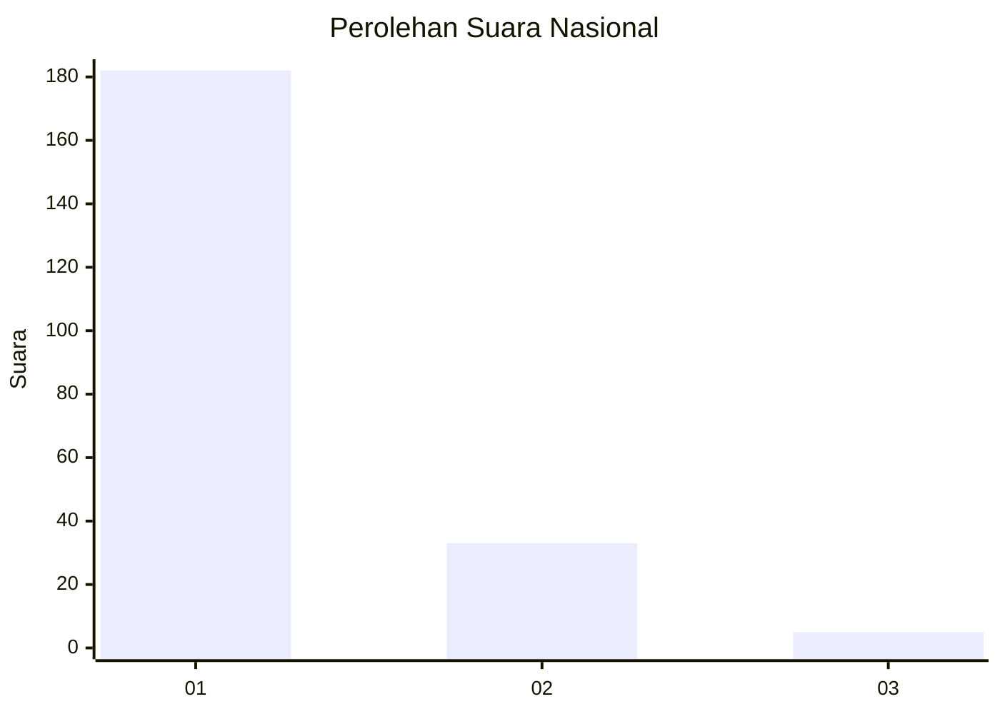
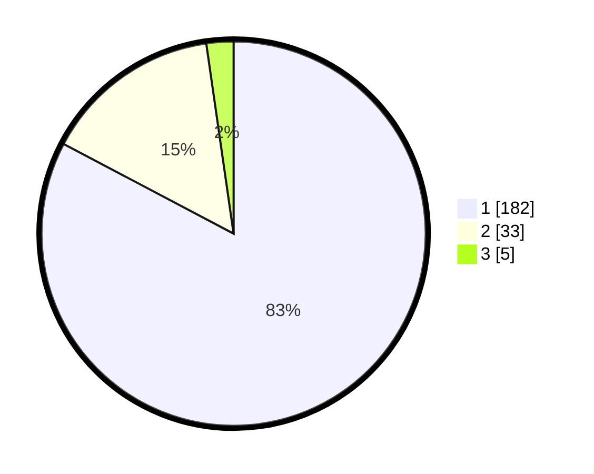

# Hasil

## Grafik

## Tabel

| No. | Nama Paslon    | Suara | Suara (raw) | Persentase |
|:--- |:-------------- | -----:| -----------:| ----------:|
| 1   | ANIES MUHAIMIN | 182   | [182][p-1]  | 82,73      |
| 2   | PRABOWO GIBRAN | 33    | [33][p-2]   | 15,00      |
| 3   | GANJAR MAHFUD  | 5     | [5][p-3]    | 2,27       |

[p-1]: https://github.com/gigit-pemilu/pemilu-2024/blob/main/pilpres/hitung-suara/sub/11-aceh/sub/73-kota-lhokseumawe/sub/01-muara-dua/sub/2008-uteunkot/sub/001-tps/sub/paslon-1.txt
[p-2]: https://github.com/gigit-pemilu/pemilu-2024/blob/main/pilpres/hitung-suara/sub/11-aceh/sub/73-kota-lhokseumawe/sub/01-muara-dua/sub/2008-uteunkot/sub/001-tps/sub/paslon-2.txt
[p-3]: https://github.com/gigit-pemilu/pemilu-2024/blob/main/pilpres/hitung-suara/sub/11-aceh/sub/73-kota-lhokseumawe/sub/01-muara-dua/sub/2008-uteunkot/sub/001-tps/sub/paslon-3.txt

## Foto C Plano

https://sirekap-obj-formc.kpu.go.id/fa2d/pemilu/ppwp/11/73/01/20/08/1173012008001-20240214-212307--90ac9f17-1fc6-4ccf-87c3-1ebfe8ed2dc7.jpg

https://sirekap-obj-formc.kpu.go.id/fa2d/pemilu/ppwp/11/73/01/20/08/1173012008001-20240214-212326--0f526c68-445f-4870-bdde-4435c10620ca.jpg

https://sirekap-obj-formc.kpu.go.id/fa2d/pemilu/ppwp/11/73/01/20/08/1173012008001-20240214-212345--b3d7fa66-dd5e-40a6-a8b2-0de39f7623e3.jpg

## Metadata

| Key        | Value               |
| ---------- | ------------------- |
| Time Stamp | 2024-02-15 03:06:03 |

