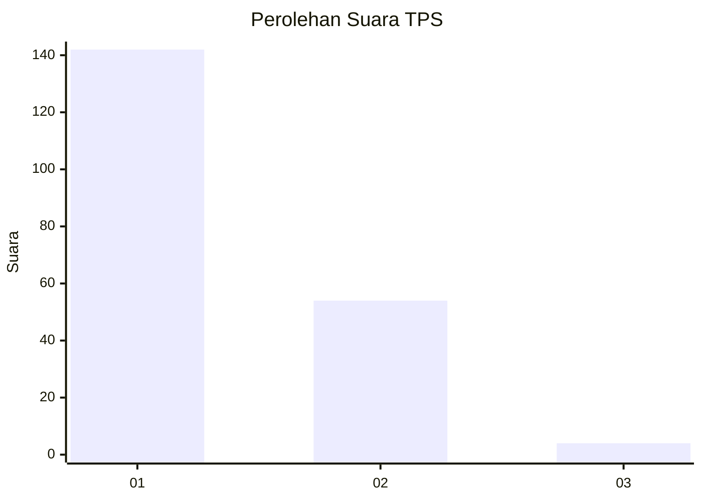
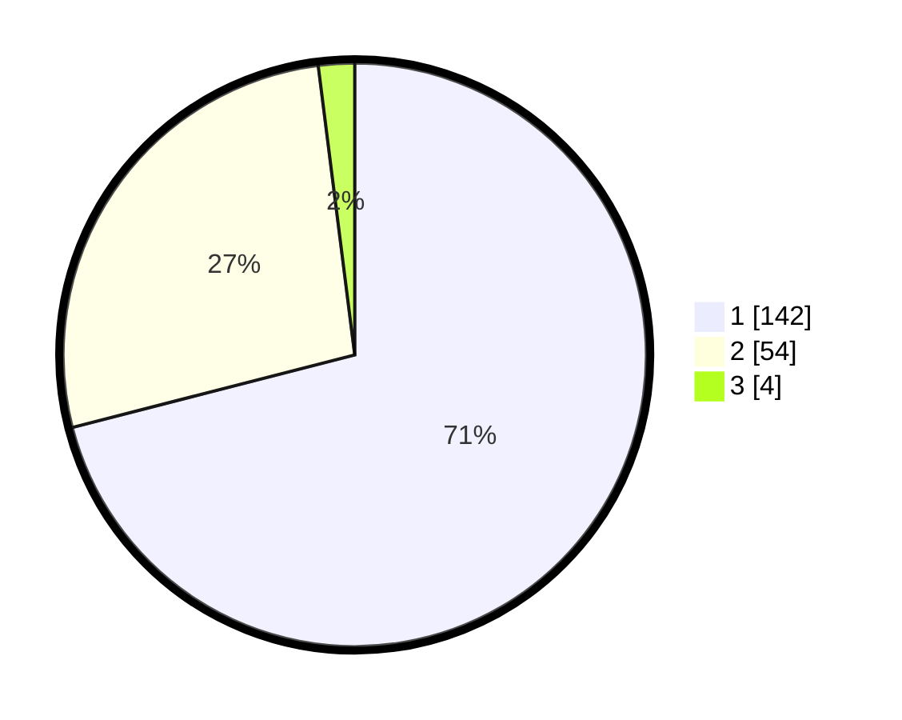

# Hasil

## Grafik

## Tabel

| No. | Nama Paslon    | Suara | Suara (raw) | Persentase |
|:--- |:-------------- | -----:| -----------:| ----------:|
| 1   | ANIES MUHAIMIN | 142   | [142][p-1]  | 71,00      |
| 2   | PRABOWO GIBRAN | 54    | [54][p-2]   | 27,00      |
| 3   | GANJAR MAHFUD  | 4     | [4][p-3]    | 2,00       |

[p-1]: https://github.com/gigit-pemilu/pemilu-2024-11-aceh/blob/main/pilpres/hitung-suara/sub/11-aceh/sub/73-kota-lhokseumawe/sub/01-muara-dua/sub/2010-meunasah-mesjid/sub/006-tps/sub/paslon-1.txt
[p-2]: https://github.com/gigit-pemilu/pemilu-2024-11-aceh/blob/main/pilpres/hitung-suara/sub/11-aceh/sub/73-kota-lhokseumawe/sub/01-muara-dua/sub/2010-meunasah-mesjid/sub/006-tps/sub/paslon-2.txt
[p-3]: https://github.com/gigit-pemilu/pemilu-2024-11-aceh/blob/main/pilpres/hitung-suara/sub/11-aceh/sub/73-kota-lhokseumawe/sub/01-muara-dua/sub/2010-meunasah-mesjid/sub/006-tps/sub/paslon-3.txt

## Foto C Plano

https://sirekap-obj-formc.kpu.go.id/470c/pemilu/ppwp/11/73/01/20/10/1173012010006-20240224-215212--5f71b5aa-09b0-441f-884b-695e33a2a9ed.jpg

https://sirekap-obj-formc.kpu.go.id/470c/pemilu/ppwp/11/73/01/20/10/1173012010006-20240215-122444--453eb764-b543-4fb7-b733-bab7ff4262db.jpg

https://sirekap-obj-formc.kpu.go.id/470c/pemilu/ppwp/11/73/01/20/10/1173012010006-20240215-122638--d91b0ef8-a403-43cf-a5af-27e5e6bc2e6d.jpg

## Metadata

| Key        | Value               |
| ---------- | ------------------- |
| Time Stamp | 2024-02-25 16:00:00 |

