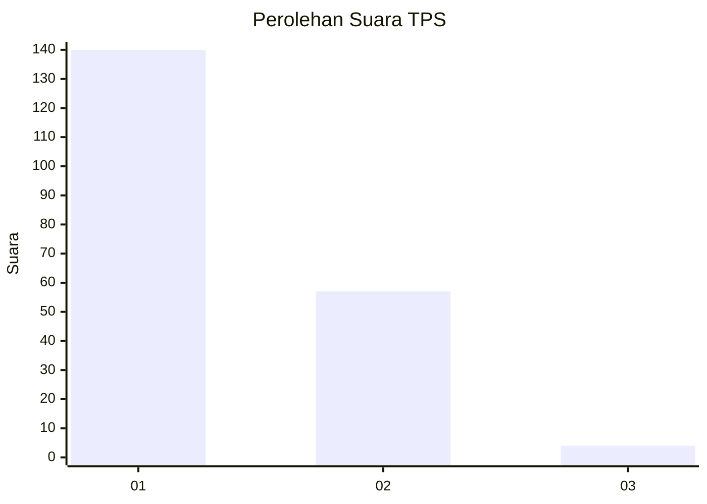
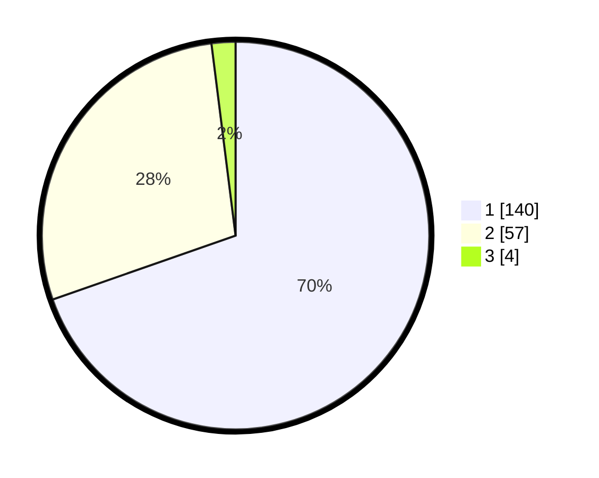

# Hasil

## Grafik

## Tabel

| No. | Nama Paslon    | Suara | Suara (raw) | Persentase |
|:--- |:-------------- | -----:| -----------:| ----------:|
| 1   | ANIES MUHAIMIN | 140   | [140][p-1]  | 69,65      |
| 2   | PRABOWO GIBRAN | 57    | [57][p-2]   | 28,36      |
| 3   | GANJAR MAHFUD  | 4     | [4][p-3]    | 1,99       |

[p-1]: https://github.com/gigit-pemilu/pemilu-2024-11-aceh/blob/main/pilpres/hitung-suara/sub/11-aceh/sub/73-kota-lhokseumawe/sub/01-muara-dua/sub/2010-meunasah-mesjid/sub/017-tps/sub/paslon-1.txt
[p-2]: https://github.com/gigit-pemilu/pemilu-2024-11-aceh/blob/main/pilpres/hitung-suara/sub/11-aceh/sub/73-kota-lhokseumawe/sub/01-muara-dua/sub/2010-meunasah-mesjid/sub/017-tps/sub/paslon-2.txt
[p-3]: https://github.com/gigit-pemilu/pemilu-2024-11-aceh/blob/main/pilpres/hitung-suara/sub/11-aceh/sub/73-kota-lhokseumawe/sub/01-muara-dua/sub/2010-meunasah-mesjid/sub/017-tps/sub/paslon-3.txt

## Foto C Plano

https://sirekap-obj-formc.kpu.go.id/5712/pemilu/ppwp/11/73/01/20/10/1173012010017-20240215-043903--8f170781-74ee-46f2-901f-f523e33ea7f1.jpg

https://sirekap-obj-formc.kpu.go.id/5712/pemilu/ppwp/11/73/01/20/10/1173012010017-20240215-062921--af62f0be-456f-4aa6-adac-c48ef6731c78.jpg

https://sirekap-obj-formc.kpu.go.id/5712/pemilu/ppwp/11/73/01/20/10/1173012010017-20240215-044156--072b984b-305e-4560-b90d-89a1e568678e.jpg

## Metadata

| Key        | Value               |
| ---------- | ------------------- |
| Time Stamp | 2024-02-15 21:01:18 |

