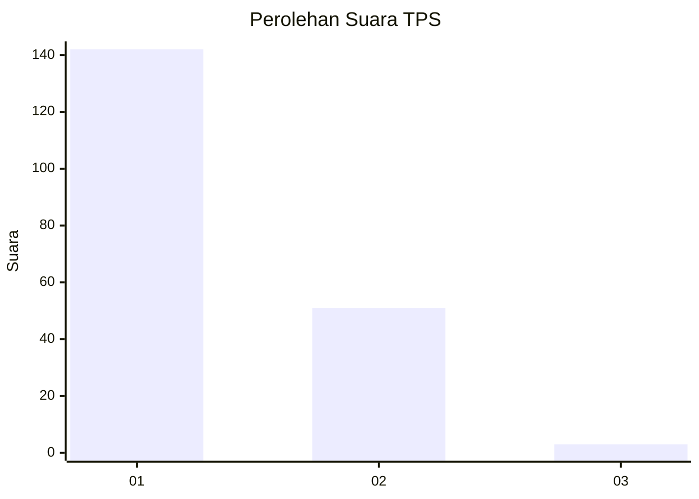
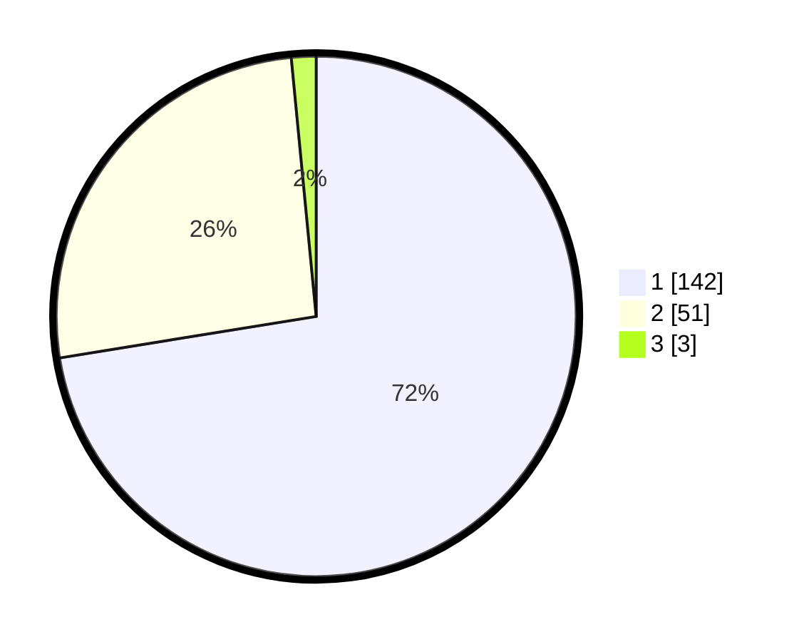

# Hasil

## Grafik

## Tabel

| No. | Nama Paslon    | Suara | Suara (raw) | Persentase |
|:--- |:-------------- | -----:| -----------:| ----------:|
| 1   | ANIES MUHAIMIN | 142   | [142][p-1]  | 72,45      |
| 2   | PRABOWO GIBRAN | 51    | [51][p-2]   | 26,02      |
| 3   | GANJAR MAHFUD  | 3     | [3][p-3]    | 1,53       |

[p-1]: https://github.com/gigit-pemilu/pemilu-2024-11-aceh/blob/main/pilpres/hitung-suara/sub/11-aceh/sub/73-kota-lhokseumawe/sub/01-muara-dua/sub/2010-meunasah-mesjid/sub/019-tps/sub/paslon-1.txt
[p-2]: https://github.com/gigit-pemilu/pemilu-2024-11-aceh/blob/main/pilpres/hitung-suara/sub/11-aceh/sub/73-kota-lhokseumawe/sub/01-muara-dua/sub/2010-meunasah-mesjid/sub/019-tps/sub/paslon-2.txt
[p-3]: https://github.com/gigit-pemilu/pemilu-2024-11-aceh/blob/main/pilpres/hitung-suara/sub/11-aceh/sub/73-kota-lhokseumawe/sub/01-muara-dua/sub/2010-meunasah-mesjid/sub/019-tps/sub/paslon-3.txt

## Foto C Plano

https://sirekap-obj-formc.kpu.go.id/8622/pemilu/ppwp/11/73/01/20/10/1173012010019-20240215-045651--68050054-ab4b-4a33-8ec1-19fc30cfe6df.jpg

https://sirekap-obj-formc.kpu.go.id/8622/pemilu/ppwp/11/73/01/20/10/1173012010019-20240215-045835--c4c11ebd-46e1-48f8-a6ba-3c67ad1b7597.jpg

https://sirekap-obj-formc.kpu.go.id/8622/pemilu/ppwp/11/73/01/20/10/1173012010019-20240215-045936--c3f12cdd-803a-452d-b051-6b1b269d81aa.jpg

## Metadata

| Key        | Value               |
| ---------- | ------------------- |
| Time Stamp | 2024-02-15 16:30:25 |

