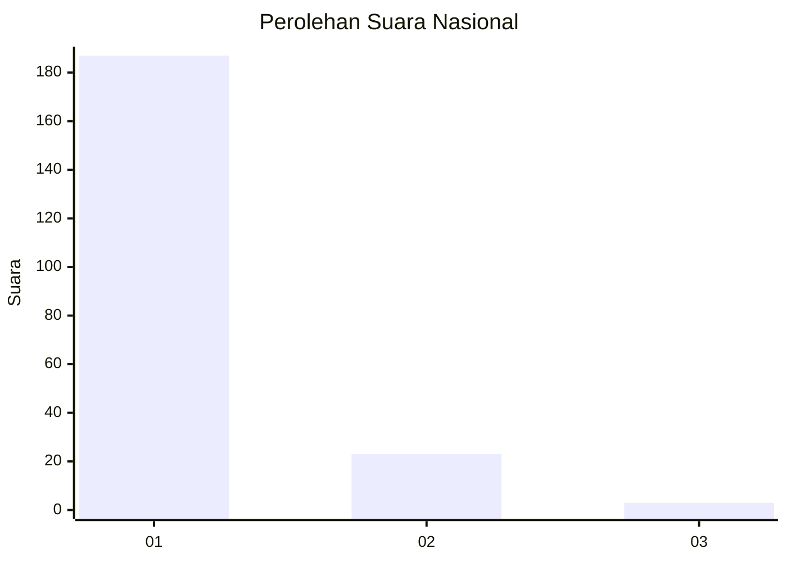
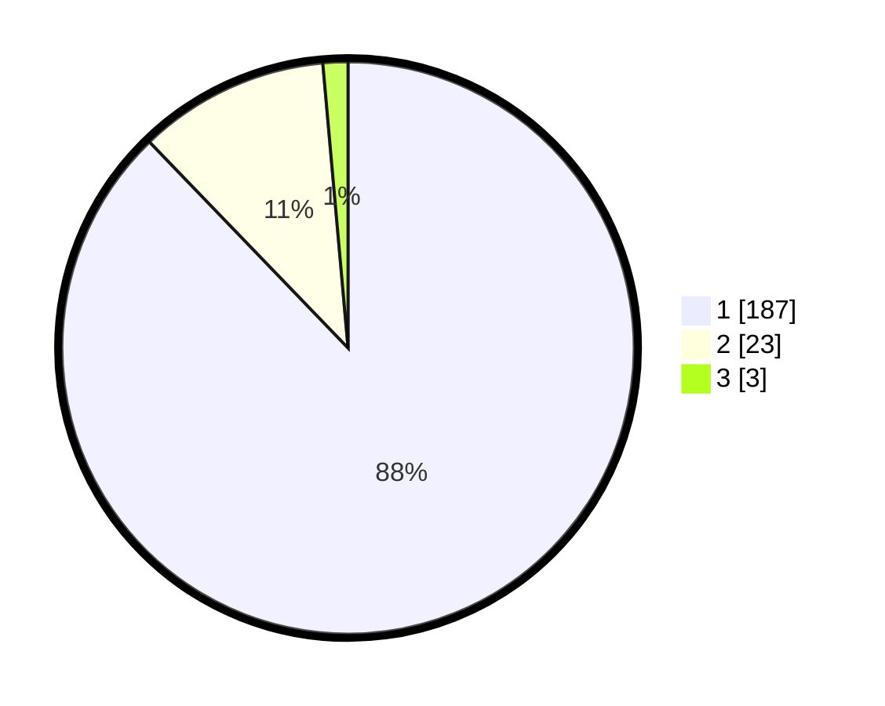

# Hasil

## Grafik

## Tabel

| No. | Nama Paslon    | Suara | Suara (raw) | Persentase |
|:--- |:-------------- | -----:| -----------:| ----------:|
| 1   | ANIES MUHAIMIN | 187   | [187][p-1]  | 87,79      |
| 2   | PRABOWO GIBRAN | 23    | [23][p-2]   | 10,80      |
| 3   | GANJAR MAHFUD  | 3     | [3][p-3]    | 1,41       |

[p-1]: https://github.com/gigit-pemilu/pemilu-2024/blob/main/pilpres/hitung-suara/sub/11-aceh/sub/73-kota-lhokseumawe/sub/01-muara-dua/sub/2011-mns-panggoi/sub/009-tps/sub/paslon-1.txt
[p-2]: https://github.com/gigit-pemilu/pemilu-2024/blob/main/pilpres/hitung-suara/sub/11-aceh/sub/73-kota-lhokseumawe/sub/01-muara-dua/sub/2011-mns-panggoi/sub/009-tps/sub/paslon-2.txt
[p-3]: https://github.com/gigit-pemilu/pemilu-2024/blob/main/pilpres/hitung-suara/sub/11-aceh/sub/73-kota-lhokseumawe/sub/01-muara-dua/sub/2011-mns-panggoi/sub/009-tps/sub/paslon-3.txt

## Foto C Plano

https://sirekap-obj-formc.kpu.go.id/6320/pemilu/ppwp/11/73/01/20/11/1173012011009-20240215-120903--804af4df-1f04-4d5e-870f-a01d49311d9f.jpg

https://sirekap-obj-formc.kpu.go.id/6320/pemilu/ppwp/11/73/01/20/11/1173012011009-20240215-123113--3ccbe2c8-67f0-4c2d-a44e-739fff783bfd.jpg

https://sirekap-obj-formc.kpu.go.id/6320/pemilu/ppwp/11/73/01/20/11/1173012011009-20240215-123212--fc7c4f99-387c-4de0-8e8b-c023ee8f8f02.jpg

## Metadata

| Key        | Value               |
| ---------- | ------------------- |
| Time Stamp | 2024-02-15 21:01:18 |

