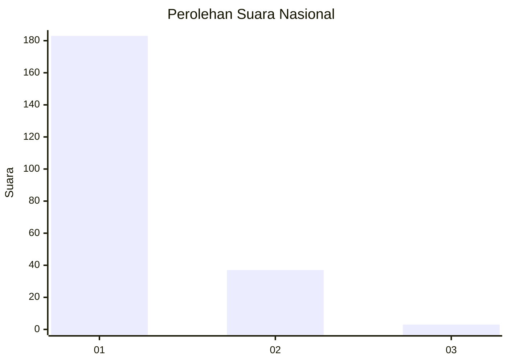
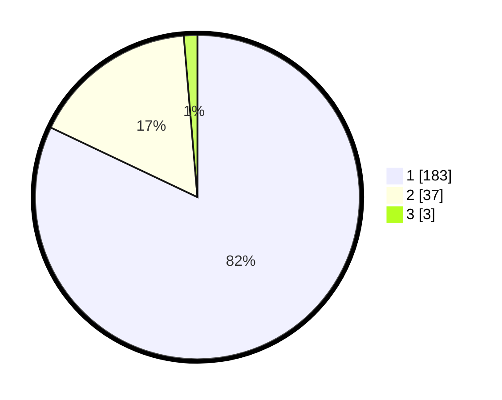

# Hasil

## Grafik

## Tabel

| No. | Nama Paslon    | Suara | Suara (raw) | Persentase |
|:--- |:-------------- | -----:| -----------:| ----------:|
| 1   | ANIES MUHAIMIN | 183   | [183][p-1]  | 82,06      |
| 2   | PRABOWO GIBRAN | 37    | [37][p-2]   | 16,59      |
| 3   | GANJAR MAHFUD  | 3     | [3][p-3]    | 1,35       |

[p-1]: https://github.com/gigit-pemilu/pemilu-2024/blob/main/pilpres/hitung-suara/sub/11-aceh/sub/73-kota-lhokseumawe/sub/01-muara-dua/sub/2014-meunasah-alue/sub/006-tps/sub/paslon-1.txt
[p-2]: https://github.com/gigit-pemilu/pemilu-2024/blob/main/pilpres/hitung-suara/sub/11-aceh/sub/73-kota-lhokseumawe/sub/01-muara-dua/sub/2014-meunasah-alue/sub/006-tps/sub/paslon-2.txt
[p-3]: https://github.com/gigit-pemilu/pemilu-2024/blob/main/pilpres/hitung-suara/sub/11-aceh/sub/73-kota-lhokseumawe/sub/01-muara-dua/sub/2014-meunasah-alue/sub/006-tps/sub/paslon-3.txt

## Foto C Plano

https://sirekap-obj-formc.kpu.go.id/0b81/pemilu/ppwp/11/73/01/20/14/1173012014006-20240214-231146--bffc98e5-1531-406f-9f91-1c2b2a542abe.jpg

https://sirekap-obj-formc.kpu.go.id/0b81/pemilu/ppwp/11/73/01/20/14/1173012014006-20240214-200622--b28c30e3-e786-495b-96f7-5207b9054e82.jpg

https://sirekap-obj-formc.kpu.go.id/0b81/pemilu/ppwp/11/73/01/20/14/1173012014006-20240214-200728--324f980e-28d7-4dae-9a57-67d500a1d249.jpg

## Metadata

| Key        | Value               |
| ---------- | ------------------- |
| Time Stamp | 2024-02-15 12:00:28 |

