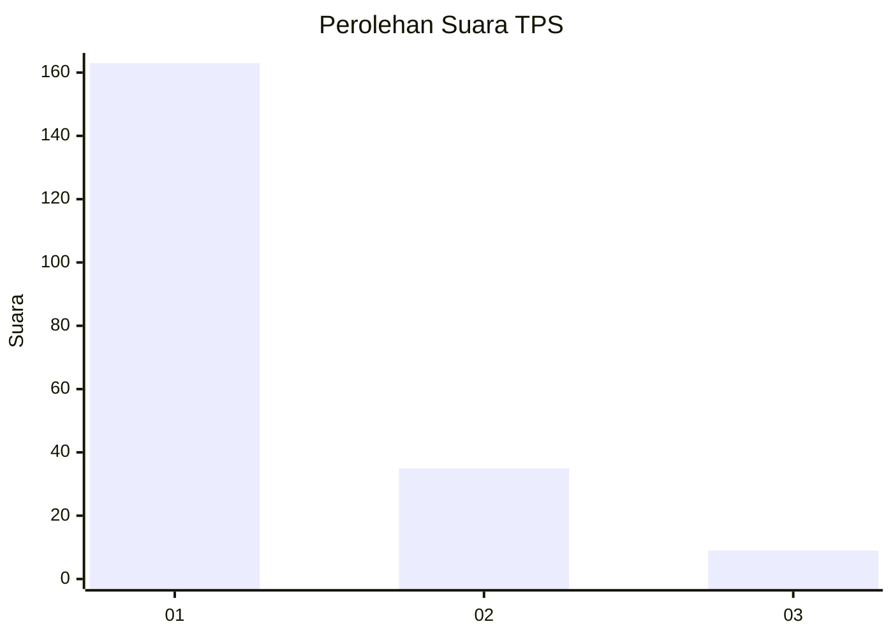
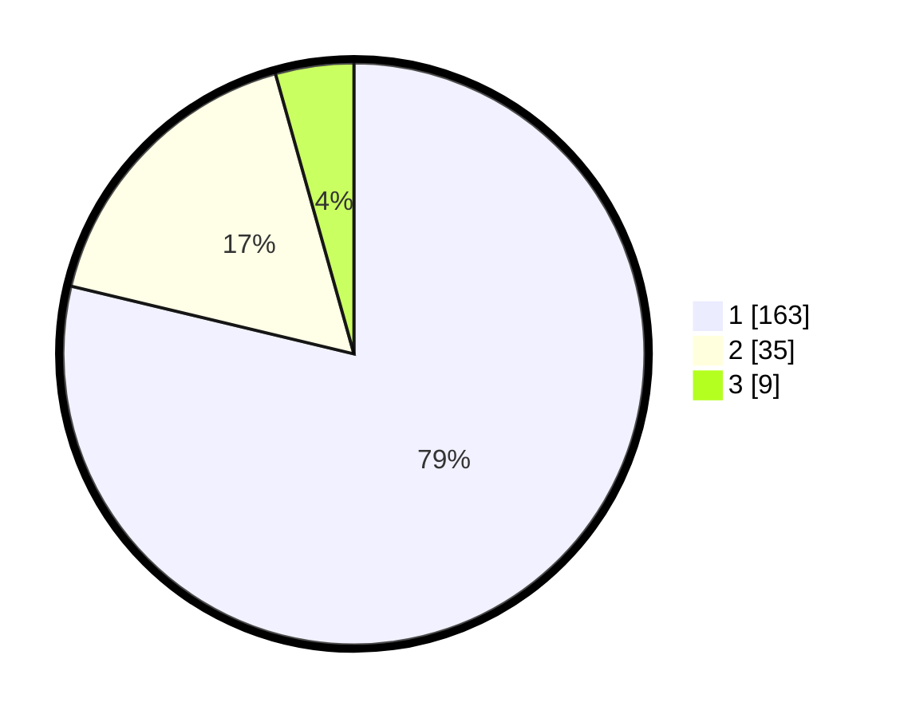

# Hasil

## Grafik

## Tabel

| No. | Nama Paslon    | Suara | Suara (raw) | Persentase |
|:--- |:-------------- | -----:| -----------:| ----------:|
| 1   | ANIES MUHAIMIN | 163   | [163][p-1]  | 78,74      |
| 2   | PRABOWO GIBRAN | 35    | [35][p-2]   | 16,91      |
| 3   | GANJAR MAHFUD  | 9     | [9][p-3]    | 4,35       |

[p-1]: https://github.com/gigit-pemilu/pemilu-2024-11-aceh/blob/main/pilpres/hitung-suara/sub/11-aceh/sub/73-kota-lhokseumawe/sub/02-banda-sakti/sub/2001-kuta-blang/sub/011-tps/sub/paslon-1.txt
[p-2]: https://github.com/gigit-pemilu/pemilu-2024-11-aceh/blob/main/pilpres/hitung-suara/sub/11-aceh/sub/73-kota-lhokseumawe/sub/02-banda-sakti/sub/2001-kuta-blang/sub/011-tps/sub/paslon-2.txt
[p-3]: https://github.com/gigit-pemilu/pemilu-2024-11-aceh/blob/main/pilpres/hitung-suara/sub/11-aceh/sub/73-kota-lhokseumawe/sub/02-banda-sakti/sub/2001-kuta-blang/sub/011-tps/sub/paslon-3.txt

## Foto C Plano

https://sirekap-obj-formc.kpu.go.id/8d9d/pemilu/ppwp/11/73/02/20/01/1173022001011-20240214-194707--77d5ca1c-cbc3-4af3-bfef-b2a3cf3c3b24.jpg

https://sirekap-obj-formc.kpu.go.id/8d9d/pemilu/ppwp/11/73/02/20/01/1173022001011-20240214-194728--d029f824-4795-4d17-86fa-4b82e109eff9.jpg

https://sirekap-obj-formc.kpu.go.id/8d9d/pemilu/ppwp/11/73/02/20/01/1173022001011-20240214-194807--569c8b0a-8b7b-4edb-b9d5-dc8b3271f919.jpg

## Metadata

| Key        | Value               |
| ---------- | ------------------- |
| Time Stamp | 2024-02-14 21:46:01 |

