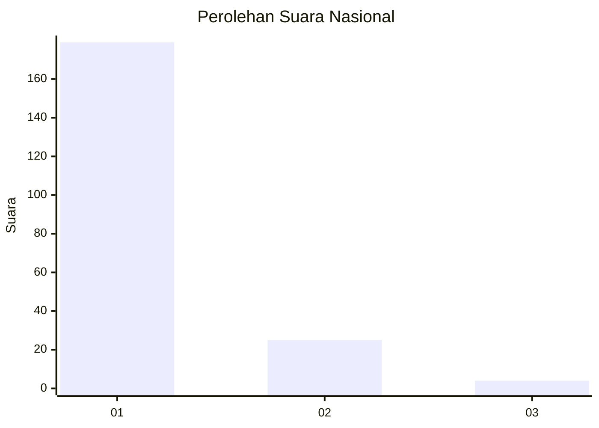
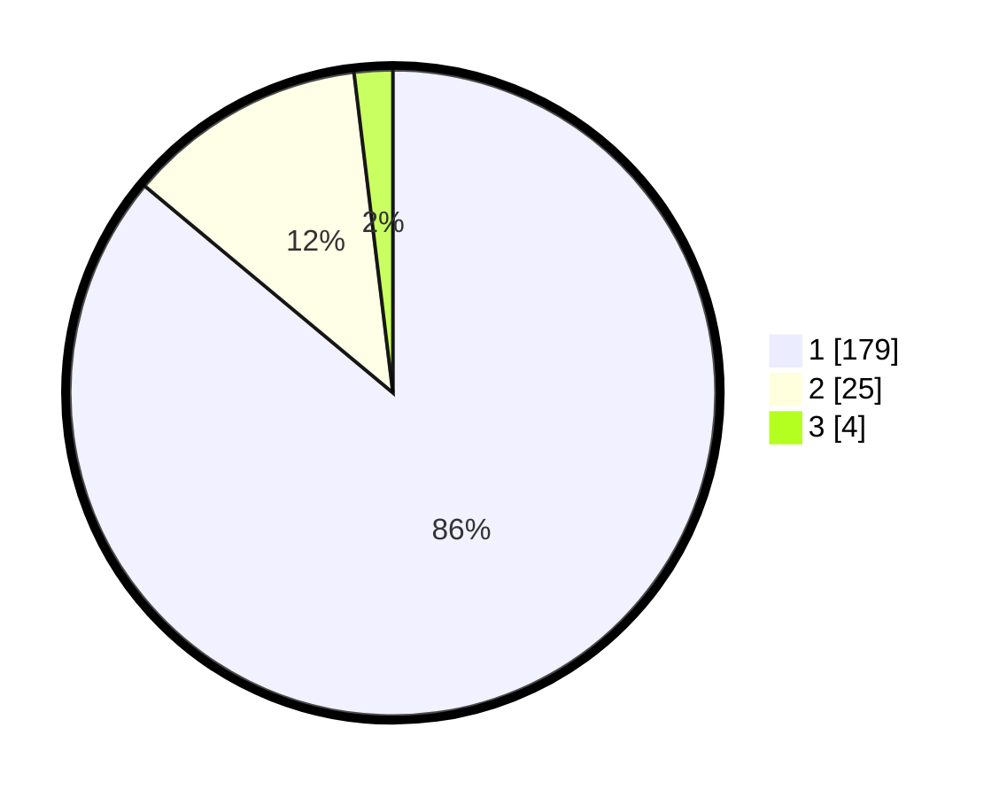

# Hasil

## Grafik

## Tabel

| No. | Nama Paslon    | Suara | Suara (raw) | Persentase |
|:--- |:-------------- | -----:| -----------:| ----------:|
| 1   | ANIES MUHAIMIN | 179   | [179][p-1]  | 86,06      |
| 2   | PRABOWO GIBRAN | 25    | [25][p-2]   | 12,02      |
| 3   | GANJAR MAHFUD  | 4     | [4][p-3]    | 1,92       |

[p-1]: https://github.com/gigit-pemilu/pemilu-2024/blob/main/pilpres/hitung-suara/sub/11-aceh/sub/73-kota-lhokseumawe/sub/02-banda-sakti/sub/2002-tumpok-teungoh/sub/006-tps/sub/paslon-1.txt
[p-2]: https://github.com/gigit-pemilu/pemilu-2024/blob/main/pilpres/hitung-suara/sub/11-aceh/sub/73-kota-lhokseumawe/sub/02-banda-sakti/sub/2002-tumpok-teungoh/sub/006-tps/sub/paslon-2.txt
[p-3]: https://github.com/gigit-pemilu/pemilu-2024/blob/main/pilpres/hitung-suara/sub/11-aceh/sub/73-kota-lhokseumawe/sub/02-banda-sakti/sub/2002-tumpok-teungoh/sub/006-tps/sub/paslon-3.txt

## Foto C Plano

https://sirekap-obj-formc.kpu.go.id/295a/pemilu/ppwp/11/73/02/20/02/1173022002006-20240214-195756--7c819e25-6f6b-49d1-9574-0319399ccd48.jpg

https://sirekap-obj-formc.kpu.go.id/295a/pemilu/ppwp/11/73/02/20/02/1173022002006-20240214-195840--93e624f8-7be6-4f94-9eec-e4b91be97416.jpg

https://sirekap-obj-formc.kpu.go.id/295a/pemilu/ppwp/11/73/02/20/02/1173022002006-20240214-195911--21ebef50-aca6-4050-b8f2-f8410792e3c7.jpg

## Metadata

| Key        | Value               |
| ---------- | ------------------- |
| Time Stamp | 2024-02-14 21:46:01 |

