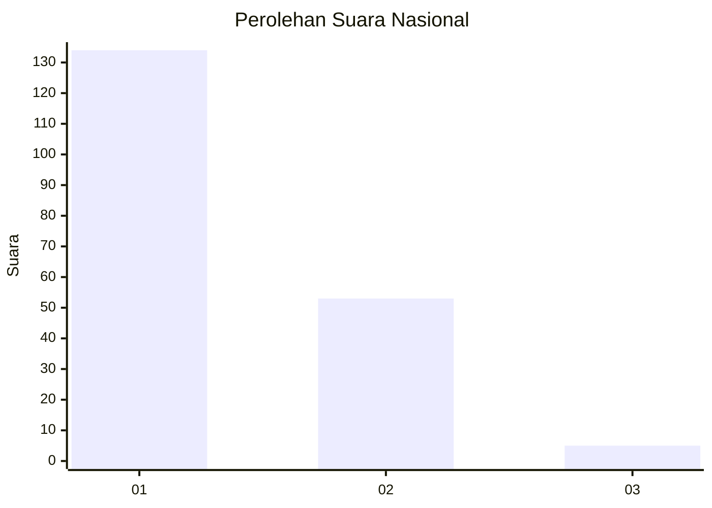
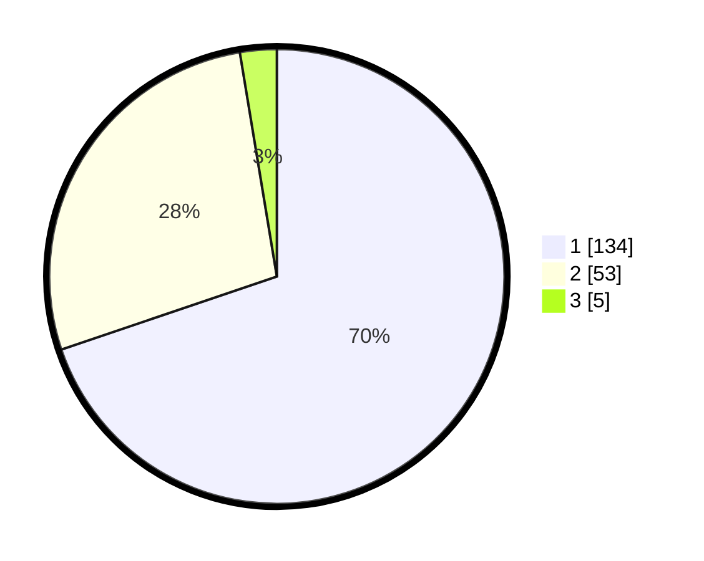

# Hasil

## Grafik

## Tabel

| No. | Nama Paslon    | Suara | Suara (raw) | Persentase |
|:--- |:-------------- | -----:| -----------:| ----------:|
| 1   | ANIES MUHAIMIN | 134   | [134][p-1]  | 69,79      |
| 2   | PRABOWO GIBRAN | 53    | [53][p-2]   | 27,60      |
| 3   | GANJAR MAHFUD  | 5     | [5][p-3]    | 2,60       |

[p-1]: https://github.com/gigit-pemilu/pemilu-2024/blob/main/pilpres/hitung-suara/sub/11-aceh/sub/73-kota-lhokseumawe/sub/02-banda-sakti/sub/2004-kampung-jawa-lhokseumawe/sub/011-tps/sub/paslon-1.txt
[p-2]: https://github.com/gigit-pemilu/pemilu-2024/blob/main/pilpres/hitung-suara/sub/11-aceh/sub/73-kota-lhokseumawe/sub/02-banda-sakti/sub/2004-kampung-jawa-lhokseumawe/sub/011-tps/sub/paslon-2.txt
[p-3]: https://github.com/gigit-pemilu/pemilu-2024/blob/main/pilpres/hitung-suara/sub/11-aceh/sub/73-kota-lhokseumawe/sub/02-banda-sakti/sub/2004-kampung-jawa-lhokseumawe/sub/011-tps/sub/paslon-3.txt

## Foto C Plano

https://sirekap-obj-formc.kpu.go.id/aaa9/pemilu/ppwp/11/73/02/20/04/1173022004011-20240214-203825--8057e16e-bc3b-47b7-abbb-56154694fc0f.jpg

https://sirekap-obj-formc.kpu.go.id/aaa9/pemilu/ppwp/11/73/02/20/04/1173022004011-20240214-204227--e7099408-685e-4521-be2e-c12882192567.jpg

https://sirekap-obj-formc.kpu.go.id/aaa9/pemilu/ppwp/11/73/02/20/04/1173022004011-20240214-204324--b56a126c-be9c-4ecb-bfee-1753bc5f1719.jpg

## Metadata

| Key        | Value               |
| ---------- | ------------------- |
| Time Stamp | 2024-02-15 20:30:46 |

