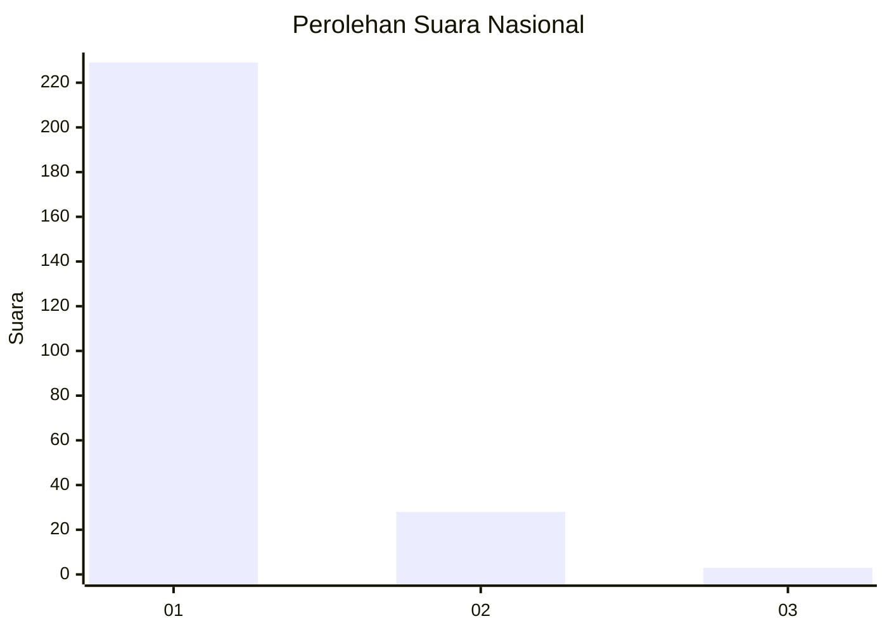
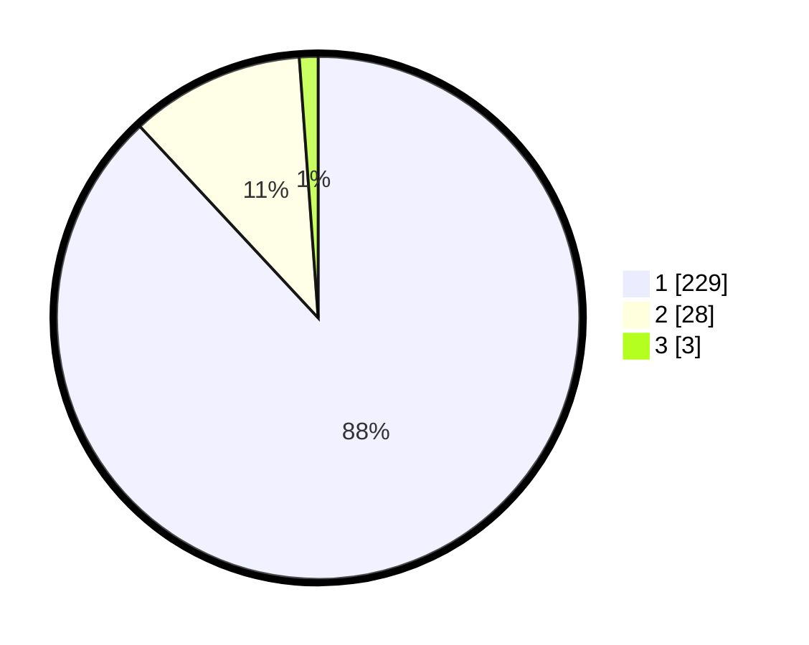

# Hasil

## Grafik

## Tabel

| No. | Nama Paslon    | Suara | Suara (raw) | Persentase |
|:--- |:-------------- | -----:| -----------:| ----------:|
| 1   | ANIES MUHAIMIN | 229   | [229][p-1]  | 88,08      |
| 2   | PRABOWO GIBRAN | 28    | [28][p-2]   | 10,77      |
| 3   | GANJAR MAHFUD  | 3     | [3][p-3]    | 1,15       |

[p-1]: https://github.com/gigit-pemilu/pemilu-2024/blob/main/pilpres/hitung-suara/sub/11-aceh/sub/73-kota-lhokseumawe/sub/02-banda-sakti/sub/2006-mon-geudong/sub/012-tps/sub/paslon-1.txt
[p-2]: https://github.com/gigit-pemilu/pemilu-2024/blob/main/pilpres/hitung-suara/sub/11-aceh/sub/73-kota-lhokseumawe/sub/02-banda-sakti/sub/2006-mon-geudong/sub/012-tps/sub/paslon-2.txt
[p-3]: https://github.com/gigit-pemilu/pemilu-2024/blob/main/pilpres/hitung-suara/sub/11-aceh/sub/73-kota-lhokseumawe/sub/02-banda-sakti/sub/2006-mon-geudong/sub/012-tps/sub/paslon-3.txt

## Foto C Plano

https://sirekap-obj-formc.kpu.go.id/745b/pemilu/ppwp/11/73/02/20/06/1173022006012-20240215-051855--0c83ad51-d080-4270-b1ca-69aa5367b4d6.jpg

https://sirekap-obj-formc.kpu.go.id/745b/pemilu/ppwp/11/73/02/20/06/1173022006012-20240215-051915--cbced79c-5740-4556-93fd-e15fc6cc8970.jpg

https://sirekap-obj-formc.kpu.go.id/745b/pemilu/ppwp/11/73/02/20/06/1173022006012-20240215-051932--6eac816c-a966-4494-8532-12dab52b3271.jpg

## Metadata

| Key        | Value               |
| ---------- | ------------------- |
| Time Stamp | 2024-02-24 22:31:28 |

