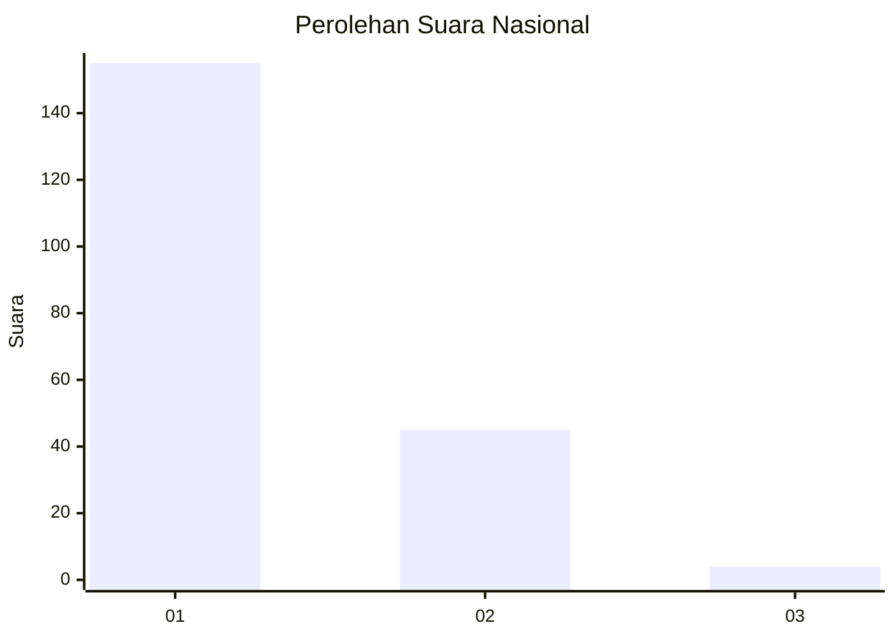
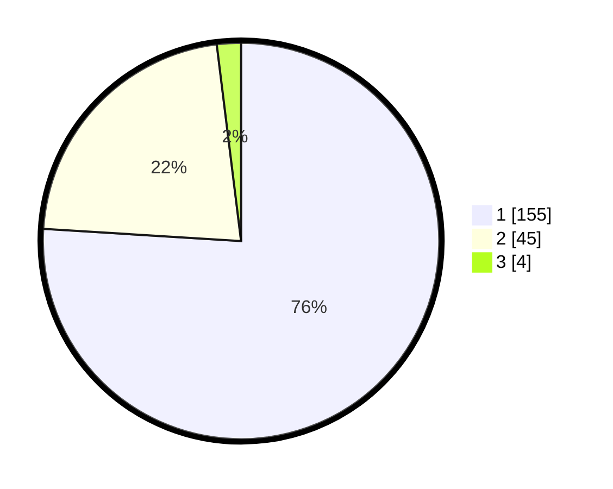

# Hasil

## Grafik

## Tabel

| No. | Nama Paslon    | Suara | Suara (raw) | Persentase |
|:--- |:-------------- | -----:| -----------:| ----------:|
| 1   | ANIES MUHAIMIN | 155   | [155][p-1]  | 75,98      |
| 2   | PRABOWO GIBRAN | 45    | [45][p-2]   | 22,06      |
| 3   | GANJAR MAHFUD  | 4     | [4][p-3]    | 1,96       |

[p-1]: https://github.com/gigit-pemilu/pemilu-2024/blob/main/pilpres/hitung-suara/sub/11-aceh/sub/73-kota-lhokseumawe/sub/02-banda-sakti/sub/2009-hagu-teungoh/sub/001-tps/sub/paslon-1.txt
[p-2]: https://github.com/gigit-pemilu/pemilu-2024/blob/main/pilpres/hitung-suara/sub/11-aceh/sub/73-kota-lhokseumawe/sub/02-banda-sakti/sub/2009-hagu-teungoh/sub/001-tps/sub/paslon-2.txt
[p-3]: https://github.com/gigit-pemilu/pemilu-2024/blob/main/pilpres/hitung-suara/sub/11-aceh/sub/73-kota-lhokseumawe/sub/02-banda-sakti/sub/2009-hagu-teungoh/sub/001-tps/sub/paslon-3.txt

## Foto C Plano

https://sirekap-obj-formc.kpu.go.id/38d6/pemilu/ppwp/11/73/02/20/09/1173022009001-20240214-225308--c0f9c7aa-fb49-4805-81a4-72810a4dd65c.jpg

https://sirekap-obj-formc.kpu.go.id/38d6/pemilu/ppwp/11/73/02/20/09/1173022009001-20240214-225339--9e079bb9-d5c7-4787-a932-27fd31df2281.jpg

https://sirekap-obj-formc.kpu.go.id/38d6/pemilu/ppwp/11/73/02/20/09/1173022009001-20240214-225403--9e757222-4b93-4cc5-9bcb-0b8e027ba04f.jpg

## Metadata

| Key        | Value               |
| ---------- | ------------------- |
| Time Stamp | 2024-02-16 00:00:26 |

