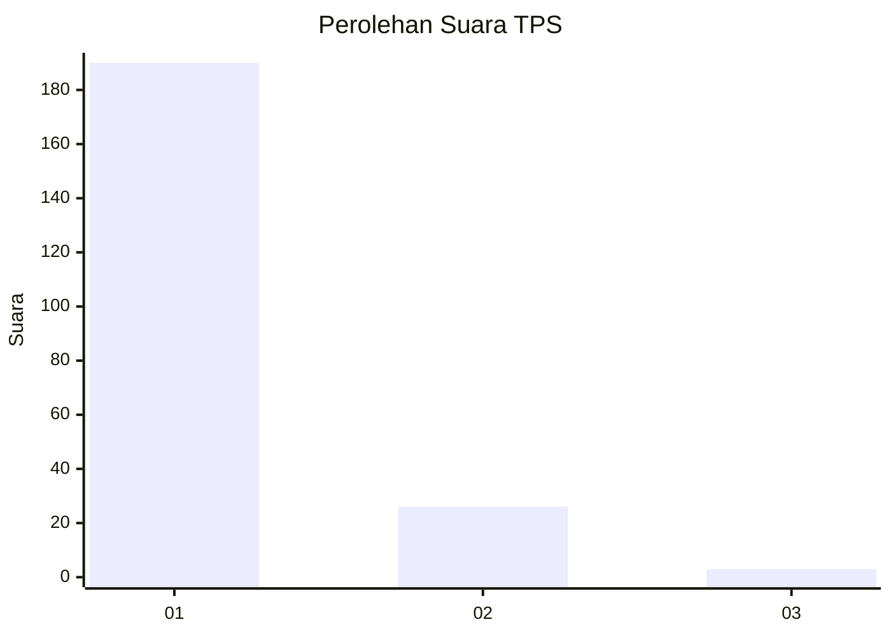
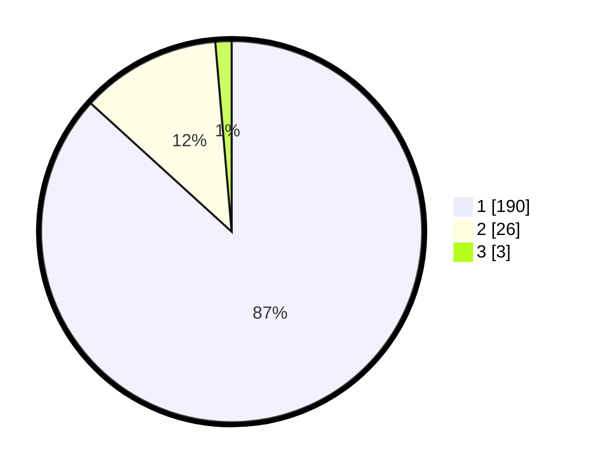

# Hasil

## Grafik

## Tabel

| No. | Nama Paslon    | Suara | Suara (raw) | Persentase |
|:--- |:-------------- | -----:| -----------:| ----------:|
| 1   | ANIES MUHAIMIN | 190   | [190][p-1]  | 86,76      |
| 2   | PRABOWO GIBRAN | 26    | [26][p-2]   | 11,87      |
| 3   | GANJAR MAHFUD  | 3     | [3][p-3]    | 1,37       |

[p-1]: https://github.com/gigit-pemilu/pemilu-2024-11-aceh/blob/main/pilpres/hitung-suara/sub/11-aceh/sub/73-kota-lhokseumawe/sub/02-banda-sakti/sub/2010-uteun-bayi/sub/012-tps/sub/paslon-1.txt
[p-2]: https://github.com/gigit-pemilu/pemilu-2024-11-aceh/blob/main/pilpres/hitung-suara/sub/11-aceh/sub/73-kota-lhokseumawe/sub/02-banda-sakti/sub/2010-uteun-bayi/sub/012-tps/sub/paslon-2.txt
[p-3]: https://github.com/gigit-pemilu/pemilu-2024-11-aceh/blob/main/pilpres/hitung-suara/sub/11-aceh/sub/73-kota-lhokseumawe/sub/02-banda-sakti/sub/2010-uteun-bayi/sub/012-tps/sub/paslon-3.txt

## Foto C Plano

https://sirekap-obj-formc.kpu.go.id/75c9/pemilu/ppwp/11/73/02/20/10/1173022010012-20240215-044901--9e8175c1-ad24-4e17-bc05-07d190c3aeb4.jpg

https://sirekap-obj-formc.kpu.go.id/75c9/pemilu/ppwp/11/73/02/20/10/1173022010012-20240214-220314--2f97600b-9c60-4155-9cbc-6d1bb03d4f5d.jpg

https://sirekap-obj-formc.kpu.go.id/75c9/pemilu/ppwp/11/73/02/20/10/1173022010012-20240215-045529--f239ccc0-3e9c-4231-bf6e-01aaef72ceb4.jpg

## Metadata

| Key        | Value               |
| ---------- | ------------------- |
| Time Stamp | 2024-02-15 17:00:25 |

