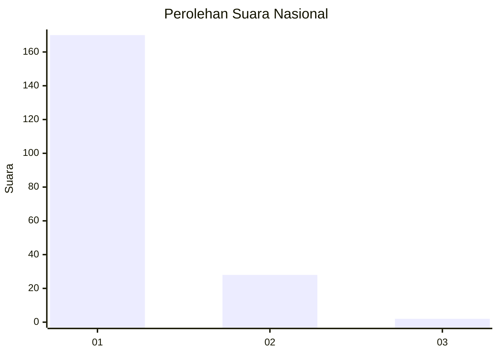
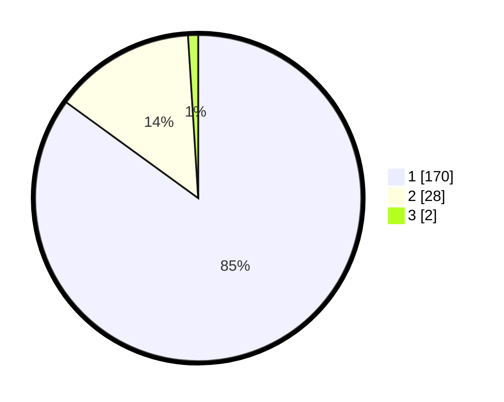

# Hasil

## Grafik

## Tabel

| No. | Nama Paslon    | Suara | Suara (raw) | Persentase |
|:--- |:-------------- | -----:| -----------:| ----------:|
| 1   | ANIES MUHAIMIN | 170   | [170][p-1]  | 85,00      |
| 2   | PRABOWO GIBRAN | 28    | [28][p-2]   | 14,00      |
| 3   | GANJAR MAHFUD  | 2     | [2][p-3]    | 1,00       |

[p-1]: https://github.com/gigit-pemilu/pemilu-2024/blob/main/pilpres/hitung-suara/sub/11-aceh/sub/73-kota-lhokseumawe/sub/02-banda-sakti/sub/2017-jawa-baroe/sub/003-tps/sub/paslon-1.txt
[p-2]: https://github.com/gigit-pemilu/pemilu-2024/blob/main/pilpres/hitung-suara/sub/11-aceh/sub/73-kota-lhokseumawe/sub/02-banda-sakti/sub/2017-jawa-baroe/sub/003-tps/sub/paslon-2.txt
[p-3]: https://github.com/gigit-pemilu/pemilu-2024/blob/main/pilpres/hitung-suara/sub/11-aceh/sub/73-kota-lhokseumawe/sub/02-banda-sakti/sub/2017-jawa-baroe/sub/003-tps/sub/paslon-3.txt

## Foto C Plano

https://sirekap-obj-formc.kpu.go.id/68ee/pemilu/ppwp/11/73/02/20/17/1173022017003-20240215-061035--3fe815a7-fe85-459c-8ce1-46b2bdf60466.jpg

https://sirekap-obj-formc.kpu.go.id/68ee/pemilu/ppwp/11/73/02/20/17/1173022017003-20240215-062045--90a6f5d6-56cd-41ee-8d34-6d37a8cdc0a2.jpg

https://sirekap-obj-formc.kpu.go.id/68ee/pemilu/ppwp/11/73/02/20/17/1173022017003-20240215-062324--7e2f728e-c392-49cd-8995-f25097844f17.jpg

## Metadata

| Key        | Value               |
| ---------- | ------------------- |
| Time Stamp | 2024-02-15 22:40:13 |

