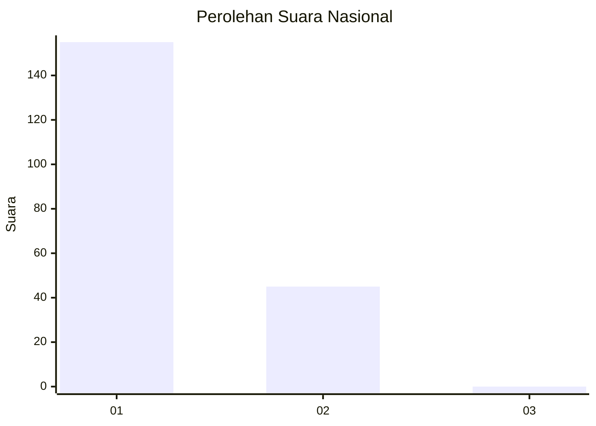
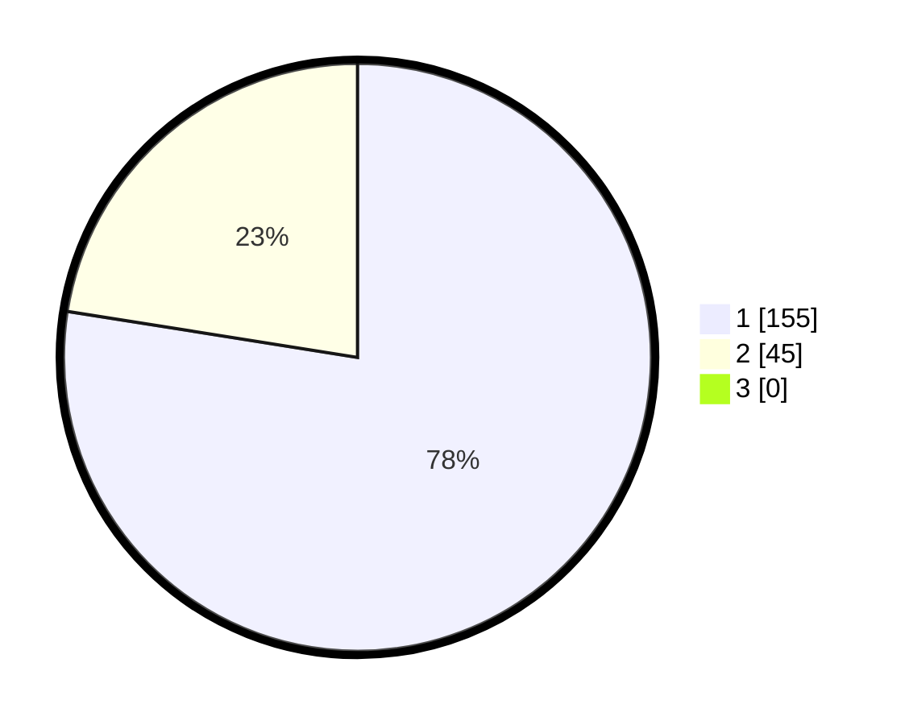

# Hasil

## Grafik

## Tabel

| No. | Nama Paslon    | Suara | Suara (raw) | Persentase |
|:--- |:-------------- | -----:| -----------:| ----------:|
| 1   | ANIES MUHAIMIN | 155   | [155][p-1]  | 77,50      |
| 2   | PRABOWO GIBRAN | 45    | [45][p-2]   | 22,50      |
| 3   | GANJAR MAHFUD  | 0     | [0][p-3]    | 0,00       |

[p-1]: https://github.com/gigit-pemilu/pemilu-2024/blob/main/pilpres/hitung-suara/sub/11-aceh/sub/73-kota-lhokseumawe/sub/02-banda-sakti/sub/2017-jawa-baroe/sub/007-tps/sub/paslon-1.txt
[p-2]: https://github.com/gigit-pemilu/pemilu-2024/blob/main/pilpres/hitung-suara/sub/11-aceh/sub/73-kota-lhokseumawe/sub/02-banda-sakti/sub/2017-jawa-baroe/sub/007-tps/sub/paslon-2.txt
[p-3]: https://github.com/gigit-pemilu/pemilu-2024/blob/main/pilpres/hitung-suara/sub/11-aceh/sub/73-kota-lhokseumawe/sub/02-banda-sakti/sub/2017-jawa-baroe/sub/007-tps/sub/paslon-3.txt

## Foto C Plano

https://sirekap-obj-formc.kpu.go.id/4674/pemilu/ppwp/11/73/02/20/17/1173022017007-20240215-062523--ee3d6f6f-bd1a-4c6f-942f-caff38e6af20.jpg

https://sirekap-obj-formc.kpu.go.id/4674/pemilu/ppwp/11/73/02/20/17/1173022017007-20240214-204215--94f931b2-b0be-4ceb-ba4d-18dc538f3089.jpg

https://sirekap-obj-formc.kpu.go.id/4674/pemilu/ppwp/11/73/02/20/17/1173022017007-20240215-062644--9d5a667d-a52b-4390-9492-88bf31a147f8.jpg

## Metadata

| Key        | Value               |
| ---------- | ------------------- |
| Time Stamp | 2024-02-15 17:00:25 |

