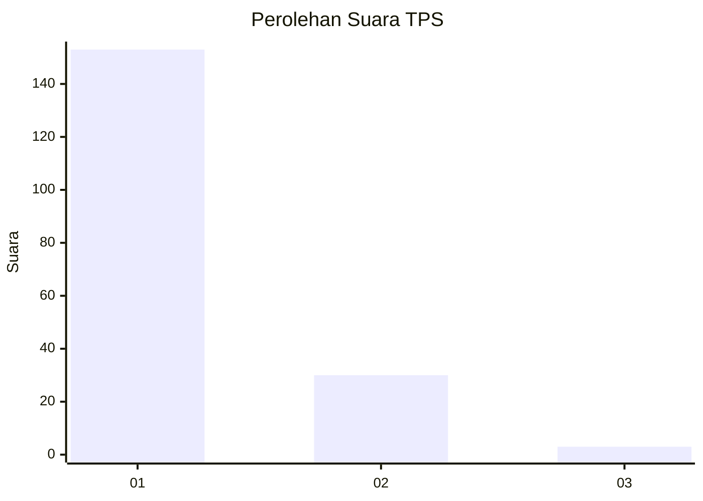
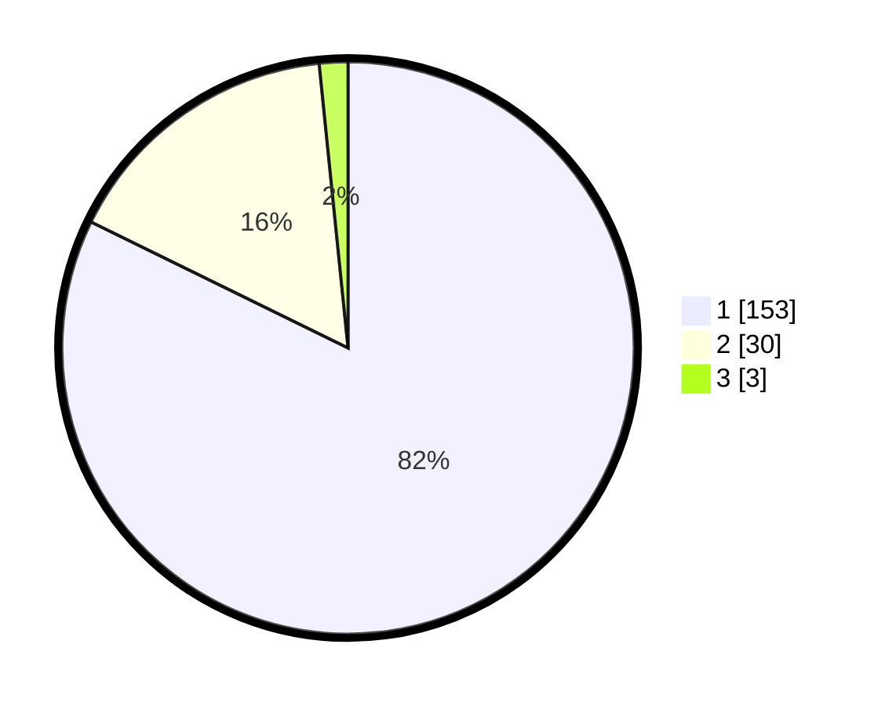

# Hasil

## Grafik

## Tabel

| No. | Nama Paslon    | Suara | Suara (raw) | Persentase |
|:--- |:-------------- | -----:| -----------:| ----------:|
| 1   | ANIES MUHAIMIN | 153   | [153][p-1]  | 82,26      |
| 2   | PRABOWO GIBRAN | 30    | [30][p-2]   | 16,13      |
| 3   | GANJAR MAHFUD  | 3     | [3][p-3]    | 1,61       |

[p-1]: https://github.com/gigit-pemilu/pemilu-2024-11-aceh/blob/main/pilpres/hitung-suara/sub/11-aceh/sub/73-kota-lhokseumawe/sub/03-blang-mangat/sub/2001-kuala/sub/001-tps/sub/paslon-1.txt
[p-2]: https://github.com/gigit-pemilu/pemilu-2024-11-aceh/blob/main/pilpres/hitung-suara/sub/11-aceh/sub/73-kota-lhokseumawe/sub/03-blang-mangat/sub/2001-kuala/sub/001-tps/sub/paslon-2.txt
[p-3]: https://github.com/gigit-pemilu/pemilu-2024-11-aceh/blob/main/pilpres/hitung-suara/sub/11-aceh/sub/73-kota-lhokseumawe/sub/03-blang-mangat/sub/2001-kuala/sub/001-tps/sub/paslon-3.txt

## Foto C Plano

https://sirekap-obj-formc.kpu.go.id/89e4/pemilu/ppwp/11/73/03/20/01/1173032001001-20240215-080138--a246bb02-7322-4e81-85e8-5ffcac17b0f1.jpg

https://sirekap-obj-formc.kpu.go.id/89e4/pemilu/ppwp/11/73/03/20/01/1173032001001-20240215-080327--b59fa454-6df6-455d-85b6-5b7abe2f6f24.jpg

https://sirekap-obj-formc.kpu.go.id/89e4/pemilu/ppwp/11/73/03/20/01/1173032001001-20240215-080512--6163369d-debf-412c-846b-fbc23be722d0.jpg

## Metadata

| Key        | Value               |
| ---------- | ------------------- |
| Time Stamp | 2024-02-15 22:00:27 |

