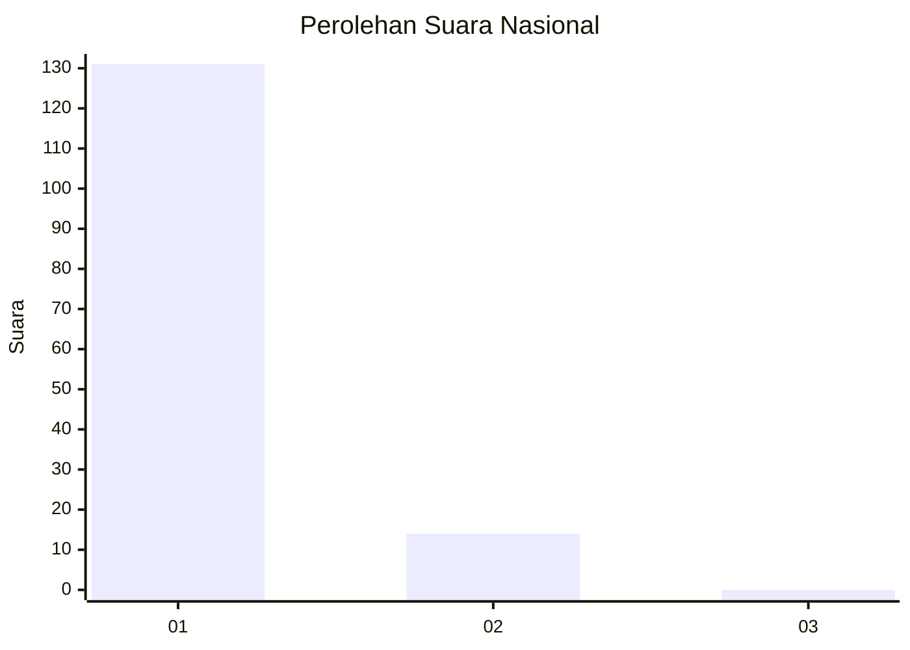
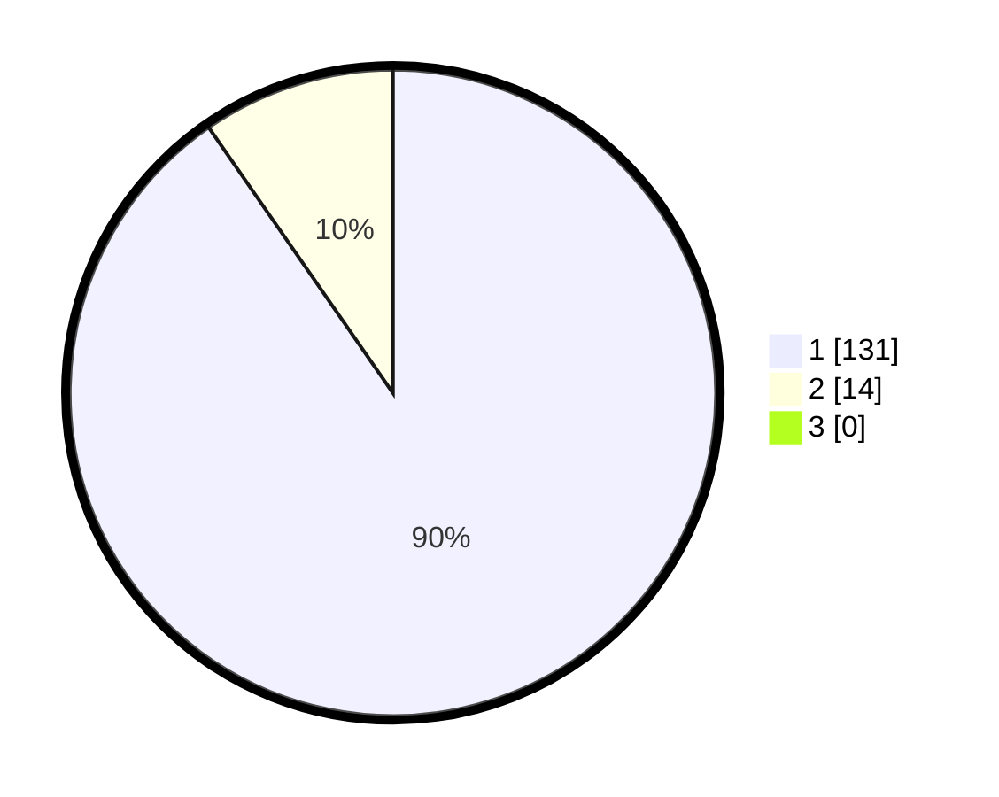

# Hasil

## Grafik

## Tabel

| No. | Nama Paslon    | Suara | Suara (raw) | Persentase |
|:--- |:-------------- | -----:| -----------:| ----------:|
| 1   | ANIES MUHAIMIN | 131   | [131][p-1]  | 90,34      |
| 2   | PRABOWO GIBRAN | 14    | [14][p-2]   | 9,66       |
| 3   | GANJAR MAHFUD  | 0     | [0][p-3]    | 0,00       |

[p-1]: https://github.com/gigit-pemilu/pemilu-2024/blob/main/pilpres/hitung-suara/sub/11-aceh/sub/73-kota-lhokseumawe/sub/03-blang-mangat/sub/2009-mane-kareung/sub/003-tps/sub/paslon-1.txt
[p-2]: https://github.com/gigit-pemilu/pemilu-2024/blob/main/pilpres/hitung-suara/sub/11-aceh/sub/73-kota-lhokseumawe/sub/03-blang-mangat/sub/2009-mane-kareung/sub/003-tps/sub/paslon-2.txt
[p-3]: https://github.com/gigit-pemilu/pemilu-2024/blob/main/pilpres/hitung-suara/sub/11-aceh/sub/73-kota-lhokseumawe/sub/03-blang-mangat/sub/2009-mane-kareung/sub/003-tps/sub/paslon-3.txt

## Foto C Plano

https://sirekap-obj-formc.kpu.go.id/d4eb/pemilu/ppwp/11/73/03/20/09/1173032009003-20240214-205849--bb6d2622-30c5-4304-9ea0-4d50a83e9d9d.jpg

https://sirekap-obj-formc.kpu.go.id/d4eb/pemilu/ppwp/11/73/03/20/09/1173032009003-20240214-231902--37da42a5-909f-4ff0-a010-8807c8af7733.jpg

https://sirekap-obj-formc.kpu.go.id/d4eb/pemilu/ppwp/11/73/03/20/09/1173032009003-20240214-205933--2cbe2203-4c92-4d20-a9c6-e39cfc36c5fa.jpg

## Metadata

| Key        | Value               |
| ---------- | ------------------- |
| Time Stamp | 2024-02-15 20:30:46 |

