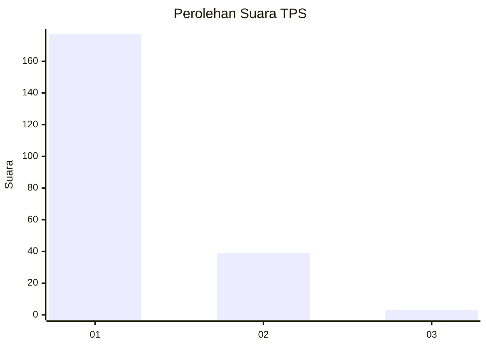
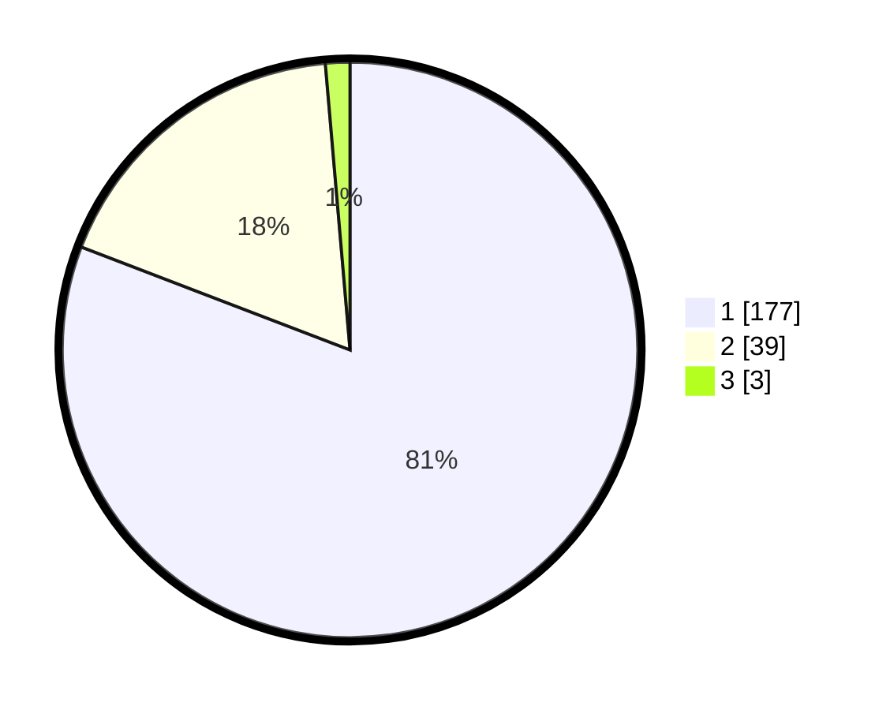

# Hasil

## Grafik

## Tabel

| No. | Nama Paslon    | Suara | Suara (raw) | Persentase |
|:--- |:-------------- | -----:| -----------:| ----------:|
| 1   | ANIES MUHAIMIN | 177   | [177][p-1]  | 80,82      |
| 2   | PRABOWO GIBRAN | 39    | [39][p-2]   | 17,81      |
| 3   | GANJAR MAHFUD  | 3     | [3][p-3]    | 1,37       |

[p-1]: https://github.com/gigit-pemilu/pemilu-2024-11-aceh/blob/main/pilpres/hitung-suara/sub/11-aceh/sub/73-kota-lhokseumawe/sub/04-muara-satu/sub/2002-blang-panyang/sub/004-tps/sub/paslon-1.txt
[p-2]: https://github.com/gigit-pemilu/pemilu-2024-11-aceh/blob/main/pilpres/hitung-suara/sub/11-aceh/sub/73-kota-lhokseumawe/sub/04-muara-satu/sub/2002-blang-panyang/sub/004-tps/sub/paslon-2.txt
[p-3]: https://github.com/gigit-pemilu/pemilu-2024-11-aceh/blob/main/pilpres/hitung-suara/sub/11-aceh/sub/73-kota-lhokseumawe/sub/04-muara-satu/sub/2002-blang-panyang/sub/004-tps/sub/paslon-3.txt

## Foto C Plano

https://sirekap-obj-formc.kpu.go.id/b0e3/pemilu/ppwp/11/73/04/20/02/1173042002004-20240215-110316--1942c56f-813d-4381-9e95-5b05bd105e26.jpg

https://sirekap-obj-formc.kpu.go.id/b0e3/pemilu/ppwp/11/73/04/20/02/1173042002004-20240215-110120--22c3cf7b-67f5-4a83-bb9a-c2bfc80bccaf.jpg

https://sirekap-obj-formc.kpu.go.id/b0e3/pemilu/ppwp/11/73/04/20/02/1173042002004-20240215-110201--f450bb82-3657-4312-9b9d-da7c66e80403.jpg

## Metadata

| Key        | Value               |
| ---------- | ------------------- |
| Time Stamp | 2024-02-15 15:30:25 |

