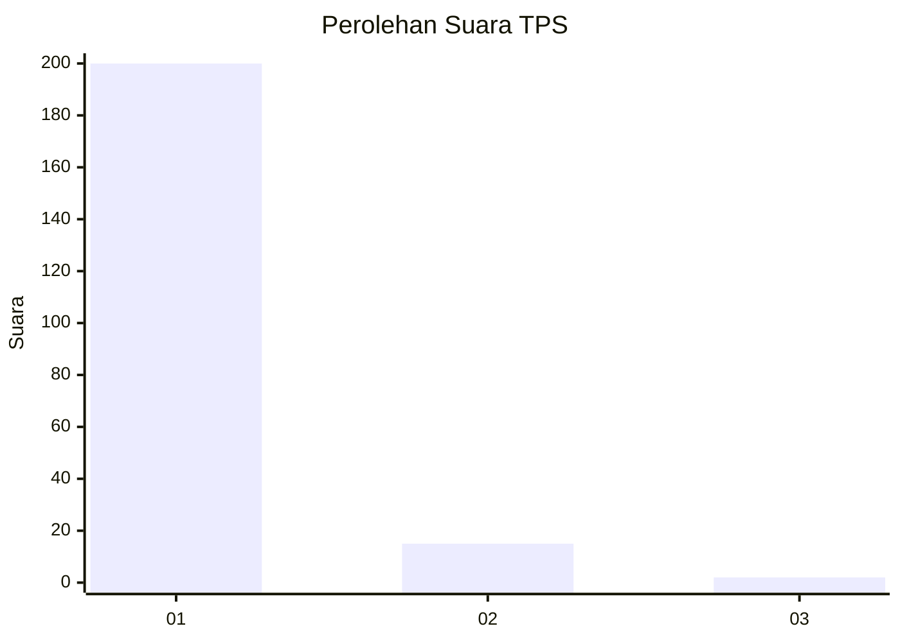
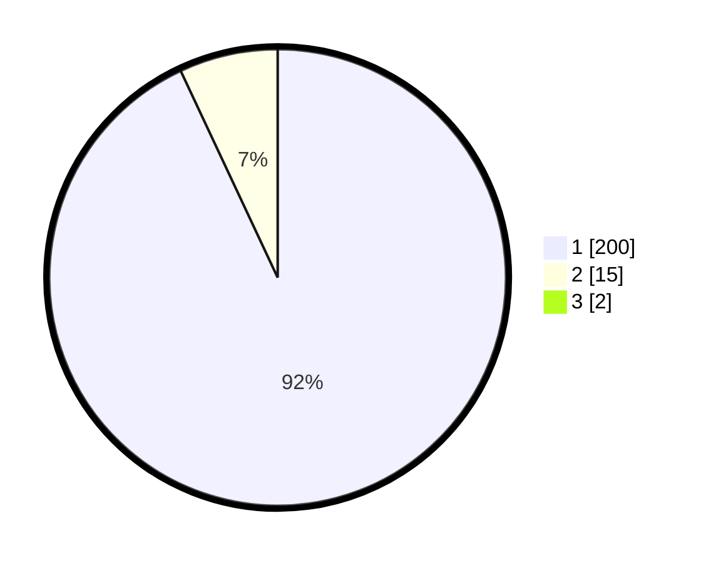

# Hasil

## Grafik

## Tabel

| No. | Nama Paslon    | Suara | Suara (raw) | Persentase |
|:--- |:-------------- | -----:| -----------:| ----------:|
| 1   | ANIES MUHAIMIN | 200   | [200][p-1]  | 92,17      |
| 2   | PRABOWO GIBRAN | 15    | [15][p-2]   | 6,91       |
| 3   | GANJAR MAHFUD  | 2     | [2][p-3]    | 0,92       |

[p-1]: https://github.com/gigit-pemilu/pemilu-2024-11-aceh/blob/main/pilpres/hitung-suara/sub/11-aceh/sub/73-kota-lhokseumawe/sub/04-muara-satu/sub/2003-meunasah-dayah/sub/003-tps/sub/paslon-1.txt
[p-2]: https://github.com/gigit-pemilu/pemilu-2024-11-aceh/blob/main/pilpres/hitung-suara/sub/11-aceh/sub/73-kota-lhokseumawe/sub/04-muara-satu/sub/2003-meunasah-dayah/sub/003-tps/sub/paslon-2.txt
[p-3]: https://github.com/gigit-pemilu/pemilu-2024-11-aceh/blob/main/pilpres/hitung-suara/sub/11-aceh/sub/73-kota-lhokseumawe/sub/04-muara-satu/sub/2003-meunasah-dayah/sub/003-tps/sub/paslon-3.txt

## Foto C Plano

https://sirekap-obj-formc.kpu.go.id/260a/pemilu/ppwp/11/73/04/20/03/1173042003003-20240221-104919--831d36dc-ec51-42b3-b23a-2b7ea16af36d.jpg

https://sirekap-obj-formc.kpu.go.id/260a/pemilu/ppwp/11/73/04/20/03/1173042003003-20240221-104650--9b2946e4-9df9-43ef-9ea9-21764acd733f.jpg

https://sirekap-obj-formc.kpu.go.id/260a/pemilu/ppwp/11/73/04/20/03/1173042003003-20240221-104745--de3fccff-a4a1-49e3-9ba9-9a1a3f4e76cc.jpg

## Metadata

| Key        | Value               |
| ---------- | ------------------- |
| Time Stamp | 2024-02-21 13:00:00 |

