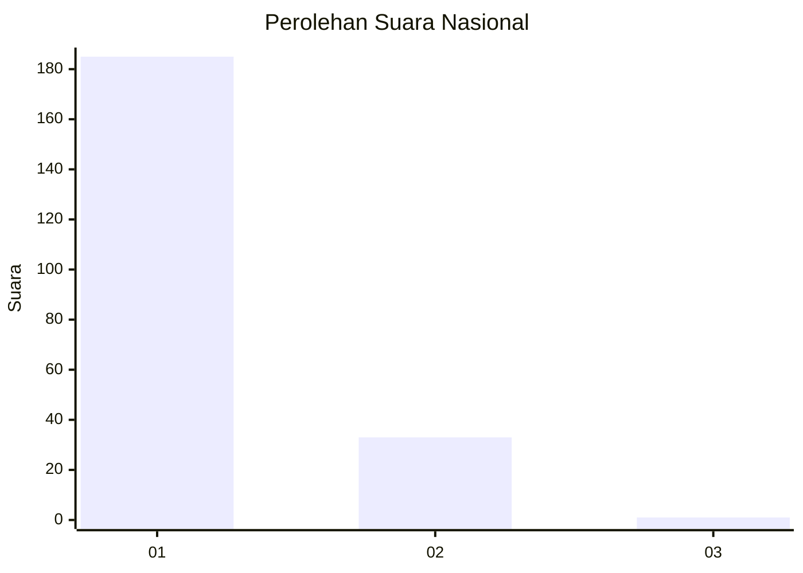
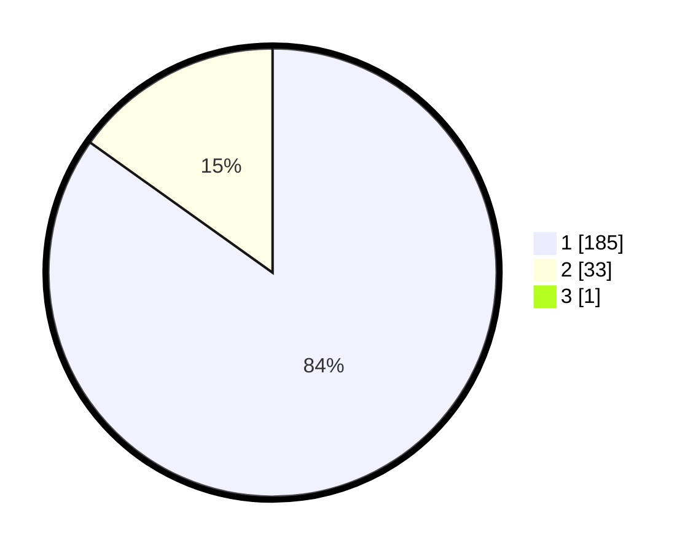

# Hasil

## Grafik

## Tabel

| No. | Nama Paslon    | Suara | Suara (raw) | Persentase |
|:--- |:-------------- | -----:| -----------:| ----------:|
| 1   | ANIES MUHAIMIN | 185   | [185][p-1]  | 84,47      |
| 2   | PRABOWO GIBRAN | 33    | [33][p-2]   | 15,07      |
| 3   | GANJAR MAHFUD  | 1     | [1][p-3]    | 0,46       |

[p-1]: https://github.com/gigit-pemilu/pemilu-2024/blob/main/pilpres/hitung-suara/sub/11-aceh/sub/73-kota-lhokseumawe/sub/04-muara-satu/sub/2005-blang-pulo/sub/004-tps/sub/paslon-1.txt
[p-2]: https://github.com/gigit-pemilu/pemilu-2024/blob/main/pilpres/hitung-suara/sub/11-aceh/sub/73-kota-lhokseumawe/sub/04-muara-satu/sub/2005-blang-pulo/sub/004-tps/sub/paslon-2.txt
[p-3]: https://github.com/gigit-pemilu/pemilu-2024/blob/main/pilpres/hitung-suara/sub/11-aceh/sub/73-kota-lhokseumawe/sub/04-muara-satu/sub/2005-blang-pulo/sub/004-tps/sub/paslon-3.txt

## Foto C Plano

https://sirekap-obj-formc.kpu.go.id/a56d/pemilu/ppwp/11/73/04/20/05/1173042005004-20240223-084249--ab00d4ec-37db-4328-8caa-a624008c58ed.jpg

https://sirekap-obj-formc.kpu.go.id/a56d/pemilu/ppwp/11/73/04/20/05/1173042005004-20240222-235725--bad2bdeb-2168-474f-9eee-582f1fb075b8.jpg

https://sirekap-obj-formc.kpu.go.id/a56d/pemilu/ppwp/11/73/04/20/05/1173042005004-20240222-235913--ccc4d289-8e7e-4d33-bde2-7400e21582fa.jpg

## Metadata

| Key        | Value               |
| ---------- | ------------------- |
| Time Stamp | 2024-02-24 22:31:28 |

