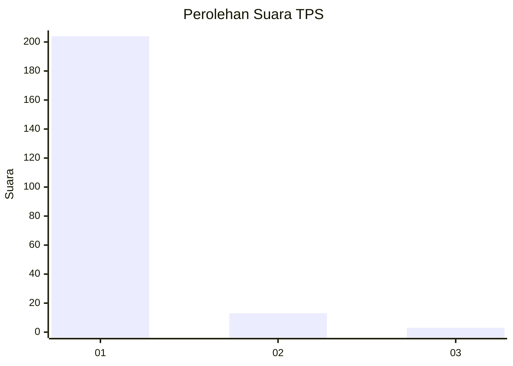
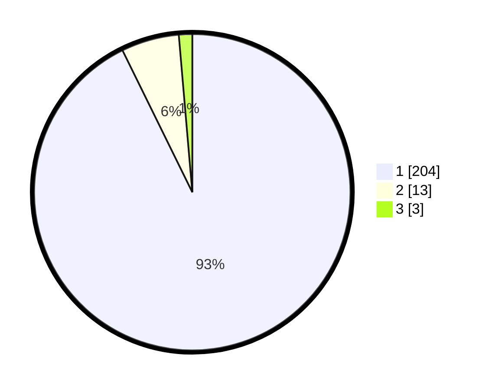

# Hasil

## Grafik

## Tabel

| No. | Nama Paslon    | Suara | Suara (raw) | Persentase |
|:--- |:-------------- | -----:| -----------:| ----------:|
| 1   | ANIES MUHAIMIN | 204   | [204][p-1]  | 92,73      |
| 2   | PRABOWO GIBRAN | 13    | [13][p-2]   | 5,91       |
| 3   | GANJAR MAHFUD  | 3     | [3][p-3]    | 1,36       |

[p-1]: https://github.com/gigit-pemilu/pemilu-2024-11-aceh/blob/main/pilpres/hitung-suara/sub/11-aceh/sub/73-kota-lhokseumawe/sub/04-muara-satu/sub/2009-padang-sakti/sub/002-tps/sub/paslon-1.txt
[p-2]: https://github.com/gigit-pemilu/pemilu-2024-11-aceh/blob/main/pilpres/hitung-suara/sub/11-aceh/sub/73-kota-lhokseumawe/sub/04-muara-satu/sub/2009-padang-sakti/sub/002-tps/sub/paslon-2.txt
[p-3]: https://github.com/gigit-pemilu/pemilu-2024-11-aceh/blob/main/pilpres/hitung-suara/sub/11-aceh/sub/73-kota-lhokseumawe/sub/04-muara-satu/sub/2009-padang-sakti/sub/002-tps/sub/paslon-3.txt

## Foto C Plano

https://sirekap-obj-formc.kpu.go.id/16ff/pemilu/ppwp/11/73/04/20/09/1173042009002-20240214-202126--41d9f913-c6f9-457e-a5a7-d6e6c6712ed7.jpg

https://sirekap-obj-formc.kpu.go.id/16ff/pemilu/ppwp/11/73/04/20/09/1173042009002-20240214-202133--dd92abad-491d-4980-afeb-0ca063161297.jpg

https://sirekap-obj-formc.kpu.go.id/16ff/pemilu/ppwp/11/73/04/20/09/1173042009002-20240214-202138--f61e3316-7671-4f52-bc33-bd6865c99cba.jpg

## Metadata

| Key        | Value               |
| ---------- | ------------------- |
| Time Stamp | 2024-02-15 00:41:44 |

