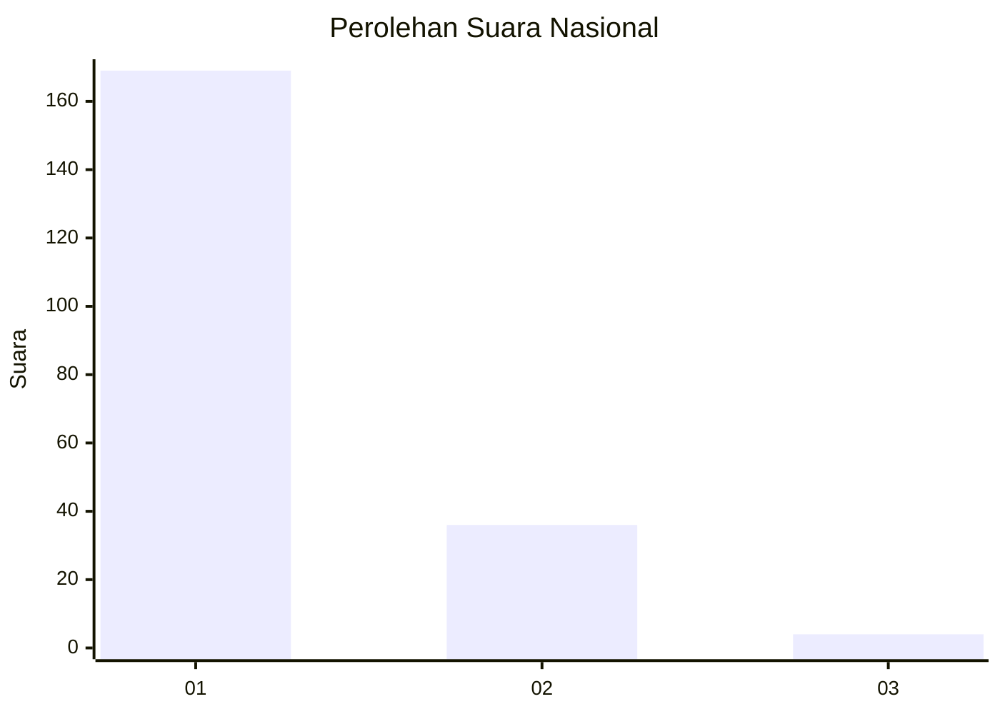
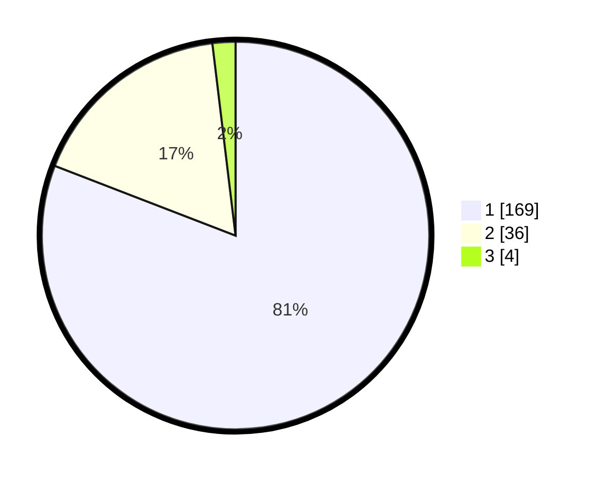

# Hasil

## Grafik

## Tabel

| No. | Nama Paslon    | Suara | Suara (raw) | Persentase |
|:--- |:-------------- | -----:| -----------:| ----------:|
| 1   | ANIES MUHAIMIN | 169   | [169][p-1]  | 80,86      |
| 2   | PRABOWO GIBRAN | 36    | [36][p-2]   | 17,22      |
| 3   | GANJAR MAHFUD  | 4     | [4][p-3]    | 1,91       |

[p-1]: https://github.com/gigit-pemilu/pemilu-2024/blob/main/pilpres/hitung-suara/sub/11-aceh/sub/73-kota-lhokseumawe/sub/04-muara-satu/sub/2009-padang-sakti/sub/003-tps/sub/paslon-1.txt
[p-2]: https://github.com/gigit-pemilu/pemilu-2024/blob/main/pilpres/hitung-suara/sub/11-aceh/sub/73-kota-lhokseumawe/sub/04-muara-satu/sub/2009-padang-sakti/sub/003-tps/sub/paslon-2.txt
[p-3]: https://github.com/gigit-pemilu/pemilu-2024/blob/main/pilpres/hitung-suara/sub/11-aceh/sub/73-kota-lhokseumawe/sub/04-muara-satu/sub/2009-padang-sakti/sub/003-tps/sub/paslon-3.txt

## Foto C Plano

https://sirekap-obj-formc.kpu.go.id/4fa1/pemilu/ppwp/11/73/04/20/09/1173042009003-20240214-222745--53b8e6ad-6013-4327-99b7-735cffb72c3c.jpg

https://sirekap-obj-formc.kpu.go.id/4fa1/pemilu/ppwp/11/73/04/20/09/1173042009003-20240214-223000--4adaec2f-f4b1-4ba7-8acc-6881ec4efae0.jpg

## Metadata

| Key        | Value               |
| ---------- | ------------------- |
| Time Stamp | 2024-02-15 15:00:29 |

