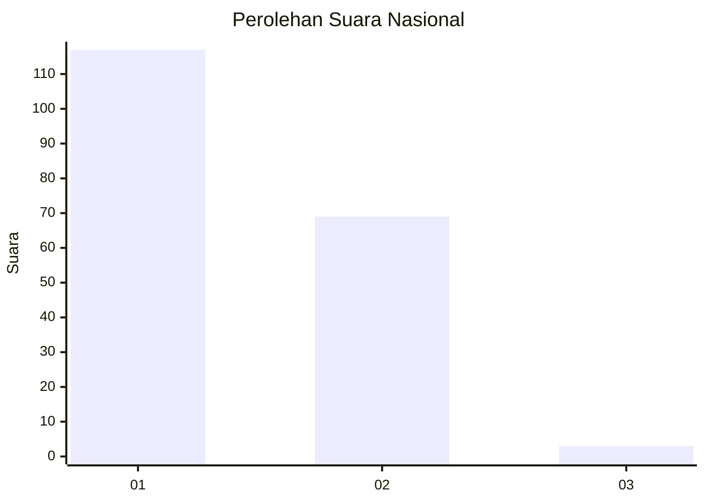
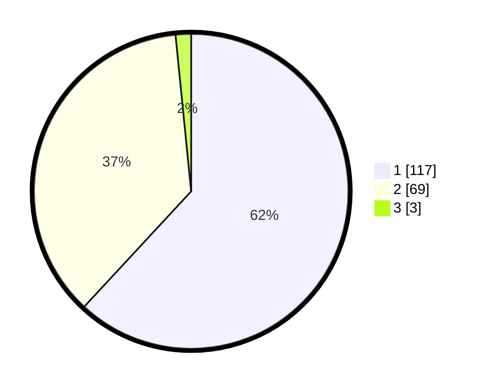

# Hasil

## Grafik

## Tabel

| No. | Nama Paslon    | Suara | Suara (raw) | Persentase |
|:--- |:-------------- | -----:| -----------:| ----------:|
| 1   | ANIES MUHAIMIN | 117   | [117][p-1]  | 61,90      |
| 2   | PRABOWO GIBRAN | 69    | [69][p-2]   | 36,51      |
| 3   | GANJAR MAHFUD  | 3     | [3][p-3]    | 1,59       |

[p-1]: https://github.com/gigit-pemilu/pemilu-2024/blob/main/pilpres/hitung-suara/sub/11-aceh/sub/74-kota-langsa/sub/01-langsa-timur/sub/2007-buket-medang-ara/sub/001-tps/sub/paslon-1.txt
[p-2]: https://github.com/gigit-pemilu/pemilu-2024/blob/main/pilpres/hitung-suara/sub/11-aceh/sub/74-kota-langsa/sub/01-langsa-timur/sub/2007-buket-medang-ara/sub/001-tps/sub/paslon-2.txt
[p-3]: https://github.com/gigit-pemilu/pemilu-2024/blob/main/pilpres/hitung-suara/sub/11-aceh/sub/74-kota-langsa/sub/01-langsa-timur/sub/2007-buket-medang-ara/sub/001-tps/sub/paslon-3.txt

## Foto C Plano

https://sirekap-obj-formc.kpu.go.id/0f08/pemilu/ppwp/11/74/01/20/07/1174012007001-20240218-113144--5e0c71a7-448c-4820-82ce-98a0604dffb5.jpg

https://sirekap-obj-formc.kpu.go.id/0f08/pemilu/ppwp/11/74/01/20/07/1174012007001-20240218-113722--705c689e-c64e-4da5-8a19-ccd0320d3e34.jpg

https://sirekap-obj-formc.kpu.go.id/0f08/pemilu/ppwp/11/74/01/20/07/1174012007001-20240218-113229--0bc1bf69-df1b-4f5a-93d6-39297aa0269b.jpg

## Metadata

| Key        | Value               |
| ---------- | ------------------- |
| Time Stamp | 2024-02-21 19:00:00 |

## DATA PEMILIH TETAP

Jumlah pemilih dalam DPT: **208**.
 * L: **103**.
 * P: **105**.

## DATA PENGGUNA HAK PILIH

Jumlah pengguna hak pilih dalam DPT: **186**.
 * L: **89**.
 * P: **97**.

Jumlah pengguna hak pilih dalam DPTb: **2**.
 * L: **1**.
 * P: **1**.

Jumlah pengguna hak pilih dalam DPK: **5**.
 * L: **3**.
 * P: **2**.

Jumlah pengguna hak pilih: **193**.
 * L: **93**.
 * P: **100**.

## JUMLAH SUARA SAH DAN TIDAK SAH

JUMLAH SELURUH SUARA SAH: **189**.

JUMLAH SUARA TIDAK SAH: **4**.

JUMLAH SELURUH SUARA SAH DAN SUARA TIDAK SAH: **193**.

