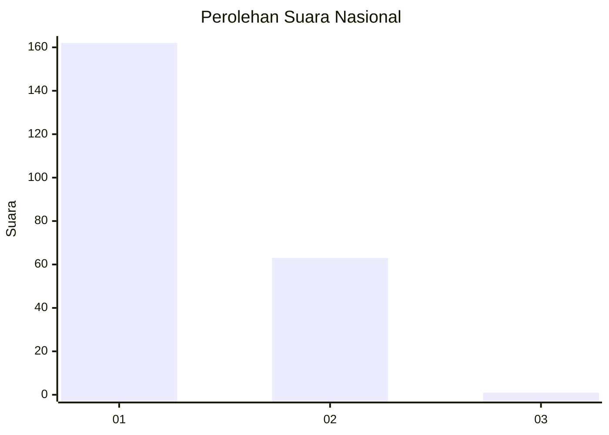
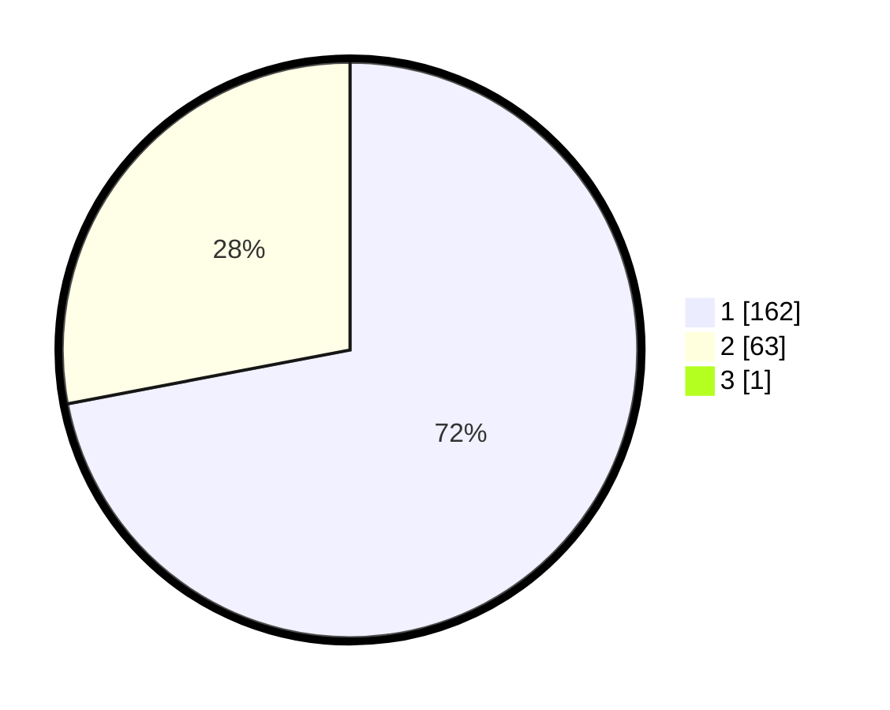

# Hasil

## Grafik

## Tabel

| No. | Nama Paslon    | Suara | Suara (raw) | Persentase |
|:--- |:-------------- | -----:| -----------:| ----------:|
| 1   | ANIES MUHAIMIN | 162   | [162][p-1]  | 71,68      |
| 2   | PRABOWO GIBRAN | 63    | [63][p-2]   | 27,88      |
| 3   | GANJAR MAHFUD  | 1     | [1][p-3]    | 0,44       |

[p-1]: https://github.com/gigit-pemilu/pemilu-2024/blob/main/pilpres/hitung-suara/sub/11-aceh/sub/74-kota-langsa/sub/01-langsa-timur/sub/2010-buket-pulo/sub/001-tps/sub/paslon-1.txt
[p-2]: https://github.com/gigit-pemilu/pemilu-2024/blob/main/pilpres/hitung-suara/sub/11-aceh/sub/74-kota-langsa/sub/01-langsa-timur/sub/2010-buket-pulo/sub/001-tps/sub/paslon-2.txt
[p-3]: https://github.com/gigit-pemilu/pemilu-2024/blob/main/pilpres/hitung-suara/sub/11-aceh/sub/74-kota-langsa/sub/01-langsa-timur/sub/2010-buket-pulo/sub/001-tps/sub/paslon-3.txt

## Foto C Plano

https://sirekap-obj-formc.kpu.go.id/30d7/pemilu/ppwp/11/74/01/20/10/1174012010001-20240214-213842--04797def-e59b-4cdf-891e-627332b50d39.jpg

https://sirekap-obj-formc.kpu.go.id/30d7/pemilu/ppwp/11/74/01/20/10/1174012010001-20240214-214050--7b683b60-ef5c-47dc-ac7d-4a2898945deb.jpg

https://sirekap-obj-formc.kpu.go.id/30d7/pemilu/ppwp/11/74/01/20/10/1174012010001-20240214-214235--603349a3-a335-4f3c-93d3-b8227ac9e4f0.jpg

## Metadata

| Key        | Value               |
| ---------- | ------------------- |
| Time Stamp | 2024-02-19 18:00:00 |

## DATA PEMILIH TETAP

Jumlah pemilih dalam DPT: **250**.
 * L: **129**.
 * P: **121**.

## DATA PENGGUNA HAK PILIH

Jumlah pengguna hak pilih dalam DPT: **227**.
 * L: **114**.
 * P: **113**.

Jumlah pengguna hak pilih dalam DPTb: **4**.
 * L: **2**.
 * P: **2**.

Jumlah pengguna hak pilih dalam DPK: **1**.
 * L: **0**.
 * P: **1**.

Jumlah pengguna hak pilih: **232**.
 * L: **116**.
 * P: **116**.

## JUMLAH SUARA SAH DAN TIDAK SAH

JUMLAH SELURUH SUARA SAH: **226**.

JUMLAH SUARA TIDAK SAH: **6**.

JUMLAH SELURUH SUARA SAH DAN SUARA TIDAK SAH: **232**.

